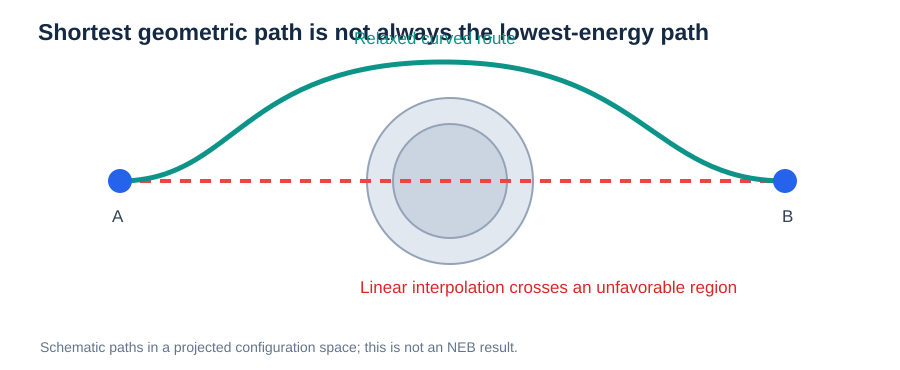

# Reaction Coordinates, Minimum-Energy Paths, and Saddle Points

> **Prerequisite:** [PES](01-potential-energy-surface.md) and [Forces and Gradients](02-forces-and-gradients.md)  
> **Next:** [NEB](../02-methods/02-neb.md)

## 1. A reaction coordinate is not simply a distance

A **reaction coordinate** parameterizes progress between two configurations. It might be a bond distance or angle, but for collective migration it may need to describe many atomic displacements.

A general pathway is a continuous mapping $\mathbf R(s)$, where $s$ runs from initial to final configuration:

```math
\mathbf R(0)=\mathbf R_A,\qquad \mathbf R(1)=\mathbf R_B.
```

An energy profile is obtained by sampling $E(\mathbf R(s))$. **This one-dimensional profile is a slice through a high-dimensional PES, not the PES itself.**


*Figure 1. Schematic energy along a reaction coordinate. Local minima represent endpoints, and the pathway reaches a high-energy region near the transition state.*

## 2. Why the straight line may be wrong



*Figure. A curved route can avoid an unfavorable high-energy region that lies on the direct interpolation.*


Linear interpolation uses:

```math
\mathbf R(s)=(1-s)\mathbf R_A+s\mathbf R_B.
```

This generates convenient initial images but can force atoms too close together or miss collective relaxation. A physically favorable route may curve through configuration space.

## 3. Minimum-energy path (MEP)

For a smooth MEP, the potential-energy gradient has no component perpendicular to the local path tangent:

```math
\nabla E(\mathbf R)-[\nabla E(\mathbf R)\cdot\hat{\boldsymbol\tau}]\hat{\boldsymbol\tau}=0.
```

The path may contain intermediate minima and multiple barriers. Different initial bands can relax to different local pathways between identical endpoints.

## 4. The saddle point

A first-order saddle point is stationary and has exactly one unstable direction among the relevant physical degrees of freedom. Along the MEP it is a local maximum; perpendicular to the unstable direction it is locally stable.

For a pathway connecting states $A$ and $B$, the directional potential-energy barriers are:

```math
E_m^{A\to B}=E_{\rm TS}-E_A,\qquad E_m^{B\to A}=E_{\rm TS}-E_B.
```

They differ when the endpoints have unequal energies. A saddle-point energy is not automatically a temperature-dependent free-energy barrier.

## 5. Ion migration examples

For a proton in BaZrO₃, OH reorientation and O–H transfer can be distinct elementary steps. For Li⁺ in a disordered solid electrolyte, the surrounding O/Cl coordination can change during the hop. In both cases, a single-ion linear displacement may be insufficient to describe the true reaction coordinate.

## Frequent pitfalls

- Treating the geometric shortest path as the MEP.
- Assuming every NEB calculation finds the global lowest barrier.
- Calling a high-energy image an exact saddle without additional refinement.
- Confusing the barrier for one hop with a bulk diffusion activation energy.

## Review questions

1. What is the difference between a reaction coordinate and a complete atomic configuration?
2. What physical information is lost when projecting onto one dimension?
3. Why is the MEP condition defined perpendicular to the path?
4. How can forward and backward barriers differ?

**Next:** [Nudged Elastic Band](../02-methods/02-neb.md).
