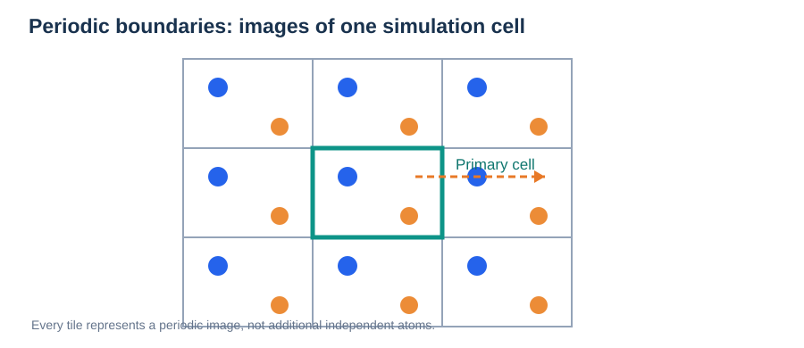
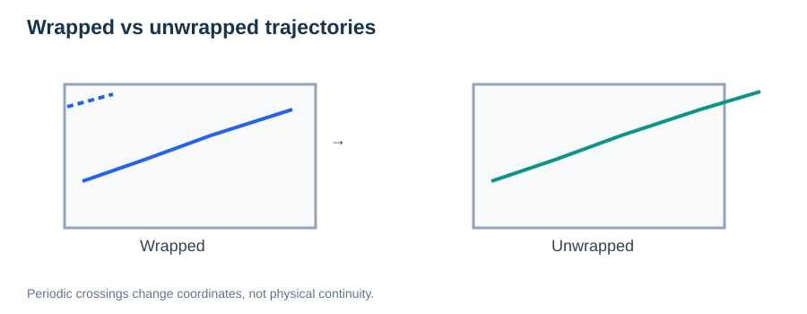

# Periodic Boundary Conditions (PBC)

> **Module:** Foundations · **Prerequisites:** [PES](01-potential-energy-surface.md)  
> **Next:** [Molecular Dynamics](../02-methods/03-molecular-dynamics.md)

## Learning goals

Explain simulation cells and periodic images, minimum-image distances, wrapped versus unwrapped coordinates, and finite-size artifacts in solids and liquids.



*Figure 1. A periodic cell repeats in each spatial direction; copies are mathematical images rather than independent particles.*

## 1. Why periodic boundaries?

Atomistic simulations can contain only a finite number of atoms. Periodic boundary conditions represent extended matter by repeating a **simulation cell**. An atom leaving one boundary re-enters through the opposite face in a wrapped visualization. The physical simulation is continuous; only its stored coordinate convention changes.

For cell vectors $\mathbf a,\mathbf b,\mathbf c$, equivalent locations satisfy:

```math
\mathbf r'=\mathbf r+n_a\mathbf a+n_b\mathbf b+n_c\mathbf c,\qquad n_a,n_b,n_c\in\mathbb Z.
```

This does not make a disordered finite sample equivalent to a truly infinite glass: all copies share the same configuration.

## 2. Minimum-image convention

For two particles, compute the shortest displacement among periodic images. In a rectangular cell with lengths $L_\alpha$:

```math
\Delta r_\alpha^{\mathrm{MIC}}=\Delta r_\alpha-L_\alpha\,\mathrm{round}\!\left(\frac{\Delta r_\alpha}{L_\alpha}\right).
```

This simple expression is specific to orthogonal cells; triclinic cells require appropriate lattice-coordinate treatment and, in general, a proper closest-image search.

**Important:** A cutoff should normally be chosen so interactions do not ambiguously double-count periodic images; the commonly used half-shortest-cell criterion applies to simple minimum-image short-range pair interactions, not every electrostatics algorithm.

## 3. Wrapped and unwrapped trajectories



*Figure 2. The stored wrapped position can jump at cell boundaries; the reconstructed unwrapped trajectory remains continuous.*

### Practical boundary-crossing example

Consider a one-dimensional 10 Å box. An ion moves from 9.7 Å to 0.3 Å across the right-hand boundary. The physically continuous displacement is **+0.6 Å**, not −9.4 Å. Over a long trajectory, image counters retain the accumulated number of cell crossings. Use these counters for MSD while using minimum-image differences for short-range pair distances.


A particle can cross a periodic boundary without physically jumping backwards. For diffusion analysis, reconstruct an **unwrapped** trajectory that preserves accumulated crossings:

```math
\mathrm{MSD}(t)=\left\langle\left|\mathbf r_i^{\mathrm{unwrapped}}(t_0+t)-\mathbf r_i^{\mathrm{unwrapped}}(t_0)\right|^2\right\rangle.
```

Using wrapped coordinates may lead to incorrect mean-squared displacements. Image flags or continuous displacement integration help reconstruct unwrapped motion. Avoid naive unwrapping if particles can move more than half a box length between saved frames.

## 4. Supercells, k-points, and finite-size effects

A **supercell** repeats a smaller primitive cell in real space. A larger cell can reduce unwanted interactions between periodic replicas of defects, dopants, or localized distortions, but costs more computation.

Periodic DFT also samples the electronic Brillouin zone using **k-points**. Real-space supercell size and reciprocal-space sampling are related, but neither replaces a convergence study.

| Question | What to check |
| --- | --- |
| Is a dopant interacting with its periodic replicas? | Compare larger cells and arrangements |
| Is slab migration affected by the opposite surface? | Increase slab/vacuum dimensions and check electrostatics |
| Is diffusion artificially correlated? | Test box size and independent trajectories |
| Can a hopping ion cross the boundary? | Verify atom correspondence and periodic image mapping |

## 5. Application to ion migration

In NEB, two endpoints must represent the intended motion with consistent atom ordering and periodic-image mapping. A naive interpolation between wrapped coordinates might send an ion across the entire unit cell instead of over the neighboring migration saddle.

## Common mistakes

- Interpreting periodic copies as independent statistical samples.
- Computing MSD from wrapped trajectories.
- Assuming all finite-size errors vanish in a modest supercell.
- Using a simple orthogonal minimum-image formula for arbitrary triclinic cells.

## Practice

1. In a 10 Å periodic 1D box, what is the minimum-image displacement between positions 9.7 Å and 0.3 Å?
2. Why can a defect formation energy depend on supercell size?
3. Why must NEB endpoints have consistent periodic-image mapping?

**Continue:** [Born–Oppenheimer Approximation](05-born-oppenheimer-approximation.md) · [MD](../02-methods/03-molecular-dynamics.md).

## References

- [ASE Atoms and cells](https://ase-lib.org/ase/atoms.html)
- [GROMACS manual: periodic boundary conditions](https://manual.gromacs.org/current/reference-manual/algorithms/periodic-boundary-conditions.html)
