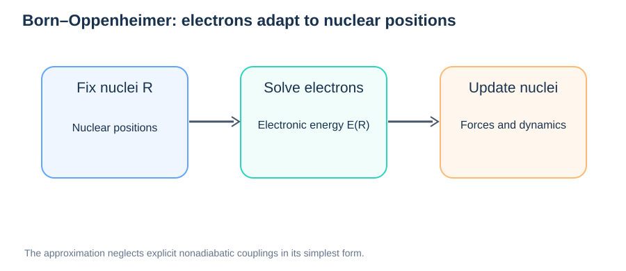

# Born–Oppenheimer Approximation

> **Module:** Foundations · **Prerequisites:** [PES](01-potential-energy-surface.md), [Forces](02-forces-and-gradients.md)  
> **Next:** [DFT Fundamentals](../02-methods/04-dft-fundamentals.md)

## Learning goals

Understand why electronic and nuclear motion are often separated, how a potential-energy surface arises from electronic structure, and when this approximation breaks down.



*Figure 1. Nuclear positions parameterize an electronic-structure problem; the resulting energy and forces determine subsequent nuclear motion.*

## 1. Electron–nucleus separation

Electrons are much lighter than nuclei. Their characteristic response is often faster than nuclear motion, motivating an **adiabatic** description in which electrons occupy an electronic eigenstate for each nuclear configuration $\mathbf R$.

The full molecular Hamiltonian may be schematically written as:

```math
\hat H=\hat T_{\mathrm n}+\hat T_{\mathrm e}+\hat V_{\mathrm{ee}}+\hat V_{\mathrm{en}}+\hat V_{\mathrm{nn}}.
```

At fixed nuclear positions, solve an electronic equation:

```math
\hat H_{\mathrm e}(\mathbf R)\,\psi_k(\mathbf r;\mathbf R)=E_k(\mathbf R)\,\psi_k(\mathbf r;\mathbf R).
```

Here $\hat H_{\mathrm e}$ includes electronic kinetic and electronic interactions plus nuclear interactions as appropriate; conventionally the nuclear–nuclear repulsion may be included in the total electronic energy surface after solving the electronic part.

## 2. From electronic states to PES

For the ground electronic state, the Born–Oppenheimer PES is $E_0(\mathbf R)$. The nuclear forces are approximately:

```math
\mathbf F_I=-\nabla_{\mathbf R_I}E_0(\mathbf R).
```

This is the conceptual link between quantum chemistry, structural optimization, DFT-based MD, and DFT-NEB.

## 3. Adiabatic approximation is not the same as classical nuclei

The Born–Oppenheimer separation concerns **electronic and nuclear degrees of freedom**. Treating nuclei as classical point particles in MD is a further approximation. Nuclear quantum effects can matter for light hydrogen and proton transport.

## 4. When does it fail?

The approximation can be poor near electronic degeneracies or avoided crossings, during photoexcitation, charge-transfer events with significant nonadiabatic coupling, and other processes where electronic-state transitions matter. Surface hopping or related nonadiabatic methods may then be required.

## 5. BOMD versus Car–Parrinello MD

- **Born–Oppenheimer MD:** Re-solves or converges the electronic ground-state problem at successive nuclear configurations.
- **Car–Parrinello MD:** Propagates auxiliary electronic degrees of freedom alongside nuclear motion under controlled conditions.

Both aim to describe coupled electronic-energy and ionic motion, but differ algorithmically.

## Common misconceptions

- “Born–Oppenheimer means DFT.” No: DFT is one possible electronic-energy method.
- “Born–Oppenheimer treats protons quantum mechanically.” Not automatically.
- “A PES is a time trajectory.” No: it is an energy function of nuclear configuration.

## Review questions

1. What physical mass separation motivates the Born–Oppenheimer picture?
2. Why can DFT and an ML potential both supply forces to NEB?
3. Why might hydrogen diffusion require considering nuclear quantum effects?
4. Name one scenario in which electronic nonadiabatic coupling matters.

**Continue:** [DFT Fundamentals](../02-methods/04-dft-fundamentals.md).

## Further reading

- [Born–Oppenheimer approximation (overview)](https://en.wikipedia.org/wiki/Born%E2%80%93Oppenheimer_approximation)
- [ASE molecular dynamics documentation](https://ase-lib.org/ase/md.html)
