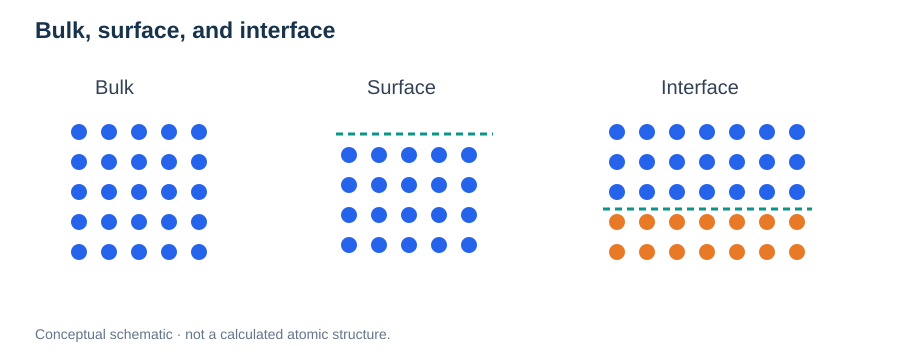

# Bulk Materials and Crystal Structures

> **Module:** Foundations · **Prerequisites:** [PES](01-potential-energy-surface.md), [PBC](04-periodic-boundary-conditions.md)  
> **Continue:** [Surfaces](../04-materials/01-surfaces-and-slabs.md) → [Interfaces](../04-materials/02-interfaces-and-heterostructures.md)

## Learning goals

Understand **bulk**, lattice, basis, unit cells, Miller indices, coordination, bulk versus local defects, and the implications of bulk reference states for surfaces and interfaces.



*Figure 1. Bulk environments have extended coordination, surfaces terminate the material, and interfaces join different regions.*

## 1. What does bulk mean?

A **bulk** solid is a region sufficiently far from external surfaces and interfaces that its local properties resemble those of an extended three-dimensional material. In a computational model, periodic boundary conditions can approximate bulk behavior, but small supercells may impose artificial periodic correlations.

A periodic crystal is constructed from a **Bravais lattice** and an atomic **basis**:

```math
\mathbf r_{n,s}=n_1\mathbf a_1+n_2\mathbf a_2+n_3\mathbf a_3+\boldsymbol\tau_s.
```

Here $n_i$ are integers, $\mathbf a_i$ are lattice vectors, and $\boldsymbol\tau_s$ locates basis atom $s$.

## 2. Primitive cells, conventional cells, and supercells

- **Primitive cell:** contains one lattice point and reproduces the crystal by translations.
- **Conventional cell:** selected for symmetry and ease of interpretation; may contain multiple lattice points.
- **Supercell:** an integer expansion of a cell, useful for defects, dopants, disordered configurations, and longer-range distortions.

Larger supercells do not automatically remove finite-size errors. Verify energies, local relaxations, defect interactions, and relevant transport observables against cell size.

## 3. Reciprocal space and Miller indices

Crystal planes are labeled using **Miller indices** $(hkl)$. For a cubic crystal:

```math
d_{hkl}=\frac{a}{\sqrt{h^2+k^2+l^2}}.
```

This is a cubic-specific interplanar-spacing expression, not a universal formula for triclinic lattices. The (001) plane is normal to one conventional cubic axis; the associated surface may admit multiple chemically different terminations.

## 4. Local coordination and polyhedra

The nearest-neighbor arrangement determines coordination environments and often affects lattice distortions and migration sites. In a perovskite $ABO_3$, a B-site cation is typically octahedrally coordinated by oxygen in the ideal structure. Real structures may distort, tilt, or change symmetry.

For BaZrO₃, oxygen environments, local Y substitution, and proton binding configurations all affect the local PES. **A dopant's influence is not fully described by its nominal concentration: spatial arrangement matters.**

## 5. Defects and charge neutrality

Vacancies, substitutions, interstitials, and protons alter local structure and energetics. A common formal defect-formation-energy expression is:

```math
E_f(D^q)=E_{\mathrm{def}}^q-E_{\mathrm{bulk}}-\sum_i n_i\mu_i+q(E_F+E_{\mathrm{VBM}})+E_{\mathrm{corr}}.
```

Conventions for $n_i$, potential alignment, chemical potentials, and corrections must be stated. This expression applies to an appropriately defined charged-defect framework, not every neutral or molecular defect model.

## 6. How is bulk relevant to diffusion?

Bulk migration requires **accessible sites**, **barriers**, and **connectivity**. Long-range diffusion generally involves a network of elementary hops rather than one isolated NEB calculation. Compare bulk and near-surface transport only under compatible reference states and physical conditions.

## Practical checklist

| Topic | Critical question |
| --- | --- |
| Cell | Does the supercell reproduce the required structural/defect environment? |
| Dopants | Are multiple arrangements needed? |
| PBC | Are image interactions significant? |
| Relaxation | Is the cell geometry appropriate for the target conditions? |
| Diffusion | Are site occupation and kinetic connectivity known? |

## Review questions

1. What is the difference between a primitive cell and a supercell?
2. Why are (001) orientation and a specific surface termination different concepts?
3. How can two bulk supercells with identical composition show different migration barriers?
4. Why must defect chemical potentials be specified?

**Next:** [Surfaces and Slab Models](../04-materials/01-surfaces-and-slabs.md).


## Advanced Application: Defect Chemistry and Hydration

In proton-conducting acceptor-doped perovskites, substitutional dopants may be charge-compensated by oxygen vacancies. Using Kröger–Vink notation, an illustrative hydration equilibrium is:

```math
\mathrm{H_2O(g)}+V_{\mathrm O}^{\bullet\bullet}+O_{\mathrm O}^{\times}\rightleftharpoons 2OH_{\mathrm O}^{\bullet}.
```

This relation describes incorporation of water into vacancy-containing oxides; actual concentrations depend on temperature, water partial pressure, dopant content, and other defect equilibria.

For an equilibrium reaction, an idealized mass-action dependence is:

```math
K(T)=\exp\!\left[-\frac{\Delta G^\circ(T)}{k_{\mathrm B}T}\right].
```

If $\Delta G^\circ$ is defined per mole, use $RT$ instead of $k_{\mathrm B}T$. Site multiplicities, activities, and electroneutrality must be treated consistently in quantitative defect models.

**Research connection:** Y doping changes both the number of available protonic defects and local trapping/hopping energetics. A lower elementary migration barrier does not automatically mean a larger mobile-proton population.

### Defect association and transport

A dopant–proton association energy measures relative stability of nearby versus separated configurations under a declared reference convention. To discuss trapping quantitatively, evaluate association energies, residence times, and connected migration paths rather than inferring association from distance alone.
