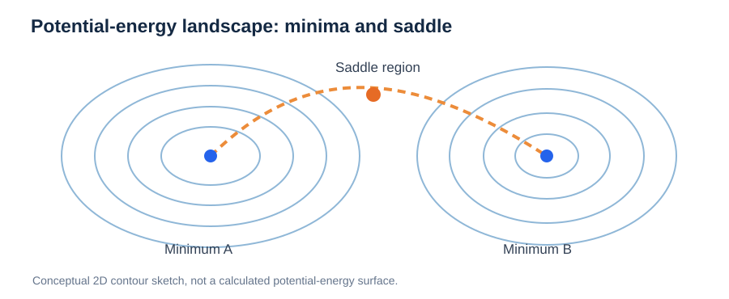
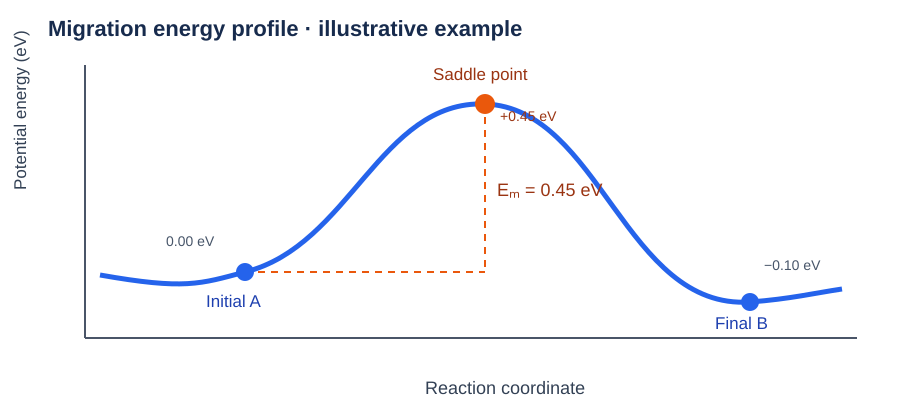
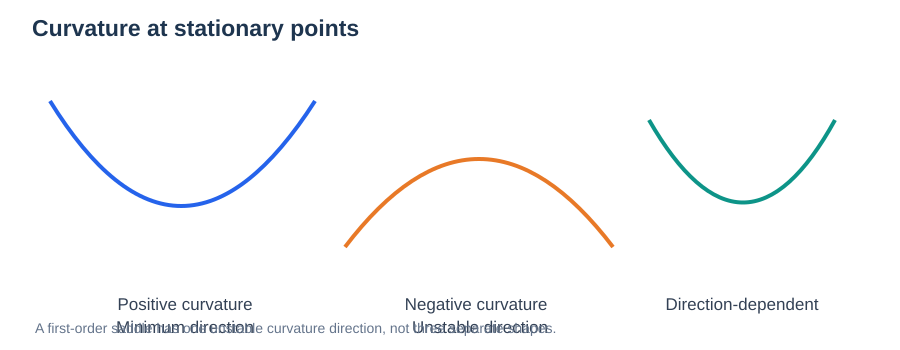
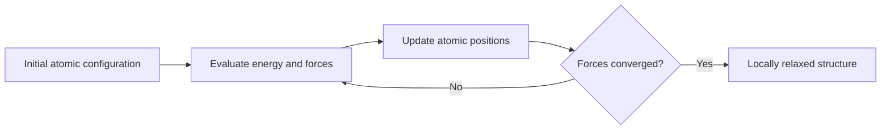
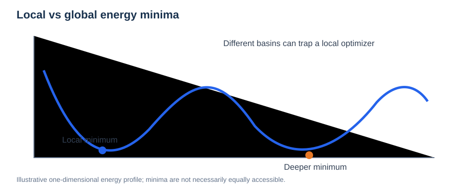
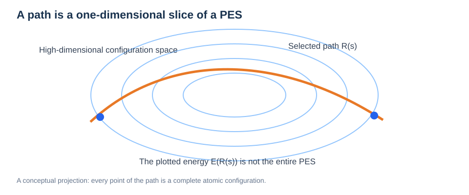

# Potential Energy Surfaces (PES)

**The foundation of atomistic simulation, geometry optimization, molecular dynamics, and transition-state searches**

> **Learning path:** [Course index](../README.md) → **01 · PES** → [02 · NEB](../03-atomistic-methods/04-neb.md)
>
> **Learning objectives:** Explain a potential energy surface, relate energies to atomic forces, distinguish minima from saddle points, understand optimization versus dynamics, and explain why path-search algorithms need a PES.

---

## Contents

1. [What Is a Potential Energy Surface?](#1-what-is-a-potential-energy-surface)
2. [Configurations and Degrees of Freedom](#2-configurations-and-degrees-of-freedom)
3. [Energy, Gradients, and Forces](#3-energy-gradients-and-forces)
4. [Minima, Maxima, and Saddle Points](#4-minima-maxima-and-saddle-points)
5. [From PES to Geometry Optimization](#5-from-pes-to-geometry-optimization)
6. [From PES to Molecular Dynamics](#6-from-pes-to-molecular-dynamics)
7. [From PES to Migration Pathways](#7-from-pes-to-migration-pathways)
8. [DFT and Machine-Learned Potentials](#8-dft-and-machine-learned-potentials)
9. [Common Misconceptions](#9-common-misconceptions)
10. [Review Questions](#10-review-questions)

## 1. What Is a Potential Energy Surface?



*Figure. Conceptual contour map of a PES showing two local minima and a saddle region.*


A **potential energy surface (PES)** is a mathematical map from atomic configurations to their potential energies. Each point corresponds to a specific arrangement of atoms, and its height represents that arrangement's energy.

For a fixed set of $N$ atoms, write the atomic coordinates as:

```math
\mathbf R=(\mathbf r_1,\mathbf r_2,\ldots,\mathbf r_N).
```

The corresponding potential energy is:

```math
E=E(\mathbf R).
```

A PES is often illustrated as a landscape of valleys, ridges, and passes. **This is an analogy**: a realistic many-atom PES lives in a high-dimensional configuration space, not on an ordinary two-dimensional sheet.



*Figure 1. An energy profile along one chosen pathway through a PES. The curve is not the full multidimensional surface.*

> **Key idea:** The PES tells us which configurations are energetically favorable and how the energy changes when atoms move.

## 2. Configurations and Degrees of Freedom

A system of $N$ atoms has $3N$ Cartesian coordinate components before constraints or removal of overall translation and rotation. A change in **any** of these coordinates can change the total potential energy.

For example, during a Li⁺ hop, nearby oxygen and chlorine atoms may relax. A migration process should therefore be described using the coordinates of the *whole system*, rather than the Li⁺ coordinate alone.

For fixed periodic simulation cells, the lattice vectors may be held constant; when cell degrees of freedom are optimized, the landscape also depends on cell geometry and the relevant thermodynamic constraints.

## 3. Energy, Gradients, and Forces

The **gradient** of the energy describes how energy changes under small displacements. The atomic force points toward decreasing potential energy:

```math
\mathbf F_i=-\nabla_{\mathbf r_i}E(\mathbf R).
```

In one dimension:

```math
F_x=-\frac{dE}{dx}.
```

A positive slope means the force points toward smaller $x$; a negative slope means the force points toward larger $x$.

**Why does this matter?** Optimizers and MD integrators need forces (or energy gradients) to update configurations. NEB also depends directly on gradients along a series of configurations.

## 4. Minima, Maxima, and Saddle Points

A **stationary point** has zero gradient:

```math
\nabla E(\mathbf R^*)=0.
```

The local curvature, represented by the **Hessian matrix**, helps classify stationary points:

```math
H_{ij}=\frac{\partial^2 E}{\partial R_i\partial R_j}.
```

| Type | Physical interpretation | Local curvature |
| --- | --- | --- |
| Local minimum | Stable against small allowed displacements | Positive in nontrivial directions |
| Local maximum | Unstable in all relevant directions | Negative in those directions |
| First-order saddle point | Transition-state candidate | One unstable direction; others stable |

Zero modes due to translation, rotation, or other symmetries require special care when interpreting Hessian eigenvalues.

**Important distinction:** A transition state for an elementary activated event typically corresponds to a first-order saddle point, **not necessarily a maximum of the full PES**. It appears as a maximum only *along the reaction path*.

### Hessian eigenvalues and the physical meaning of curvature



*Figure. Local energy curvature distinguishes stable and unstable directions; a saddle point has both.*

Near a stationary configuration $\mathbf R_0$, expand the energy in a small displacement $\delta\mathbf R$:

```math
E(\mathbf R_0+\delta\mathbf R)\approx E(\mathbf R_0)+\frac12\delta\mathbf R^{\mathrm T}H\delta\mathbf R.
```

The Hessian's eigenvectors define local displacement directions, while its eigenvalues measure local curvature. After excluding trivial zero modes, positive curvatures indicate local stability; one negative curvature identifies a first-order saddle. The corresponding mass-weighted Hessian is used in vibrational analysis.

**Application:** In NEB, the climbing image is meant to approach a saddle, but a converged projected force alone does not rigorously verify the number of unstable modes. A targeted vibrational or Hessian check can provide additional evidence for critical pathways.


## 5. From PES to Geometry Optimization

**Geometry optimization** seeks a nearby local minimum by moving atoms according to energies and forces.



A successful relaxation identifies a *local* minimum near the starting structure, not necessarily the global minimum. Different initial structures may relax to different minima.

## 6. From PES to Molecular Dynamics

**Molecular dynamics (MD)** follows the evolution of atom positions and velocities using equations of motion. In classical MD, forces derived from the PES drive the trajectories:

```math
m_i\frac{d^2\mathbf r_i}{dt^2}=\mathbf F_i.
```

MD can sample vibrational motion, structural relaxation, and occasional activated jumps, depending on temperature, system size, and simulation time.

**Optimization vs MD:** Optimization searches for a nearby energy minimum; MD produces a time-dependent trajectory. These are different operations even when both use the same potential.

## 7. From PES to Migration Pathways

Suppose two relaxed configurations, **A** and **B**, represent two ion residence sites. We want a pathway joining them.

An **energy barrier** along a chosen path is the difference between the path's highest relevant energy and the initial-state energy:

```math
E_m=E_{\mathrm{TS}}-E_A.
```

The **minimum-energy path (MEP)** is locally relaxed in directions perpendicular to its tangent. It need not be the geometrically shortest route, and multiple local pathways can connect the same endpoints.

NEB represents such a path with a chain of complete atomic configurations called **images**. The next lesson explains how NEB optimizes these images and how climbing-image NEB locates the saddle point more accurately.

➡️ **Next lesson: [02 · Nudged Elastic Band (NEB)](../03-atomistic-methods/04-neb.md)**

## 8. DFT and Machine-Learned Potentials

A PES is a *physical concept*, not a single computational method.

| Energy/force model | What it provides | Typical trade-off |
| --- | --- | --- |
| Density functional theory (DFT) | Approximate quantum-mechanical energies and forces | Greater expense per evaluation |
| Classical interatomic potential | Energies and forces from a chosen functional form | Efficiency but potentially limited transferability |
| Machine-learned interatomic potential (MLIP) | Learned approximation to reference energies and forces | Fast evaluation, but reliability depends on training coverage |

The same NEB concept can be used with different energy-and-force models. However, different models can predict different barriers, especially in poorly sampled transition-state regions.

## Deeper Understanding: Basins, Metastability, and Reaction Coordinates



*Figure. Local minimization can converge to a metastable basin rather than the absolute lowest-energy structure.*

A **local minimum** has no nearby downhill displacement, whereas a **global minimum** has the lowest energy over the entire specified configuration space. A metastable configuration can persist for a long time if its escape barrier is large, even when its potential energy is above that of another structure.

**Energy is not the same as probability.** At finite temperature, occupation depends on entropy and statistical weights. For states with well-defined free energies $G_A$ and $G_B$, their equilibrium population ratio can be approximately related to their free-energy difference:

```math
\frac{p_B}{p_A}=\exp\!\left[-\frac{G_B-G_A}{k_{\mathrm B}T}\right].
```

This assumes consistent state definitions and equilibrium conditions.



*Figure. A reaction coordinate selects a path through a much larger configuration space.*

In atomistic simulations, the full configuration vector contains all atomic coordinates. A reaction coordinate $s$ parameterizes a path $\mathbf R(s)$, producing a one-dimensional profile $E[\mathbf R(s)]$. **Different paths between the same endpoints can have different barriers.** The path is a slice of the PES, not the entire surface.

### Worked example: why relaxation and NEB answer different questions

Relaxing a proton near oxygen A seeks a local minimum. Relaxing it near oxygen B seeks another minimum. NEB connects these optimized endpoints and searches for a pathway. None of these computations alone determines which site is most populated at a given temperature.

### Review

1. Can a higher-energy local minimum be long-lived?
2. Does the globally lowest potential energy guarantee highest finite-temperature population?
3. Why can two different reaction coordinates yield distinct barriers?

## 9. Common Misconceptions

- **“The PES is a 2D graph.”** The graph is a visualization or lower-dimensional slice of a high-dimensional function.
- **“Zero force always means a stable structure.”** Saddle points also have zero net gradient.
- **“Geometry optimization always finds the global minimum.”** It usually finds a nearby local minimum.
- **“A short migration distance guarantees a low barrier.”** Local atomic repulsion and relaxation determine the barrier.
- **“A PES directly gives a diffusion coefficient.”** Diffusion additionally requires dynamics, site connectivity, statistical populations, or a kinetic model.

## 10. Review Questions

1. What constitutes a single point on the PES of a 100-atom system?
2. How are forces related to the energy gradient?
3. Why is a first-order saddle point different from a local minimum?
4. Why might two geometry optimizations end in different structures?
5. Why must the surrounding atoms be considered when modeling Li⁺ migration?
6. How does a PES support both MD and NEB?

### Key Takeaway

**The PES connects structure, energy, and force.** Local minima represent stable configurations, first-order saddle points describe elementary activated transitions, and force information allows us to optimize structures, integrate trajectories, and search for migration pathways.

---

**Continue:** [02 · Nudged Elastic Band (NEB)](../03-atomistic-methods/04-neb.md)

**Materials context:** [Bulk crystal structures](../04-materials-interfaces/01-bulk-crystal-structures.md) connect the PES to periodic solid models.

---