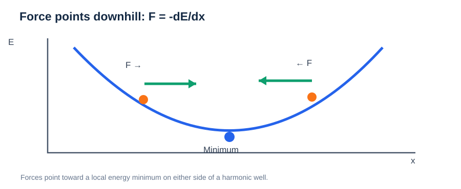
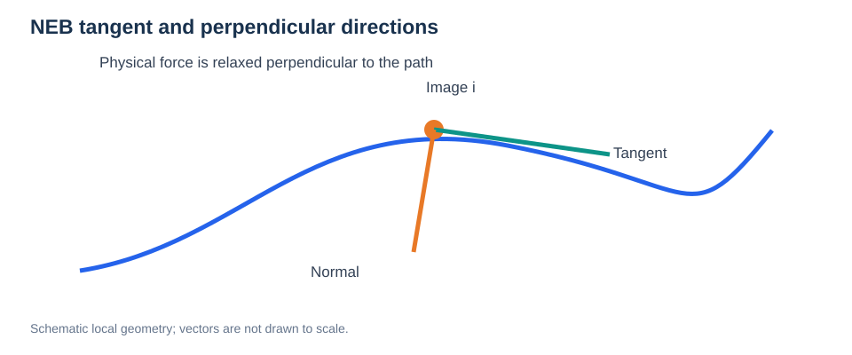
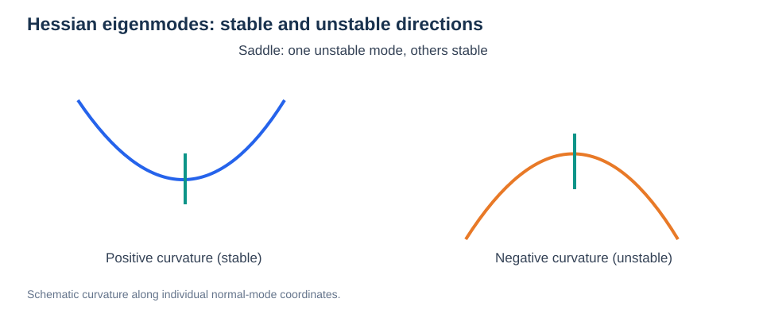

# Forces, Energy Gradients, and Curvature

> **Prerequisite:** [Potential Energy Surfaces](01-potential-energy-surface.md)  
> **Next:** [Geometry Optimization](../03-atomistic-methods/01-geometry-optimization.md)

## Learning objectives

Understand why forces point downhill on a PES, how gradients and Hessians differ, and why zero force is not sufficient to identify a stable structure.

## 1. From energy to forces



*Figure. Forces point opposite to the energy gradient in a one-dimensional potential well.*


For a configuration with atomic positions $\mathbf R$, the potential energy is $E(\mathbf R)$. The force on atom $i$ is the **negative gradient** with respect to its Cartesian position:

```math
\mathbf F_i=-\nabla_{\mathbf r_i}E(\mathbf R).
```

A gradient points toward the steepest local increase of energy. The force points in the opposite direction.

In one dimension:

```math
F_x=-\frac{dE}{dx}.
```

At the bottom of a smooth potential well, the slope is zero; on either side, the force tends to push the particle back toward the minimum.

## 2. Force and curvature are different

A force measures a **first derivative**. Curvature measures a **second derivative**:

```math
H_{ij}=\frac{\partial^2 E}{\partial R_i\,\partial R_j}.
```

The matrix $H$ is the Hessian. At a stationary structure, its eigenvalues reveal local stability (after accounting for constrained and trivial zero modes).

| Stationary configuration | Gradient | Curvature |
| --- | --- | --- |
| Local minimum | Zero | Positive in nontrivial directions |
| First-order saddle | Zero | One unstable direction |
| Local maximum | Zero | Negative in the considered directions |

**A vanishing force does not prove that the structure is a minimum.** This is important when assessing a transition state.

## 3. Harmonic approximation

Near a relaxed minimum $\mathbf R_0$, a Taylor expansion gives:

```math
E(\mathbf R_0+\Delta\mathbf R)\approx E(\mathbf R_0)+\frac12\Delta\mathbf R^{\mathrm T}H\Delta\mathbf R.
```

The linear term disappears at a stationary point. This approximation connects curvature to local vibrational motion, but strongly activated jumps usually travel beyond the harmonic region.

## 4. Why NEB uses projected forces

An NEB image experiences a force that can be decomposed relative to the tangent $\hat{\boldsymbol\tau}$:

```math
\mathbf F_{\parallel}=(\mathbf F\cdot\hat{\boldsymbol\tau})\hat{\boldsymbol\tau},\qquad \mathbf F_{\perp}=\mathbf F-\mathbf F_{\parallel}.
```

In regular NEB, the physical force **perpendicular** to the band relaxes the pathway, while spring forces **parallel** to it help distribute images. This separation prevents the artificial springs from distorting the physical route.

## 5. Numerical issues

Small force magnitudes can be misleading if energies and forces are noisy, the electronic structure has not converged, or constraints hide unstable directions. When comparing methods, check that forces are evaluated consistently.

## Check your understanding

1. What sign relates force and energy gradient?
2. Why can both a local minimum and a saddle point have zero net force?
3. What does the Hessian tell us that the gradient does not?
4. Why does NEB project forces parallel and perpendicular to its path?

**Next:** [Geometry Optimization and Convergence](../03-atomistic-methods/01-geometry-optimization.md).

---

## Extended Foundations: Projected Forces and Normal Modes



*Figure. The local path tangent defines parallel and perpendicular components of a force.*

For unit tangent $\hat{\boldsymbol\tau}$, a vector force $\mathbf F$ can be decomposed into:

```math
\mathbf F_{\parallel}=(\mathbf F\cdot\hat{\boldsymbol\tau})\hat{\boldsymbol\tau},\qquad \mathbf F_{\perp}=\mathbf F-\mathbf F_{\parallel}.
```

In standard NEB, the **physical perpendicular force** relaxes the path, while an artificial **parallel spring force** controls image distribution. A tangent must be estimated from nearby images, which is why abrupt path kinks can cause optimization problems.



*Figure. A first-order saddle has one unstable physical eigenmode; locally stable directions have positive curvature.*

For small displacements about a stationary point, the Hessian provides a quadratic approximation. The **mass-weighted Hessian** yields squared harmonic vibrational frequencies:

```math
\widetilde H_{i\alpha,j\beta}=\frac{H_{i\alpha,j\beta}}{\sqrt{m_i m_j}}.
```

A negative eigenvalue indicates an unstable mode and is commonly described as an imaginary frequency. At a first-order saddle, exactly one physically relevant negative-curvature mode is expected. Translation, rotation, numerical noise, and constrained atoms must be treated correctly.

### Why force convergence can be deceptive

A small projected NEB force does not ensure that a path has sufficient images, that the endpoints are well relaxed, or that the saddle's unstable-mode count is correct. Validate **geometry, force residuals, barrier stability, and alternate routes** together.

### Review

1. Why is perpendicular force important in NEB?
2. What is the difference between a zero force and a stable minimum?
3. What physical information is contained in Hessian eigenvectors?
