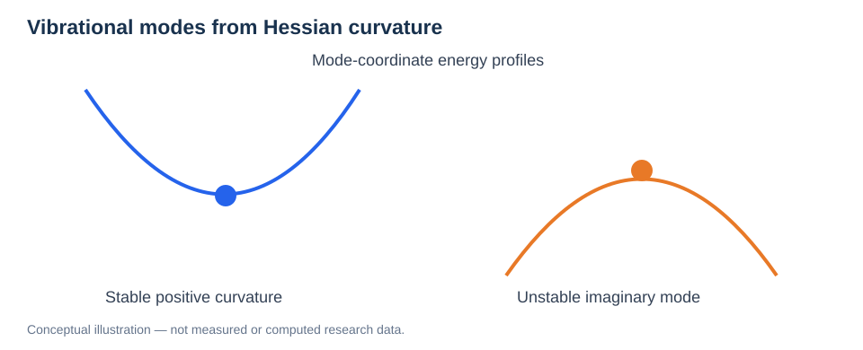
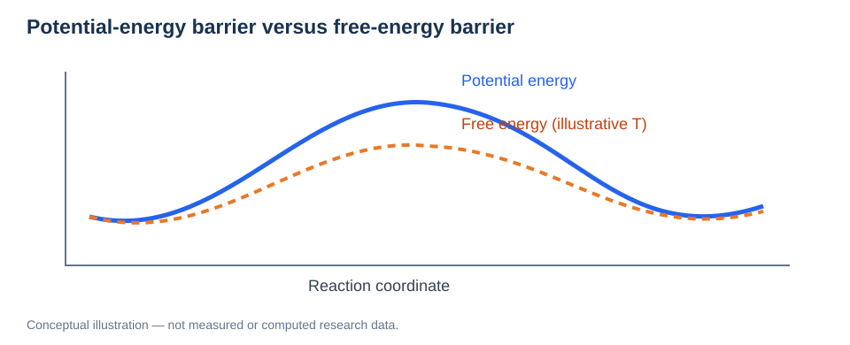

# Vibrations, Phonons, and Free-Energy Effects

> **Study area:** Physical Foundations / Atomistic Methods  
> **Prerequisites:** [PES](01-potential-energy-surface.md), [Forces and Hessians](02-forces-and-gradients.md), [Transition-State Theory](../03-atomistic-methods/05-transition-state-theory.md).

## Learning objectives

Understand harmonic vibrations and normal modes, interpret Hessian eigenvalues, distinguish phonons from generic molecular vibrations, calculate common harmonic thermodynamic contributions, and understand why nuclear quantum effects matter for proton migration.

## 1. From the PES to normal modes

Expand the energy near a stable structure $\mathbf R_0$:

```math
E(\mathbf R_0+\mathbf u)\approx E(\mathbf R_0)+\frac12\mathbf u^{\mathrm T}H\mathbf u.
```

The **Hessian** contains second derivatives with respect to atomic coordinates. Diagonalizing the mass-weighted Hessian produces independent harmonic normal modes with squared frequencies as eigenvalues:

```math
\sum_{j\beta}\frac{H_{i\alpha,j\beta}}{\sqrt{m_i m_j}}e_{j\beta,\lambda}=\omega_\lambda^2 e_{i\alpha,\lambda}.
```

The eigenvector describes an atomic displacement pattern, while $\omega_\lambda$ is its angular frequency. Translational modes and any structural constraints require careful handling.



*Figure 1. Stable modes have positive curvature; a first-order saddle features one relevant unstable direction and a formally imaginary harmonic frequency.*

## 2. Molecular vibrations versus phonons

A **normal mode** is a collective displacement of atoms near an equilibrium configuration. In a crystal, periodicity permits vibrational modes labeled by wave vector $\mathbf q$ and branch index $\nu$; these modes are commonly called **phonons**.

A phonon dispersion consists of $\omega_\nu(\mathbf q)$ across reciprocal space. A small supercell or a single Gamma-point frequency calculation does not establish the full phonon dispersion.

## 3. Zero-point energy and quantum oscillator

A harmonic vibrational mode has quantized energy levels:

```math
E_n=\hbar\omega\left(n+\frac12\right),\qquad n=0,1,2,\ldots.
```

Even at zero temperature, the lowest level has **zero-point energy (ZPE)**:

```math
E_{\mathrm{ZPE}}=\frac12\sum_\lambda\hbar\omega_\lambda.
```

Differences in ZPE between initial and saddle configurations can modify a proton-transfer activation energy. The saddle's unstable mode is excluded from conventional transition-state vibrational partition functions.

## 4. Harmonic vibrational free energy

For independent quantum harmonic modes:

```math
F_{\mathrm{vib}}(T)=\sum_\lambda\left[\frac12\hbar\omega_\lambda+k_{\mathrm B}T\ln\left(1-e^{-\hbar\omega_\lambda/(k_{\mathrm B}T)}\right)\right].
```

This is a Helmholtz vibrational free-energy contribution under harmonic assumptions. At finite pressure, comparing Gibbs free energies additionally requires appropriate pressure–volume and other thermodynamic treatment.

A free-energy barrier may differ from a PES barrier due to entropy and vibrational effects:

```math
\Delta G^\ddagger(T)=\Delta H^\ddagger(T)-T\Delta S^\ddagger(T).
```



*Figure 2. Illustrative profiles: finite-temperature free-energy and potential-energy barriers need not coincide.*

## 5. Imaginary modes and saddle validation

For a fully relaxed local minimum, physical squared frequencies should be nonnegative within numerical precision. A robust first-order transition-state saddle ideally has **one** unstable vibrational mode, aligned with the target reaction mechanism.

Additional unstable modes can mean an incompletely relaxed structure, an incorrect saddle, a genuine instability, or numerical shortcomings. Tiny negative values near zero may arise from finite-difference error or imperfect acoustic sum rules.

## 6. Harmonic transition-state theory

A simple Arrhenius-like rate is:

```math
k(T)\approx\nu(T)\exp\left[-\frac{E_m}{k_{\mathrm B}T}\right].
```

Harmonic transition-state theory estimates a vibrational prefactor from stable modes at reactant and saddle states; this supplies information beyond the bare NEB energy barrier. Recrossing, anharmonicity, correlated hopping, and state populations can still matter.

## 7. Hydrogen and nuclear quantum effects

Hydrogen's small mass produces relatively large vibrational frequencies and zero-point amplitudes. **Classical nuclei in conventional AIMD or MLIP-MD** do not automatically describe tunneling or zero-point motion. Depending on temperature and barrier geometry, path-integral methods or quantum rate approaches may be needed.

For hydrated BaZrO₃, distinguish OH reorientation and oxygen-to-oxygen proton transfer before interpreting vibrational corrections or kinetic rates.

## 8. Computational reliability

- Relax minimum and saddle structures carefully.
- Validate force constants with displacement step and numerical settings.
- Use correct masses, symmetry, and cell size.
- Treat imaginary modes and translational zero modes consistently.
- Check whether the harmonic approximation is reasonable for flexible or strongly anharmonic local environments.
- Report whether a barrier is **potential energy**, **ZPE-corrected**, **Helmholtz free energy**, or **Gibbs free energy**.

## Review questions

1. What do eigenvalues and eigenvectors of the mass-weighted Hessian represent?
2. Why can a first-order saddle have one imaginary mode?
3. What is the difference between phonon dispersion and a molecular normal-mode calculation?
4. Why do hydrogen-containing systems show noticeable nuclear quantum effects?
5. Why can a finite-temperature activation free energy differ from a DFT-NEB energy barrier?

**Related:** [PES](01-potential-energy-surface.md) · [Transition-State Theory](../03-atomistic-methods/05-transition-state-theory.md) · [NEB](../03-atomistic-methods/04-neb.md).
