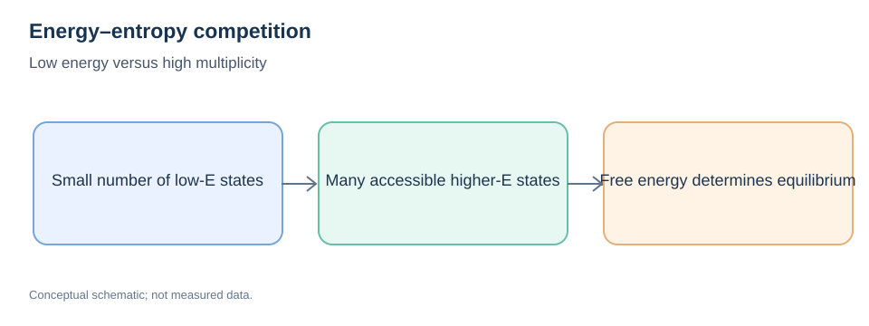
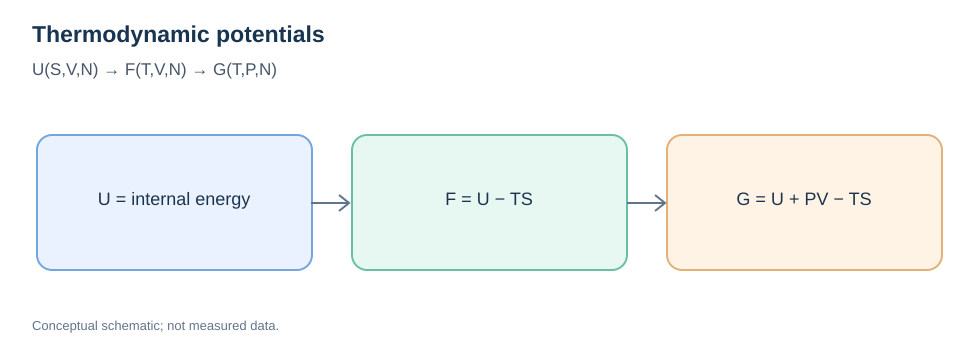

# Thermodynamics Fundamentals

> **Prerequisites:** [PES](01-potential-energy-surface.md), [Forces](02-forces-and-gradients.md)  
> **Next:** [Statistical Mechanics](08-statistical-mechanics-fundamentals.md) · [Free-Energy Methods](../03-atomistic-methods/06-free-energy-calculation-methods.md)

## Learning objectives

Distinguish internal energy, heat, work, entropy, enthalpy, Helmholtz and Gibbs energies, chemical potential, equilibrium, and phase stability. Understand which thermodynamic potential applies under which constraints.

## 1. Energy, heat, and work

For a closed system, a first-law sign convention is:

```math
dU=\delta Q-\delta W_{\mathrm{by}}.
```

$U$ is a state function; heat and work are *process-dependent transfers*, not stored properties. For quasistatic mechanical pressure–volume work, $\delta W_{\mathrm{by}}=P_{\mathrm{ext}}dV$ under appropriate conditions.

## 2. Entropy and the second law

For a reversible heat transfer:

```math
dS=\frac{\delta Q_{\mathrm{rev}}}{T}.
```

Entropy is a thermodynamic state function. In an isolated system, spontaneous processes do not decrease total entropy. A configuration with the lowest potential energy is not automatically the thermodynamically preferred macroscopic state at finite temperature.



*Figure 1. Many accessible microstates can compensate for a higher internal energy.*

## 3. Natural variables and thermodynamic potentials

For a simple single-phase, multicomponent equilibrium system:

```math
dU=T\,dS-P\,dV+\sum_i\mu_i\,dN_i.
```

Define:

```math
H=U+PV,\qquad F=U-TS,\qquad G=U+PV-TS.
```



*Figure 2. Legendre transforms select potentials convenient for different controlled variables.*

| Potential | Typical controlled variables | Equilibrium principle (appropriate conditions) |
| --- | --- | --- |
| Internal energy $U$ | $S,V,N_i$ | Minimize at fixed entropy, volume, composition |
| Enthalpy $H$ | $S,P,N_i$ | Useful at fixed entropy and pressure |
| Helmholtz $F$ | $T,V,N_i$ | Minimize at fixed temperature and volume |
| Gibbs $G$ | $T,P,N_i$ | Minimize at fixed temperature and pressure |

For a suitable single-component system, $G$ depends naturally on $(T,P,N)$; for mixtures, include composition variables. Care is required for surfaces, stress, fields, and constrained systems.

## 4. Chemical potential

The chemical potential is the marginal change in a relevant thermodynamic potential upon adding a particle of component $i$:

```math
\mu_i=\left(\frac{\partial G}{\partial N_i}\right)_{T,P,N_{j\neq i}}.
```

Equality of chemical potentials across phases is a condition for exchange equilibrium. Reservoir chemical potentials influence defect formation and adsorption thermodynamics. Chemical potential is **not** an arbitrary “potential energy per atom.”

## 5. Phase competition and coexistence

At fixed $T,P$ and overall composition, equilibrium minimizes Gibbs energy subject to constraints. Metastable phases can persist behind kinetic barriers despite not having the global equilibrium free energy.

This explains an important distinction: **thermodynamics determines driving forces and equilibrium; kinetics determines timescales and pathways.**

## 6. Potential-energy barrier versus free-energy barrier

NEB generally evaluates a pathway on an approximate potential-energy surface. The activated rate at finite temperature may be governed by a free-energy barrier:

```math
\Delta G^\ddagger=\Delta H^\ddagger-T\Delta S^\ddagger.
```

The two should not be labeled interchangeably. Vibrational entropy, configurational states, volume work, and solvent or lattice reorganization may matter.

## 7. Worked conceptual exercise

Two states have energies $E_A=0$ and $E_B=0.04\,\mathrm{eV}$ per specified system. State B has a higher configurational degeneracy. At finite temperature, it can still have greater equilibrium population because its entropy is higher. The complete answer requires properly defined free energies and state counting.

## Common misconceptions

- “Spontaneous” does not necessarily mean “fast.”
- An energy minimum does not guarantee the lowest free energy.
- Heat and work are not thermodynamic state functions.
- A DFT total energy is not automatically a finite-temperature Gibbs free energy.

## Review

1. Which potential is natural for NVT versus NPT?
2. How can an energetically higher phase be favored at finite temperature?
3. What role does chemical potential play in adsorption?
4. Why does a finite-temperature activation free energy differ from an NEB barrier?

**Next:** [Statistical Mechanics Fundamentals](08-statistical-mechanics-fundamentals.md).
