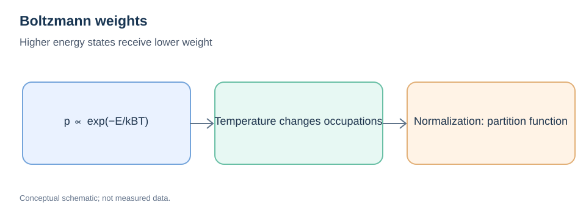
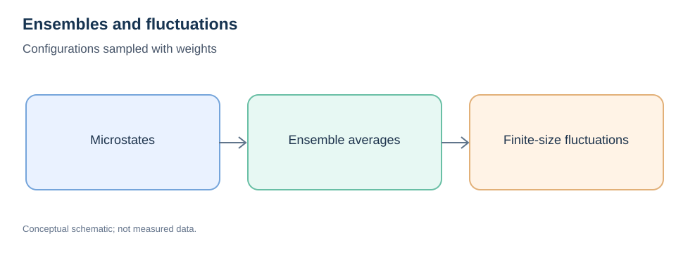

# Statistical Mechanics Fundamentals

> **Prerequisites:** [Thermodynamics](07-thermodynamics-fundamentals.md), [PES](01-potential-energy-surface.md)  
> **Related:** [MD ensembles](../03-atomistic-methods/03-statistical-ensembles.md), [Free-Energy Methods](../03-atomistic-methods/06-free-energy-calculation-methods.md)

## Learning objectives

Connect microscopic configurations to equilibrium thermodynamics through microstates, probability distributions, the partition function, expectation values, entropy and fluctuations.

## 1. Microstates and macrostates

A *microstate* specifies microscopic degrees of freedom, such as atomic positions and momenta (classically), while a *macrostate* specifies constraints such as temperature, pressure and composition. One macrostate may correspond to many microstates.

A statistical ensemble is a probability distribution over these possible microstates, not simply a collection of saved trajectory frames.

## 2. Boltzmann weights and the partition function

For a discrete canonical ensemble:

```math
p_i=\frac{\exp(-\beta E_i)}{Z},\qquad Z=\sum_i\exp(-\beta E_i),\qquad\beta=\frac{1}{k_{\mathrm B}T}.
```



*Figure 1. Relative probabilities depend on energy differences, temperature and multiplicity.*

For classical continuous phase space, the canonical partition function involves an appropriately normalized position–momentum integral. Its prefactors depend on indistinguishability and phase-space conventions; do not replace the full partition function with a naive sum over minima unless a separate basin approximation is justified.

For the canonical ensemble:

```math
F=-k_{\mathrm B}T\ln Z.
```

This connects thermodynamic free energy to microscopic weights.

## 3. Averages, variance and fluctuations

For discrete states, an observable $A$ has expectation:

```math
\langle A\rangle=\sum_i p_i A_i,\qquad \operatorname{Var}(A)=\langle A^2\rangle-\langle A\rangle^2.
```



*Figure 2. Averages represent a distribution; finite samples and autocorrelations affect precision.*

In the canonical ensemble, energy fluctuations are related to heat capacity:

```math
\operatorname{Var}(E)=k_{\mathrm B}T^2 C_V.
```

This assumes the relevant canonical equilibrium distribution and the appropriate fixed-volume heat capacity.

## 4. Entropy from probabilities

For a discrete probability distribution:

```math
S=-k_{\mathrm B}\sum_i p_i\ln p_i.
```

This provides a statistical interpretation of entropy. Continuous classical entropy and coarse-graining require care because probability densities carry units and reference conventions.

## 5. Ensemble versus time average

MD generates correlated states in time. Under suitable stationarity and ergodicity assumptions, long trajectory averages approximate ensemble expectations, but **ergodicity is not automatically guaranteed**.

An observed lack of rare jumps can reflect insufficient sampling, not a true absence of accessible transitions. Multiple replicas and autocorrelation analysis help assess uncertainty.

## 6. Free-energy landscapes and populations

For a well-defined collective variable $s$ with equilibrium probability density $P(s)$, a potential of mean force (PMF) can be defined up to a constant:

```math
F(s)=-k_{\mathrm B}T\ln P(s)+C.
```

The variable's measure/Jacobian and the sampling ensemble matter. The PMF is not necessarily the same as a minimum-potential-energy profile along $s$.

## 7. Worked exercise: two-state equilibrium

Suppose $E_B-E_A=\Delta E$ and degeneracies are $g_A,g_B$. Then:

```math
\frac{P_B}{P_A}=\frac{g_B}{g_A}\exp\!\left(-\frac{\Delta E}{k_{\mathrm B}T}\right).
```

As temperature increases, energetic penalties become relatively less dominant; multiplicity may control the occupation ratio.

## Common errors and review

- Confusing a probability with a Boltzmann factor before normalization.
- Treating correlated MD frames as independent equilibrium samples.
- Ignoring the coordinate measure when interpreting PMF.
- Confusing ensemble averages with instantaneous values.

**Questions:** Why is $Z$ needed? When can state B have a larger population despite higher energy? Why can time averaging fail on a trapped trajectory?

**Continue:** [Statistical Ensembles](../03-atomistic-methods/03-statistical-ensembles.md) · [Free-Energy Calculation Methods](../03-atomistic-methods/06-free-energy-calculation-methods.md).
