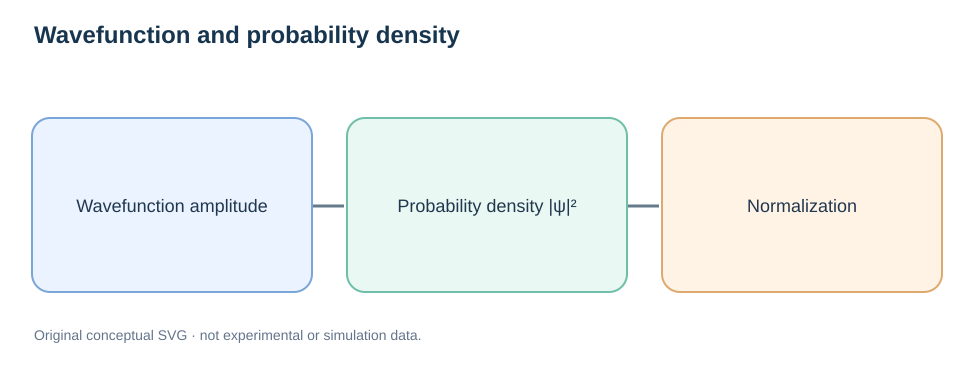
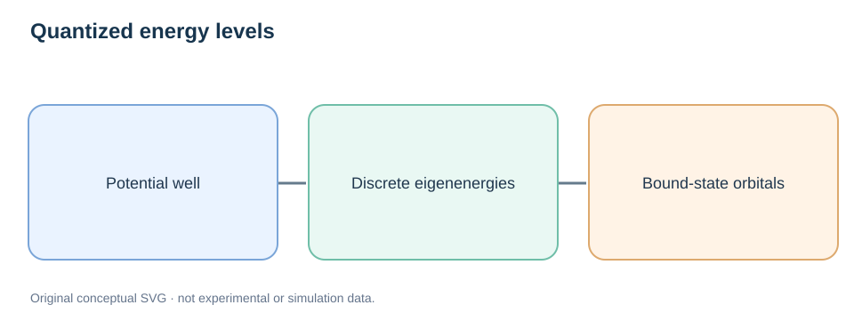

# Quantum Mechanics Fundamentals

> **Study sequence:** [Linear Algebra and Gradients](02-forces-and-gradients.md) → **Quantum Mechanics** → [Born–Oppenheimer](04-born-oppenheimer-approximation.md) → [DFT](../02-electronic-structure/01-dft-fundamentals.md)

## Learning objectives

Understand complex wavefunctions, the Born probability rule, normalization, Hermitian operators, stationary states, superposition, the Schrödinger equation, quantization, uncertainty, tunneling, and the approximations required for practical electronic-structure calculations.

## 1. Why classical mechanics is not sufficient

Microscopic particles exhibit wave-like interference and discrete bound-state spectra. A classical trajectory with a perfectly specified position and velocity does not fully describe an electron. Quantum mechanics represents a physical state by a vector (or wavefunction representation) in a Hilbert space.



*Figure 1. A wavefunction is an amplitude; its squared modulus is related to measurement probabilities.*

## 2. Wavefunctions and normalization

For one spinless particle in the position representation, the wavefunction is $\psi(\mathbf r,t)$. The Born interpretation states:

```math
P(\mathbf r\in\Omega,t)=\int_\Omega |\psi(\mathbf r,t)|^2\,d^3r.
```

A normalized wavefunction satisfies:

```math
\int_{\mathbb R^3}|\psi(\mathbf r,t)|^2\,d^3r=1.
```

Wavefunctions can be complex: $\psi$ and $e^{i\phi}\psi$ describe the same pure physical state under a global phase. Interference depends on **relative** phases. For many-electron systems, the wavefunction depends on all electronic coordinates (including spin) and obeys fermionic antisymmetry.

## 3. Operators, eigenvalues and expectation values

Physical observables correspond to suitable self-adjoint operators. An eigenstate obeys:

```math
\hat A|a_n\rangle=a_n|a_n\rangle.
```

For a normalized state $|\psi\rangle$, the expectation value is:

```math
\langle A\rangle=\langle\psi|\hat A|\psi\rangle.
```

Expectation values are ensemble means over identically prepared measurements; they are not generally the outcome of one measurement.

The position and momentum operators in the coordinate representation are $\hat{\mathbf r}=\mathbf r$ and $\hat{\mathbf p}=-i\hbar\nabla$. Their noncommutation underpins the uncertainty principle:

```math
\Delta x\,\Delta p_x\geq\frac{\hbar}{2}.
```

## 4. Time-dependent and stationary Schrödinger equations

A closed nonrelativistic system evolves as:

```math
i\hbar\frac{\partial}{\partial t}\Psi(\mathbf x,t)=\hat H\Psi(\mathbf x,t).
```

For a time-independent Hamiltonian, stationary eigenstates solve:

```math
\hat H\phi_n(\mathbf x)=E_n\phi_n(\mathbf x).
```

Their temporal factors are $\exp(-iE_nt/\hbar)$. A superposition of stationary states is also a valid state; a general superposition can produce time-dependent probability densities.

## 5. Particle in a one-dimensional infinite box

For $0<x<L$ and $\psi(0)=\psi(L)=0$, the stationary equation yields:

```math
-\frac{\hbar^2}{2m}\frac{d^2\phi}{dx^2}=E\phi,\qquad \phi_n(x)=\sqrt{\frac2L}\sin\left(\frac{n\pi x}{L}\right).
```

The allowed energies are discrete:

```math
E_n=\frac{n^2\pi^2\hbar^2}{2mL^2},\qquad n=1,2,\ldots.
```



*Figure 2. Confinement can generate discrete stationary eigenenergies.*

The ground state has nonzero energy. This is not identical to the zero-point energy of the harmonic oscillator, though both reflect quantum confinement.

## 6. Tunneling and barrier transmission

A quantum particle may penetrate a classically forbidden region where $V(x)>E$. In a sufficiently smooth one-dimensional barrier, the semiclassical WKB transmission exponent contains:

```math
T_{\mathrm{WKB}}\propto\exp\left[-2\int_{x_1}^{x_2}\frac{\sqrt{2m[V(x)-E]}}{\hbar}\,dx\right].
```

This illustrates the strong dependence on particle mass and barrier width; prefactors, turning points, and applicability assumptions matter. A classical NEB barrier does **not** directly provide a tunneling rate.

## 7. From electrons to DFT

The many-electron problem includes kinetic energy, electron–nucleus attraction, electron–electron repulsion and antisymmetry. Solving the full wavefunction problem scales poorly. Hartree–Fock approximates the wavefunction with an antisymmetrized determinant, while Kohn–Sham DFT uses an auxiliary orbital system designed to reproduce the ground-state density.

The [Born–Oppenheimer approximation](04-born-oppenheimer-approximation.md) separates nuclear and electronic degrees of freedom under controlled assumptions. It is distinct from DFT and from treating nuclei classically.

## 8. Common confusions and review

- A wavefunction is not itself a probability distribution.
- A quantum eigenvalue is not the expectation value for every possible state.
- Complex amplitudes can interfere even when probabilities are positive.
- Electron ground-state quantum mechanics does not guarantee nuclei are treated quantum mechanically.

**Questions:** Why does an infinite box have discrete energies? Why does a global phase not change measurements? How is a stationary state different from a particle sitting still? Why does tunneling depend on mass?

## Further reading

- [Born–Oppenheimer fundamentals](04-born-oppenheimer-approximation.md)
- [DFT fundamentals](../02-electronic-structure/01-dft-fundamentals.md)
- [Vibrations and quantum effects](06-vibrations-phonons-free-energy.md)
