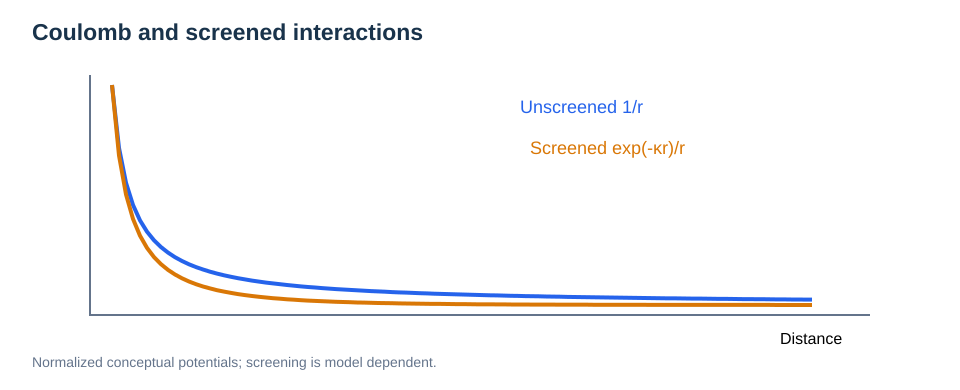

# Electrostatics and Long-Range Interactions

> **Prerequisites:** [Vector Calculus](02-forces-and-gradients.md), [Periodic Boundary Conditions](03-periodic-boundary-conditions.md).  
> **Related:** [DFT](../02-electronic-structure/01-dft-fundamentals.md), [MLIPs](../06-machine-learning-potentials/01-mlip-fundamentals.md), [Interfaces](../04-materials-interfaces/03-interfaces-and-heterostructures.md).

## Learning goals

Understand Coulomb interactions, electrostatic potential and electric field, Gauss's law, Poisson's equation, dielectric screening, boundary conditions, reciprocal-space electrostatics, Ewald summation, and the limits of local interaction cutoffs.

## 1. Coulomb forces and potential

Two point charges $q_i,q_j$ in vacuum separated by distance $r$ have an interaction energy

```math
U_{ij}(r)=\frac{q_iq_j}{4\pi\varepsilon_0r}.
```

The associated force is the negative gradient of this energy. The $1/r$ potential decays slowly: excluding distant interactions requires more care than using a short-range pair cutoff.

The electric field and scalar electrostatic potential satisfy:

```math
\mathbf E=-\nabla\phi,\qquad \mathbf F_i=q_i\mathbf E(\mathbf r_i).
```

Electrostatic potential energy is $q\phi$, not $\phi$ by itself. The absolute zero of potential is a gauge convention; observable potential differences are meaningful.

## 2. Gauss's law and Poisson's equation

Gauss's law in vacuum is $\nabla\cdot\mathbf E=\rho/\varepsilon_0$. Substituting $\mathbf E=-\nabla\phi$ gives:

```math
\nabla^2\phi(\mathbf r)=-\frac{\rho(\mathbf r)}{\varepsilon_0}.
```

In a linear dielectric with a possibly space-dependent scalar permittivity:

```math
\nabla\cdot[\varepsilon(\mathbf r)\nabla\phi(\mathbf r)]=-\rho_{\mathrm{free}}(\mathbf r).
```

These expressions require a consistent definition of free/bound charges, boundary conditions, and material response. The dielectric approximation can fail at atomically abrupt interfaces or under strong nonlinear polarization.

## 3. Screening and dielectric response



*Figure 1. The same bare $1/r$ interaction can be modified by polarization or screening; the exponential form is an illustrative screening model.*

For simple linear isotropic bulk screening, a Yukawa-like potential may be written:

```math
\phi(r)=\frac{q}{4\pi\varepsilon r}\exp(-\kappa r),
```

where $\kappa^{-1}$ is a characteristic screening length. Not every insulating solid or interface admits this model. Distinguish **electronic dielectric screening**, **ionic relaxation**, and **mobile-carrier screening**.

## 4. Why periodic electrostatics is difficult

For a periodic set of charges, directly summing $1/r$ terms over all images converges poorly or is conditionally convergent. A standard **Ewald decomposition** splits the periodic interaction into rapidly convergent real-space and reciprocal-space parts (plus self and boundary corrections).

A conceptual Ewald identity is:

```math
\frac1r=\frac{\operatorname{erfc}(\alpha r)}r+\frac{\operatorname{erf}(\alpha r)}r.
```

The first term is short ranged; the second is evaluated efficiently in reciprocal space. Physical energies must be independent of the arbitrary Ewald splitting parameter $\alpha$ after numerical convergence.

### Charged periodic cells and conventions

Conventional periodic Ewald electrostatics generally assumes neutrality or requires a compensating convention. Charged-defect calculations often employ backgrounds and finite-size corrections; their physical meaning depends on electrostatic references and boundary conditions.

**A uniform neutralizing background is a computational convention, not a physical salt solution.**

## 5. Ewald, PME, and long-range methods

Ewald uses explicit reciprocal sums. Particle-mesh methods such as PME approximate parts of reciprocal electrostatics on a grid for better scaling. Their accuracy depends on grid resolution, interpolation, cutoffs and treatment of cell shape.

| Model | Typical strengths | Important risks |
| --- | --- | --- |
| Direct pair truncation | Cheap for screened short-range forces | Artifacts for bare Coulomb interactions |
| Ewald sums | Systematic periodic electrostatics | Boundary and neutrality conventions |
| Particle-mesh Ewald | Efficient large periodic systems | Mesh and interpolation accuracy |
| Explicit charge equilibration / polarizable terms | Responds to local field changes | Extra parameters and validation |

## 6. Surface, slab, and interface electrostatics

A slab represented in a periodic cell with vacuum still has 3D periodic electrostatics unless a specific correction or reduced-dimensional kernel is used. Artificial inter-slab dipoles and net charges can alter adsorption energies, surface band alignment, and migration barriers.

At a heterogeneous interface, electrostatic potential profiles may affect ion concentrations and transport, but local atomic chemistry and defect equilibration also matter.

## 7. Link to MLIPs

Strictly local energy sums with fixed cutoffs may miss far-field Coulomb response, dielectric polarization, and charge transfer. MLIPs can address these issues through explicit electrostatic terms, nonlocal message passing, charge models, or suitable data-driven architectures. **Do not assume that every graph potential is strictly local or that all charge information is absent.**

## 8. Practical checks

1. Verify total cell charge and electrostatic boundary assumptions.
2. Compare interaction cutoff, Ewald precision or mesh settings.
3. Test cell-size, vacuum and dipole corrections.
4. Separate numerical convergence from model approximation.
5. Examine sensitivity of *differences* in adsorption, defects and reaction barriers.

## Review questions

Why can Coulomb energy not generally be truncated like a short-range pair interaction? What assumptions underlie Poisson's equation? Why does a charged periodic cell need an electrostatic convention? How does the Ewald split help convergence? Which long-range effects could challenge a local MLIP?
