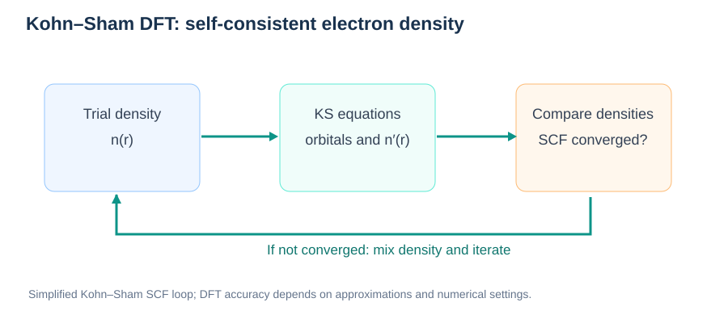
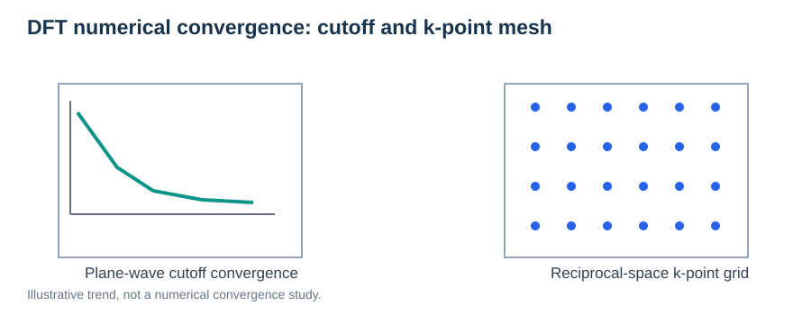

# Density Functional Theory (DFT) Fundamentals

> **Module:** Methods · **Prerequisites:** [PES](../01-foundations/01-potential-energy-surface.md), [Born–Oppenheimer](../01-foundations/05-born-oppenheimer-approximation.md)  
> **Related:** [Geometry Optimization](01-geometry-optimization.md), [NEB](02-neb.md)

## Learning goals

Understand electron density, the Kohn–Sham equations, exchange–correlation approximations, SCF iteration, and major convergence settings for atomistic simulations.



*Figure 1. Simplified self-consistent field loop: construct an effective potential, solve Kohn–Sham equations, and update the density.*

## 1. Why density instead of a many-electron wavefunction?

The interacting wavefunction depends on coordinates of many electrons. **Ground-state DFT** expresses the ground-state energy as a functional of the electron density $n(\mathbf r)$, which depends on three spatial coordinates.

A schematic Kohn–Sham energy decomposition is:

```math
E[n]=T_s[n]+\int v_{\mathrm{ext}}(\mathbf r)n(\mathbf r)\,d\mathbf r+E_{\mathrm H}[n]+E_{\mathrm{xc}}[n]+E_{\mathrm{II}}.
```

$T_s$ is the noninteracting reference kinetic energy, $E_{\mathrm H}$ the Hartree energy, $E_{\mathrm{xc}}$ the exchange–correlation term, and $E_{\mathrm{II}}$ the nuclear–nuclear repulsion for fixed ions.

## 2. Kohn–Sham equations

Auxiliary single-particle orbitals satisfy:

```math
\left[-\frac{\hbar^2}{2m_e}\nabla^2+v_{\mathrm{eff}}[n](\mathbf r)\right]\phi_i(\mathbf r)=\varepsilon_i\phi_i(\mathbf r).
```

The density is reconstructed from occupied orbitals:

```math
n(\mathbf r)=\sum_i f_i|\phi_i(\mathbf r)|^2.
```

The effective potential depends on the density, making the equations **self-consistent**.

## 3. SCF (self-consistent field) iteration

1. Guess the density.
2. Build the effective potential and solve the Kohn–Sham equations.
3. Update density and mix with the previous iteration if appropriate.
4. Iterate until residuals and energies satisfy convergence requirements.

Poor SCF convergence produces noisy energies and forces, which can disrupt structural relaxation and NEB.

## 4. Exchange–correlation is an approximation

The exact exchange–correlation functional is generally unknown in practice. Common approximations include LDA, GGA (for example PBE), meta-GGA, and hybrids. They trade accuracy, numerical sensitivity, and computational cost differently; no functional is universally best.

## 5. Numerical choices



*Figure 2. Increasing basis-set resolution and reciprocal-space sampling improves numerical completeness; actual convergence must be established for the target observable.*

### Plane-wave cutoff and reciprocal-space sampling

In periodic plane-wave DFT, the expansion contains reciprocal-lattice components satisfying a kinetic-energy cutoff:

```math
\frac{\hbar^2}{2m_e}\left|\mathbf k+\mathbf G\right|^2\leq E_{\mathrm{cut}}.
```

Increasing $E_{\mathrm{cut}}$ enlarges the basis and usually increases cost. A denser k-point mesh samples more of the Brillouin zone, while a larger supercell often permits a coarser mesh. Convergence must be checked for **forces and energy differences**, not only absolute total energy.


| Setting | Why it matters |
| --- | --- |
| Basis / plane-wave cutoff | Controls representational completeness |
| k-point mesh | Samples periodic reciprocal space |
| Pseudopotential / PAW dataset | Treats core and valence electrons approximately |
| Electronic convergence | Determines accuracy of energies and forces |
| Smearing / occupation | Affects metallic and small-gap calculations |
| Spin treatment | Matters for spin-polarized systems |
| Cell size and vacuum | Important for defects, interfaces, and slabs |

Always converge the **quantity of interest**: a small total-energy change alone does not guarantee accurate energy differences, forces, stresses, or barriers.

## 6. DFT, PES, and NEB

For each NEB image, DFT evaluates $E(\mathbf R_i)$ and forces. The entire path is iteratively optimized. A reliable barrier needs compatible numerical settings across images and adequate convergence at the saddle region.

## 7. Limitations

DFT is not automatically exact, nor does standard ground-state DFT directly capture all temperature effects. Common challenges include exchange–correlation errors, finite-size effects, expensive sampling, and correlation phenomena beyond simple approximations.

## Review questions

1. What is self-consistent in Kohn–Sham DFT?
2. Why can force convergence be stricter than total-energy convergence?
3. What changes when you increase a plane-wave cutoff?
4. Why must one use consistent numerical settings across NEB images?

## Further reading

- [Kohn–Sham original paper](https://doi.org/10.1103/PhysRev.140.A1133)
- [VASP Wiki](https://www.vasp.at/wiki/)
- [Quantum ESPRESSO documentation](https://www.quantum-espresso.org/documentation/)
