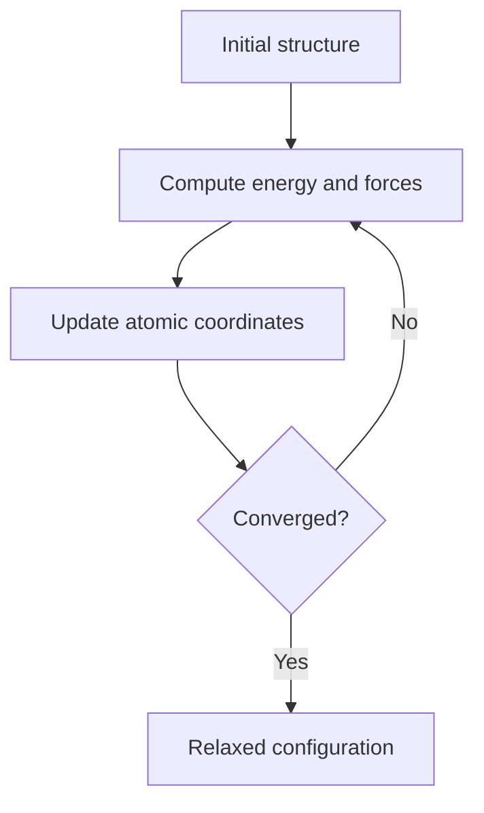
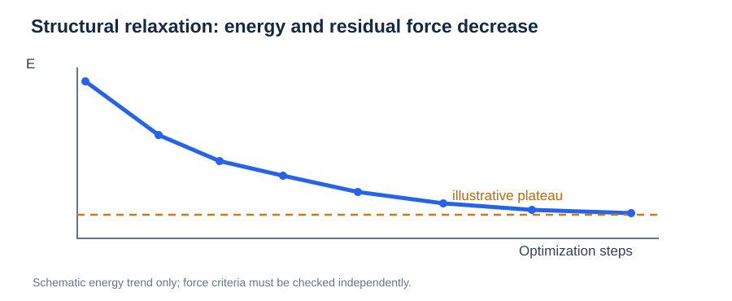
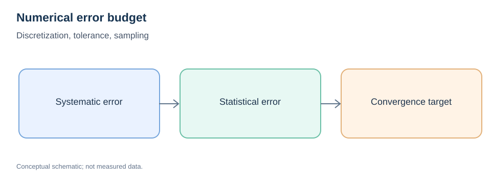

# Geometry Optimization and Numerical Convergence

> **Prerequisite:** [Potential Energy Surfaces](../01-physical-foundations/01-potential-energy-surface.md) and [Forces and Gradients](../01-physical-foundations/02-forces-and-gradients.md)  
> **Next:** [Reaction Coordinates and Saddle Points](../01-physical-foundations/05-reaction-coordinates-and-saddle-points.md)

## 1. What does geometry optimization do?

Geometry optimization searches for a nearby stationary configuration by iteratively changing atomic coordinates to reduce an objective such as potential energy.



**Important:** A successful minimization generally identifies a nearby local minimum, not the unique global minimum.

## 2. The force criterion



*Figure. Illustrative energy decrease during structural relaxation. The energy plot alone is not proof of force convergence.*


A common convergence criterion is that the largest unconstrained atomic force magnitude is below a specified tolerance:

```math
\max_i\left\|\mathbf F_i\right\|<F_{\rm tol}.
```

A smaller tolerance demands tighter relaxation and usually more computation. The force threshold must be interpreted together with electronic convergence, cell constraints, and the stability of the resulting structure.

## 3. Optimization algorithms

| Optimizer | Basic principle | Practical note |
| --- | --- | --- |
| Conjugate gradient | Uses gradient information and conjugate directions | Widely used for structural relaxation |
| BFGS / L-BFGS | Approximates inverse curvature | Often fast for moderate, well-behaved problems |
| FIRE | Uses velocity-like dynamics and force alignment | Common for atomistic optimization |

No optimizer compensates for a physically incorrect energy-and-force model.

## 4. Fixed cell or variable cell?

With a **fixed cell**, only selected atomic positions relax. With a **variable cell**, lattice vectors can also change under the chosen stress/pressure conditions. The choice affects the physical problem being solved.

For a slab, bottom layers may be fixed to represent a bulk-like substrate; such constraints change the set of accessible minima and migration paths.

## 5. Preparing endpoints for NEB

Both endpoints should use the same composition, cell, constraints, energy model, and compatible numerical settings. Ensure the atom indexing matches between structures. Verify that the migration site is actually stable after relaxation.

When atomic correspondence is wrong, interpolation may move the wrong atom across the cell, even though the geometry files look superficially similar.

## 6. Convergence is more than a successful exit code

Check:

- Maximum residual force and its location.
- Electronic/SCF convergence if using DFT.
- Dependence on plane-wave cutoff, k-point sampling, cell size, and constraints where relevant.
- Short interatomic contacts or unrealistic distortions.
- Energy differences between independent, well-relaxed structures.

In periodic simulations, account for the minimum-image convention and atomic wrapping when constructing corresponding endpoints.

## 7. A compact NEB-readiness checklist

| Check | Why |
| --- | --- |
| Both endpoints relaxed | Removes artificial starting forces |
| Same numerical setup | Makes energies comparable |
| Identical atom order | Preserves physical correspondence |
| Reasonable interpolated images | Avoids collisions |
| Meaningful constraints | Prevents unphysical motion |
| Force convergence verified | Supports credible barrier estimates |

## Review questions

1. Why does tight force convergence matter for NEB endpoint energies?
2. Why is atom indexing important when interpolating structures?
3. How can constraints change a predicted migration barrier?
4. Does an optimizer prove that a relaxed configuration is the global minimum?

**Next:** [Reaction Coordinates and Saddle Points](../01-physical-foundations/05-reaction-coordinates-and-saddle-points.md), then [NEB](04-neb.md).

---

## Numerical Methods: Gradients, Finite Differences, and Error Budgets



*Figure. Numerical resolution, solver tolerances and finite sampling contribute different kinds of uncertainty.*

For a differentiable scalar function $f(x)$, the centered finite-difference derivative is:

```math
f'(x)\approx\frac{f(x+h)-f(x-h)}{2h}.
```

For smooth functions its truncation error is typically of order $h^2$, but reducing $h$ indefinitely can amplify floating-point and force/energy noise. A step-size convergence test is often necessary for Hessians and vibrational modes.

### Error types

| Type | Example | Check |
| --- | --- | --- |
| Discretization | Plane-wave cutoff, finite timestep | Refine numerical resolution |
| Solver tolerance | SCF or optimizer residual | Tighten until observable stabilizes |
| Finite size | Periodic replica interaction | Increase system size |
| Sampling | Limited independent structures | Multiple replicas and uncertainty intervals |
| Model error | Approximate DFT or MLIP | Compare appropriate references |

Optimization algorithms such as BFGS, conjugate gradient and FIRE behave differently. A small step size or small energy difference per iteration does **not** imply small residual forces. The stopping criterion should reflect the intended use.

### Propagation to an energy barrier

For $E_m=E_{\mathrm{TS}}-E_A$, errors in both energies contribute. If error estimates have variances and covariance:

```math
\operatorname{Var}(E_m)=\operatorname{Var}(E_{\mathrm{TS}})+\operatorname{Var}(E_A)-2\operatorname{Cov}(E_{\mathrm{TS}},E_A).
```

Common systematic errors can cancel partially, but that cancellation must not be assumed without validation. Numerical convergence and model uncertainty are not interchangeable.

**Practice:** Test force thresholds separately from energy change; examine whether an NEB barrier is stable when endpoint and saddle settings are both tightened.
