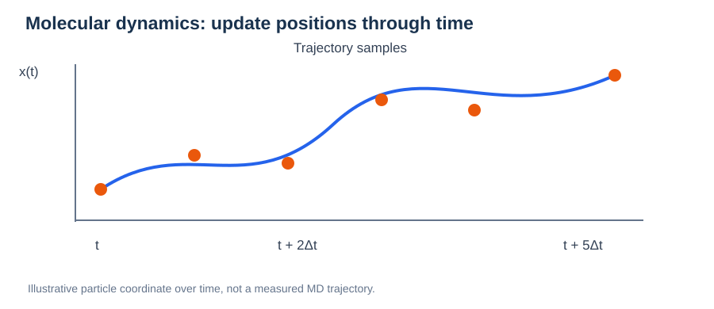
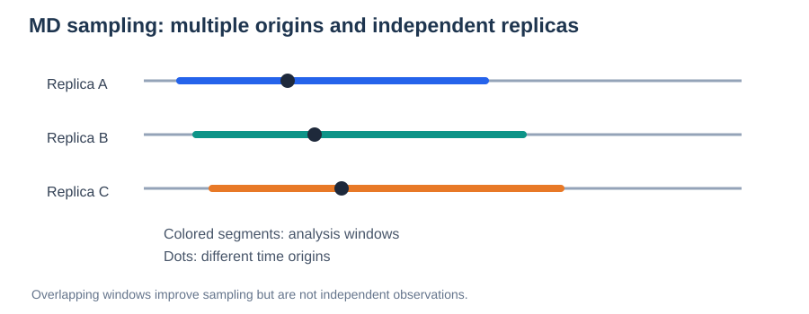
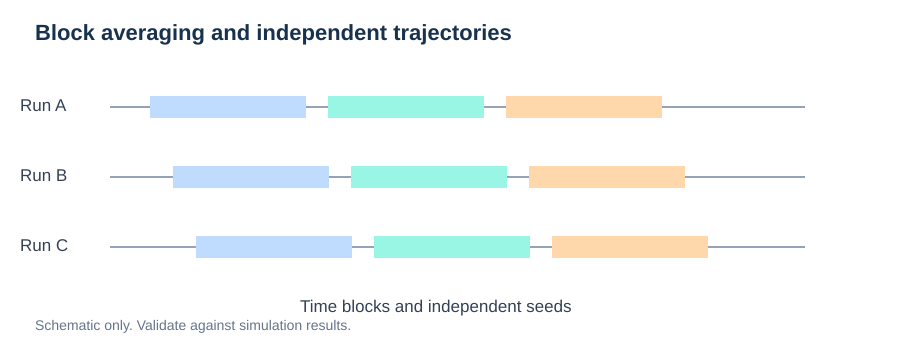

# Molecular Dynamics (MD) Fundamentals

> **Module:** Methods · **Prerequisites:** [PES](../01-physical-foundations/01-potential-energy-surface.md), [Forces](../01-physical-foundations/02-forces-and-gradients.md), [PBC](../01-physical-foundations/03-periodic-boundary-conditions.md)  
> **Next:** [Statistical Ensembles](03-statistical-ensembles.md) · [Diffusion and MSD](../05-transport-properties/01-diffusion-and-msd.md)

## Learning goals

Understand Newtonian trajectories, timesteps, Velocity Verlet, temperature, equilibration, and how to interpret simulated motion versus diffusion.



*Figure 1. Schematic time series of a particle coordinate. MD integrates equations of motion rather than optimizing a static pathway.*

## 1. Equations of motion

In classical MD, atoms evolve under forces derived from a potential energy function:

```math
m_i\frac{d^2\mathbf r_i}{dt^2}=\mathbf F_i=-\nabla_{\mathbf r_i}E(\mathbf R).
```

Positions $\mathbf r_i(t)$ and velocities $\mathbf v_i(t)$ are updated at discrete intervals $\Delta t$.

## 2. Velocity Verlet

A common integrator is:

```math
\mathbf r(t+\Delta t)=\mathbf r(t)+\mathbf v(t)\Delta t+\frac{\mathbf F(t)}{2m}\Delta t^2.
```

After recomputing force at the new position:

```math
\mathbf v(t+\Delta t)=\mathbf v(t)+\frac{\mathbf F(t)+\mathbf F(t+\Delta t)}{2m}\Delta t.
```

This is a reversible, symplectic-style integration scheme for ordinary conservative dynamics; thermostats and constraints can modify its behavior.

## 3. Choosing the timestep

The timestep should resolve the fastest relevant atomic motion. Hydrogen-containing systems often require shorter timesteps than heavy-atom systems. Too-large steps lead to integration error or instability; tiny steps increase cost without necessarily improving sampling efficiency.

Check total-energy drift in a representative NVE trajectory, in addition to physically sensible structural dynamics.

## 4. Temperature and kinetic energy

The instantaneous kinetic temperature is estimated from kinetic energy:

```math
T=\frac{2K}{f k_{\mathrm B}},\qquad K=\sum_i\frac12m_i|\mathbf v_i|^2.
```

Here $f$ is the number of active quadratic kinetic degrees of freedom, corrected for applicable constraints and removed motions. A finite system's instantaneous temperature fluctuates.

## 5. Equilibration versus production

**Equilibration** allows a system to approach an appropriate stationary distribution under selected conditions. **Production** collects trajectories used for analysis. Duration requirements depend on the property: stable temperature is not evidence that rare diffusion events have been sampled adequately.

### Statistical sampling and uncertainty



*Figure. Multiple runs and time origins improve sampling; overlapping time windows from the same run remain correlated.*

For diffusion, average over particles and multiple time origins, but do not treat every overlapping displacement as an independent measurement. Where possible, use independently seeded trajectories or independent glass realizations to quantify between-replica variability.

A simple uncertainty estimate from $M$ approximately independent diffusivity estimates is:

```math
\overline D=\frac{1}{M}\sum_{j=1}^M D_j,\qquad \mathrm{SE}(\overline D)\approx\frac{s_D}{\sqrt M}.
```

Here $s_D$ is the sample standard deviation across independent estimates. Correlated replicas or too few activated hops invalidate a naive standard error.

**Practical diagnostics:** inspect the MSD fit-window sensitivity, hop counts, direction-resolved MSDs, and uncertainty across independent simulations. A stable temperature and low energy drift alone do not imply converged transport.


## 6. MD outputs are observables only after analysis

| From trajectories | Analysis |
| --- | --- |
| Unwrapped positions | MSD and self-diffusion |
| Pair distances | RDF and coordination statistics |
| Velocities | Velocity autocorrelation |
| Atomic fluctuations | Vibrational and structural information |
| Charge-weighted displacements | Collective conductivity estimates |

## 7. AIMD versus MLIP-MD

AIMD usually obtains forces from electronic structure repeatedly, while MLIP-MD evaluates a trained force model. MLIPs allow longer trajectories but require validation for the relevant compositions, temperatures, and local environments.

## Pitfalls

- Calculating MSD from wrapped coordinates.
- Mistaking a short trajectory with no jumps for zero true diffusivity.
- Fitting MSD before reaching the diffusive regime.
- Ignoring thermostat effects and inadequate sampling.

## Review questions

1. What is the difference between a numerical timestep and an ion-hop waiting time?
2. Why should one test energy drift in NVE?
3. How can a trajectory have accurate forces but inadequate diffusion statistics?
4. Why can an MD simulation at high temperature fail to represent room-temperature transport?

**Next:** [Statistical Ensembles](03-statistical-ensembles.md).

---

## Advanced Practice: Correlation Time and Effective Sampling



*Figure. Block partitioning and multiple trajectories can reveal variability; neighboring blocks may remain correlated.*

Two million trajectory frames are not two million independent observations. For a stationary scalar observable $A(t)$, a normalized autocorrelation function can be written as:

```math
C_A(t)=\frac{\langle\delta A(t_0+t)\,\delta A(t_0)\rangle}{\langle\delta A(t_0)^2\rangle},\qquad \delta A=A-\langle A\rangle.
```

The integrated autocorrelation time helps estimate statistical efficiency:

```math
\tau_{\mathrm{int}}=\int_0^\infty C_A(t)\,dt.
```

For a sufficiently long stationary trajectory of duration $T_{\mathrm{obs}}$, an approximate effective sample count is $N_{\mathrm{eff}}\sim T_{\mathrm{obs}}/(2\tau_{\mathrm{int}})$. This heuristic depends on the observable, normalization convention, and correlation behavior; it is not reliable if rare transport events have not been sampled.

### What counts as independent data?

Overlapping MSD time origins are **correlated** because they share trajectory segments. Independent glass quenches, starting velocities, or separate long simulations often provide a stronger uncertainty assessment. Compare fitted diffusivities among replicas, not only thousands of overlapping lag windows.

### Finite-temperature sampling checklist

| Check | Reason |
| --- | --- |
| Equilibration stability | Avoid transient drift in structure |
| Timestep and NVE drift | Identify integration artifacts |
| Thermostat sensitivity | Detect altered time correlations |
| Diffusive MSD window | Separate vibrations and plateau behavior from diffusion |
| Independent replicas | Estimate between-sample uncertainty |
| Hop/residence statistics | Diagnose rare events and trapping |

**Research example:** For amorphous Li–O–Hf–Cl, sample independent glass structures. A single fast-moving Li ion in one glass does not guarantee a representative bulk conductivity.

---

## Numerical Time Integration and Uncertainty

Time discretization affects trajectories even when the force model is exact. A finite timestep $\Delta t$ approximates the continuous equations of motion. Check stability and representative NVE energy drift as $\Delta t$ changes, but remember that small energy drift alone does not prove convergence of rare hopping rates.

For an estimated observable $\overline A$ formed from $M$ approximately independent replica estimates $A_i$:

```math
\mathrm{SE}(\overline A)\approx\frac{s_A}{\sqrt M}.
```

This familiar standard error is not valid if the $A_i$ are strongly correlated or fail to sample the process of interest. For correlated trajectory blocks, use block-length sensitivity or other autocorrelation-aware analyses. For rare events, report event counts and waiting-time evidence before fitting macroscopic transport parameters.

**Avoid a false precision trap:** a long numerical trajectory is not necessarily a statistically converged diffusion estimate, especially when an ion remains trapped for nearly the entire run.
