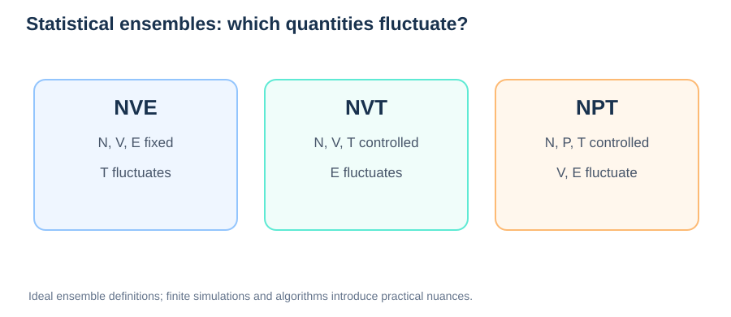
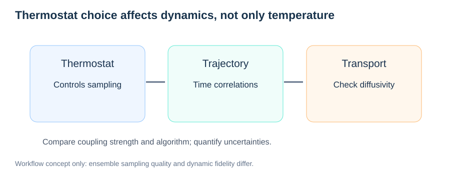

# Statistical Ensembles: NVE, NVT, and NPT

> **Module:** Methods · **Prerequisites:** [MD Fundamentals](02-molecular-dynamics.md)  
> **Next:** [Diffusion and MSD](../05-transport-properties/01-diffusion-and-msd.md)

## Learning goals

Distinguish physical ensembles, controlled thermodynamic variables, thermostats and barostats, equilibrium sampling, and their implications for dynamical properties.



*Figure 1. Controlled thermodynamic quantities and typical fluctuating variables in three common ensembles.*

## 1. What is an ensemble?

An ensemble is a statistical description of many possible microscopic states compatible with specified macroscopic constraints. An MD trajectory can approximate samples from an intended ensemble if the simulation algorithm and equilibration are suitable.

| Ensemble | Fixed macroscopic quantities | Typical MD implementation |
| --- | --- | --- |
| Microcanonical (NVE) | Particle number, volume, total energy | Energy-conserving dynamics |
| Canonical (NVT) | Particle number, volume, temperature parameter | Thermostat |
| Isothermal–isobaric (NPT) | Particle number, pressure, temperature parameter | Thermostat and barostat |

The ensemble specifies a **distribution**, not that every instantaneous variable is constant. In NVT, instantaneous kinetic temperature and energy fluctuate.

## 2. Canonical statistics

For a classical state with Hamiltonian $H$, the canonical probability density is proportional to:

```math
P(\mathbf R,\mathbf P)\propto\exp[-\beta H(\mathbf R,\mathbf P)],\qquad\beta=\frac{1}{k_{\mathrm B}T}.
```

The thermostat should sample the intended equilibrium distribution, but different algorithms alter the dynamical trajectory.

## 3. Thermostats



*Figure 2. Thermostat choice can affect time-dependent observables even when equilibrium temperature distributions appear well controlled.*

### Ensemble accuracy vs transport accuracy

A correct equilibrium distribution does not guarantee undisturbed real-time correlations. Stochastic thermostats can perturb velocity autocorrelations and jump rates. A careful diffusion study reports coupling times and compares different strengths or NVE production runs after equilibration. Interpret differences alongside finite sampling errors, not from a single trajectory.


| Thermostat | Main idea | Caution |
| --- | --- | --- |
| Nosé–Hoover | Extended-system deterministic dynamics | May be nonergodic for some small systems |
| Langevin | Adds friction and stochastic forces | Can alter time correlations and diffusion |
| Stochastic velocity rescaling | Controls temperature statistically | Coupling parameters affect dynamics |

**Temperature control and physically faithful dynamics are not the same objective.** If diffusion is the observable, test sensitivity to thermostat type and coupling strength or use equilibrated NVE production where appropriate.

## 4. Barostats and cell volume

NPT allows box dimensions to fluctuate in response to the chosen pressure/temperature conditions. This is useful for density relaxation, thermal expansion, and equation-of-state calculations.

For a surface slab with vacuum, generic three-dimensional isotropic pressure coupling is often physically inappropriate. Fixed-area or constrained-cell approaches may be more suitable.

## 5. Why this matters for diffusion

Diffusivity depends on structure and dynamics. NPT changes the volume distribution, which may alter ion channels and migration barriers; thermostat parameters can change dynamical correlations.

A useful study is to compare converged ensembles and check whether observed differences exceed sampling uncertainty.

## 6. Diagnostic checks

- Track instantaneous temperature, volume, total energy, and pressure.
- Check long-time stationarity and equilibration.
- Assess reproducibility across starting seeds.
- Examine NVE energy drift.
- State thermostat/barostat algorithms and coupling times.
- Test diffusion against ensemble and thermostat choices.

## Review questions

1. Why is instantaneous temperature not constant in NVT?
2. Why might a Langevin thermostat alter diffusion?
3. What is the role of a barostat in NPT?
4. When would isotropic NPT be unsuitable for a surface slab?

**Continue:** [Diffusion and MSD](../05-transport-properties/01-diffusion-and-msd.md).
