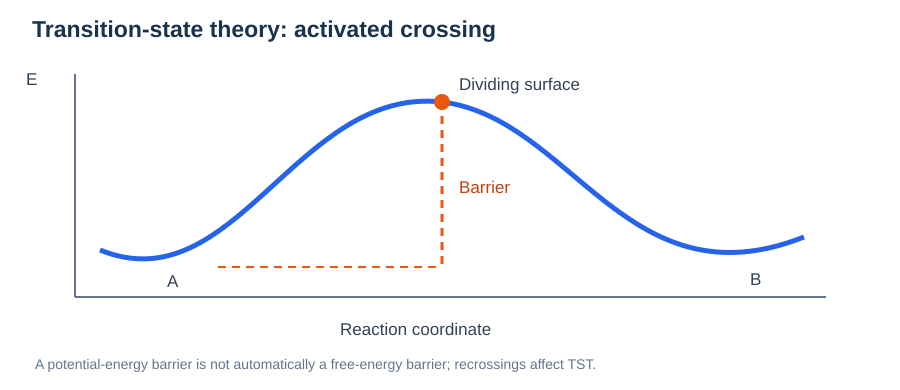
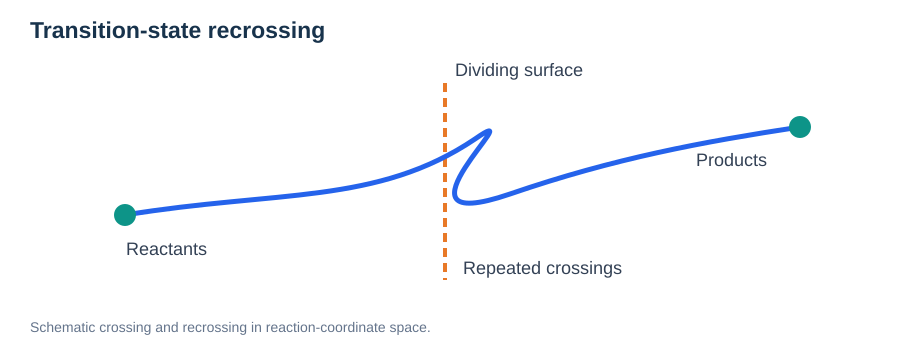

# Transition-State Theory (TST) and Kinetic Rates

> **Module:** Methods · **Prerequisites:** [PES](../01-physical-foundations/01-potential-energy-surface.md), [Reaction Coordinates](../01-physical-foundations/05-reaction-coordinates-and-saddle-points.md), [NEB](04-neb.md)  
> **Related:** [Diffusion and MSD](../05-transport-properties/01-diffusion-and-msd.md)

## Learning goals

Connect saddle points to jump rates, distinguish potential-energy from free-energy barriers, and understand prefactors, recrossing, and the limits of interpreting one NEB result as macroscopic transport.



*Figure 1. Schematic activated process and dividing surface; crossing events may recross before producing a lasting state transition.*

## 1. From energy barriers to rates

An elementary activated event is often approximately modeled as:

```math
k(T)\approx\nu(T)\exp\left[-\frac{E_m}{k_{\mathrm B}T}\right].
```

$E_m$ is a potential-energy barrier and $\nu(T)$ an effective attempt frequency. This Arrhenius-like expression is an approximation with assumptions about entropy, mechanisms, and prefactors.

## 2. Free-energy form of transition-state theory

A canonical TST expression for a suitably defined reaction coordinate and standard-state treatment is:

```math
k_{\mathrm{TST}}(T)=\frac{k_{\mathrm B}T}{h}\exp\left[-\frac{\Delta G^\ddagger(T)}{k_{\mathrm B}T}\right].
```

Here $\Delta G^\ddagger$ is the activation **free-energy** difference. This expression includes entropic contributions that are not automatically present in a zero-temperature NEB barrier.

Actual rate conventions may absorb degeneracy and standard-state factors into the prefactor or free-energy definition.

## 3. Harmonic transition-state theory (HTST)

In the harmonic approximation, one can use vibrational frequencies around a minimum and a first-order saddle to estimate the rate prefactor. For a classical system with consistent treatment of zero modes:

```math
k_{\mathrm{HTST}}\approx\frac{\prod_{j}^{\mathrm{stable}}\nu_j^{(\mathrm A)}}{\prod_{j}^{\mathrm{stable}}\nu_j^{(\mathrm{TS})}}\exp\left[-\frac{E_m}{k_{\mathrm B}T}\right].
```

The stable-mode products and their normalization must be treated consistently; the single unstable saddle mode is excluded. The exact prefactor convention depends on mode counting and treatment of translations.

## 4. Recrossing and dynamical correction



*Figure 2. Crossing a dividing surface is not always a committed transition: trajectories may recross and return to their original basin.*

### Potential-energy barriers versus free-energy barriers

An NEB calculation generally provides a minimum-potential-energy path for a chosen structure and model. The finite-temperature free-energy barrier includes entropic and other thermal effects:

```math
\Delta G^\ddagger(T)=\Delta H^\ddagger(T)-T\Delta S^\ddagger(T).
```

The activation free energy is therefore not necessarily equal to the zero-temperature NEB energy barrier. Harmonic vibrational analysis is one approximation for estimating thermal contributions; anharmonicity and multiple pathways can matter for mobile-ion conductors.


TST assumes that positive crossings of a dividing surface lead to product formation without recrossing. Real trajectories may cross back, giving a transmission coefficient $\kappa$:

```math
k_{\mathrm{actual}}\approx\kappa\,k_{\mathrm{TST}},\qquad 0\leq\kappa\leq1.
```

The simple inequality applies to a conventional reactive-flux correction and is not a universal statement for every non-Markovian kinetic model.

## 5. Networks of hops

An ion may encounter several local minima and multiple edges in a transition network. The global diffusion coefficient depends on site populations, hop distances, network connectivity, correlations, and the set of directional rates — not on the lowest isolated barrier alone.

A master equation for state probabilities $p_i$ is:

```math
\frac{dp_i}{dt}=\sum_{j\neq i}\left(k_{j\to i}p_j-k_{i\to j}p_i\right).
```

For disordered materials, many barriers and kinetic pathways may be needed; kinetic Monte Carlo can combine transition rates across a longer time scale when their assumptions are valid.

## 6. What NEB provides and what it does not

| NEB result | Additional information required for rates |
| --- | --- |
| Local MEP and saddle geometry | Vibrational/entropic information |
| Potential-energy barrier | Rate prefactor and finite-T corrections |
| Candidate microscopic mechanism | Competing channels, occupancy, connectivity |
| Relative barriers under consistent settings | Statistical validation and uncertainty |

## Review questions

1. How does $\Delta G^\ddagger$ differ from $E_m$?
2. What does a TST transmission coefficient represent?
3. Why do two hops with the same barrier potentially have different rates?
4. Why is a network of hops needed to predict conductivity in amorphous solids?

## Further reading

- [Eyring equation](https://en.wikipedia.org/wiki/Eyring_equation)
- [Climbing-image NEB original paper](https://doi.org/10.1063/1.1329672)

**Related:** [NEB](04-neb.md) and [Diffusion, MSD, and Ionic Transport](../05-transport-properties/01-diffusion-and-msd.md).
