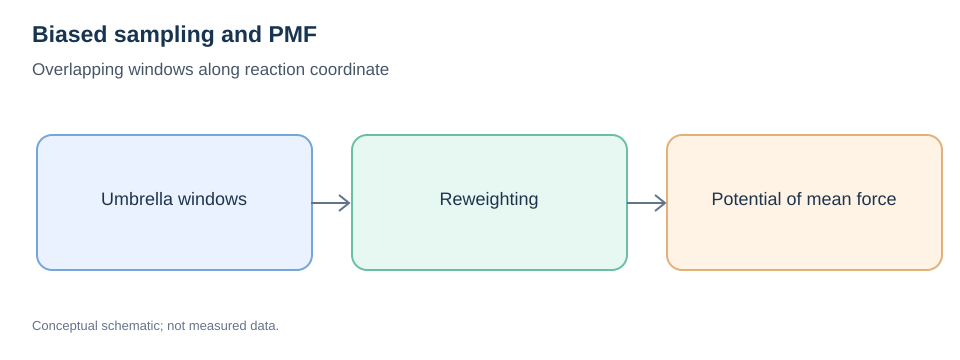
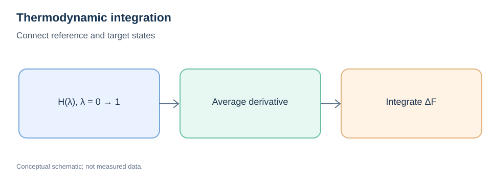
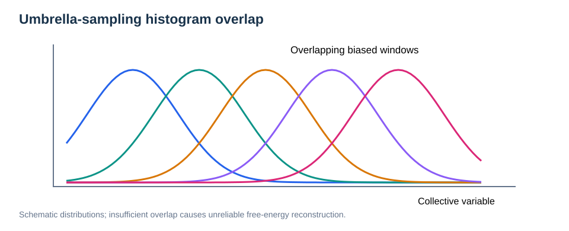

# Free-Energy Calculation Methods

> **Prerequisites:** [Thermodynamics](../01-physical-foundations/07-thermodynamics-fundamentals.md), [Statistical Mechanics](../01-physical-foundations/08-statistical-mechanics-fundamentals.md), [MD](02-molecular-dynamics.md)  
> **Related:** [PES and NEB](04-neb.md), [Transition-State Theory](05-transition-state-theory.md).

## Learning objectives

Distinguish potential-energy and free-energy profiles; understand collective variables, potential of mean force, umbrella sampling, reweighting, metadynamics, thermodynamic integration, overlap diagnostics and uncertainty.

## 1. Why NEB is not a free-energy calculation

A minimum-energy path connects stationary configurations on a PES. A free-energy landscape accounts for the statistical weight of configurations at finite temperature. The entropy of rearrangements orthogonal to a selected coordinate can change barriers and basin populations.

For a collective variable $s(\mathbf R)$, a PMF can be defined by:

```math
F(s)=-k_{\mathrm B}T\ln P(s)+C.
```

Here $P(s)$ is an equilibrium probability density in the specified ensemble and coordinate measure. The constant $C$ is arbitrary; only differences within a consistent definition are meaningful.

## 2. Collective variables and reaction coordinates

A collective variable (CV) may be a distance, angle, coordination number, local order parameter, or combination thereof. A useful CV distinguishes metastable states and captures the slow transition mechanism; a poor CV can hide orthogonal barriers and cause hysteresis.

**Important:** A convenient geometric coordinate is not guaranteed to be a correct reaction coordinate.

## 3. Umbrella sampling



*Figure 1. Overlapping biased windows enhance sampling of otherwise rare states.*

In window $k$, add a harmonic bias around $s_k$:

```math
W_k(s)=\frac12K_k(s-s_k)^2.
```

Each window samples a biased distribution. Recover the unbiased PMF by statistically combining data (for example, using WHAM or MBAR) with correct bias potentials, temperature and normalization.

**Validation checklist:** adjacent histogram overlap, equilibration of each window, independent starts, CV coverage, hysteresis checks, and bootstrap/block uncertainty. Merely placing many windows does not guarantee correct sampling when hidden orthogonal barriers are unsampled.

## 4. Metadynamics

Metadynamics introduces a history-dependent bias to discourage revisiting previously sampled CV regions. An illustrative Gaussian bias is:

```math
V_{\mathrm{bias}}(s,t)=\sum_{t_k<t}w_k\exp\!\left[-\frac{(s-s(t_k))^2}{2\sigma_k^2}\right].
```

Well-tempered metadynamics modifies bias heights to improve convergence. Free-energy reconstruction and kinetics require method-specific assumptions and reweighting; a raw biased trajectory is generally **not** a physical-rate trajectory.

## 5. Thermodynamic integration (TI)



*Figure 2. An alchemical or model interpolation connects two equilibrium states.*

For a differentiable Hamiltonian $H(\lambda)$ along a reversible equilibrium pathway:

```math
F(1)-F(0)=\int_0^1\left\langle\frac{\partial H}{\partial\lambda}\right\rangle_\lambda\,d\lambda.
```

The averaging ensemble and interpolation path must be compatible. Singular endpoint interactions, poor overlap and phase transitions can compromise numerical integration.

## 6. Choosing the method

| Goal | Method | Central caveat |
| --- | --- | --- |
| Static saddle on PES | NEB / CI-NEB | Not a finite-T free energy |
| Free-energy profile along a CV | Umbrella sampling / WHAM or MBAR | Requires overlap and sufficient equilibration |
| Explore multiple CV basins | Metadynamics | CV choice and reweighting matter |
| Free-energy difference between reference systems | TI | Reversible path and integrand convergence |
| Elementary kinetic rate | TST or reactive-flux methods | Recrossing and prefactors matter |

## 7. Example without a material-specific system

Consider a particle transitioning between two coordination basins in a flexible lattice. NEB yields a zero-temperature path through a saddle. Umbrella sampling at fixed $T$ can estimate the PMF along a chosen coordination-related CV, allowing surrounding atoms to fluctuate. The two barrier estimates may differ because the latter integrates over many configurations, not just a single optimized path.

## 8. Reliability and reporting

State CV definitions, ensemble, thermostat, sampling length, bias parameters, independent starts, uncertainty methodology, and any observed hysteresis. Distinguish a **free-energy difference** from a **rate**: a barrier alone does not encode all dynamical recrossing or transport correlations.

## Enhanced Sampling: Overlap, Hysteresis and Convergence



*Figure. Overlapping biased distributions enable statistically connected reweighting; poor overlap leaves uncertain free-energy regions.*

In umbrella sampling the unbiased probability along $s$ is recovered by accounting for the bias $W_k(s)$. For a single biased distribution measured under the same reference temperature, a schematic reweighting relationship is

```math
P_0(s)\propto P_k^{\mathrm{bias}}(s)\,\exp[\beta W_k(s)].
```

Proper normalization and multiwindow combination are required. WHAM and MBAR use bias information across overlapping windows rather than independently stitching unnormalized histograms.

### Hidden barriers and hysteresis

Even extensive sampling along one collective variable can miss slow orthogonal rearrangements. Compare sampling initiated from both sides of a transition, use multiple independent starts, and inspect whether free-energy estimates depend on history. Converged histogram appearance is not enough if slow modes remain trapped.

### Effective sample size and error bars

Correlated samples reduce the effective information in reweighting. Block-bootstrap or autocorrelation-aware uncertainty estimates are preferable to treating every MD frame as independent. Test sensitivity to umbrella spacing, spring constants, run lengths and CV definition.

### Metadynamics caution

History-dependent bias allows exploration of difficult states, but biased event counts are generally not unbiased physical rate estimates. Kinetics recovery requires dedicated assumptions and reweighting or infrequent-bias methods where appropriate.


## Integrating Free-Energy Sampling with Microkinetics

A free-energy profile from umbrella sampling or metadynamics characterizes the reversible statistical cost of a collective-variable change. It does **not** automatically yield a reaction rate: a kinetic model also needs appropriate dynamical assumptions, prefactors and possible recrossing corrections.

For a simple activated event, under transition-state assumptions:

```math
k_{\rm TST}=\frac{k_{\rm B}T}{h}\exp(-\beta\Delta G^\ddagger).
```

**Do not** take the highest value of an arbitrary one-dimensional PMF as a universal rate barrier without checking the coordinate measure, dividing surface and hidden slow degrees of freedom.

For reaction networks with several intermediates, compute relative basin free energies and directional rates under consistent reference conventions, then solve a master equation or surface population balances.

**Related:** [Microkinetics and Electrochemical Reaction Fundamentals](07-microkinetics-and-electrocatalysis.md).

## Review questions

1. Why can entropy change the apparent barrier?
2. What does histogram overlap indicate in umbrella sampling?
3. Why do biased metadynamics trajectories not directly yield unbiased jump rates?
4. Which quantity is averaged in TI?
5. When could a one-dimensional PMF be misleading?

**Related:** [Statistical Mechanics](../01-physical-foundations/08-statistical-mechanics-fundamentals.md) · [NEB](04-neb.md).
