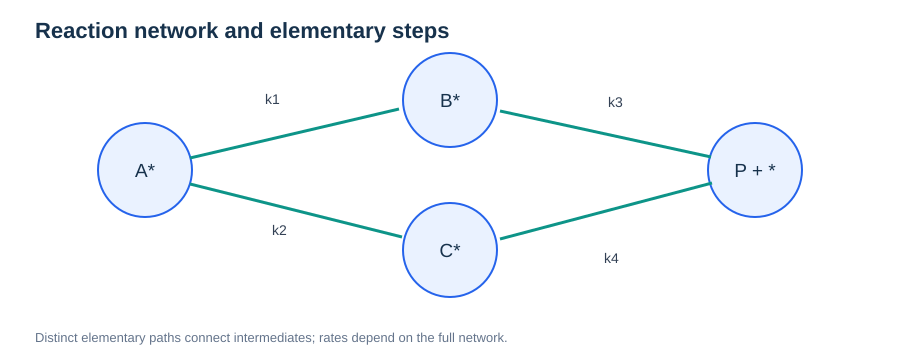
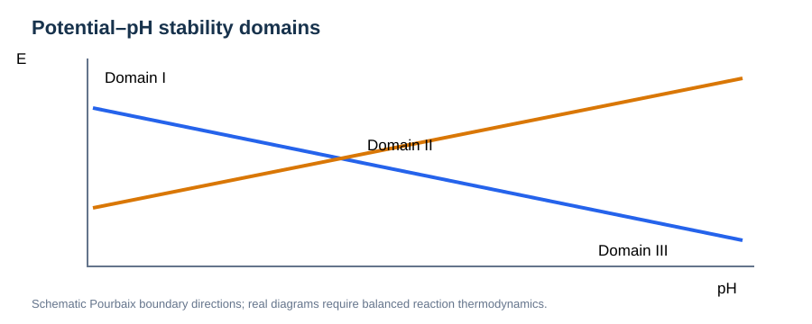
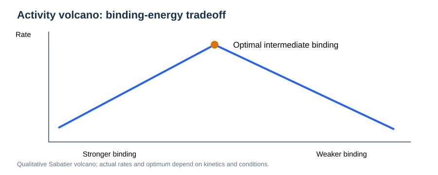

# Microkinetics and Electrochemical Reaction Fundamentals

> **Prerequisites:** [Thermodynamics](../01-physical-foundations/07-thermodynamics-fundamentals.md), [Statistical Mechanics](../01-physical-foundations/08-statistical-mechanics-fundamentals.md), [Transition-State Theory](05-transition-state-theory.md), [Surfaces](../04-materials-interfaces/02-surfaces-and-slabs.md).

## Learning objectives

Connect adsorption thermodynamics, reaction free energies, elementary transition rates, surface coverages, steady states, electrode potentials, detailed balance, volcano relations, and Pourbaix stability. All examples use generic chemical species.

## 1. Elementary reactions and reaction networks



*Figure 1. Competing pathways couple surface intermediates; one isolated barrier does not determine the overall reaction rate.*

For adsorption $\mathrm{A(g)+*\rightleftharpoons A*}$, the available sites obey $\theta_*+\theta_A=1$. With independent sites and no lateral interactions, one ideal kinetic model is:

```math
r_{\mathrm{ads}}=k_{\mathrm{ads}}p_A\theta_*,\qquad r_{\mathrm{des}}=k_{\mathrm{des}}\theta_A.
```

At adsorption equilibrium the rates match, so with $K=k_{\mathrm{ads}}/k_{\mathrm{des}}$:

```math
\theta_A=\frac{Kp_A}{1+Kp_A}.
```

This Langmuir isotherm is not universal: dissociation, nonideal sites, electrostatic interactions and lateral coverage effects change it.

## 2. Steady-state microkinetics

A network of elementary rate expressions is summarized by:

```math
\frac{d\boldsymbol\theta}{dt}=\mathbf S\mathbf r(\boldsymbol\theta,T,\mathbf p,U),
```

where $\mathbf S$ is the stoichiometric matrix and $\mathbf r$ contains rates. **Steady state** means vanishing net population changes, not that each forward/backward elementary rate is zero.

Under consistent state definitions, thermodynamic detailed balance at equilibrium implies:

```math
\frac{k_{i\to j}}{k_{j\to i}}=\exp\!\left[-\frac{G_j-G_i}{k_{\mathrm B}T}\right].
```

Site degeneracies and standard-state conventions must be incorporated into the state free energies or prefactors.

## 3. Reaction-rate theory and uncertainty

An activated elementary step may approximately follow:

```math
k(T)\approx\frac{k_{\mathrm B}T}{h}\exp\!\left[-\frac{\Delta G^\ddagger}{k_{\mathrm B}T}\right].
```

Recrossing, solvent dynamics, adsorbate interactions and nonadiabatic electron transfers can make this estimate inaccurate. Increasing or decreasing a single barrier changes the *network* response in a coverage-dependent way; consequently, the notion of a single rate-determining step may be inadequate.

## 4. Electrochemical potential and electrode conditions

For a species of charge number $z_i$ and per-particle chemical potential $\mu_i$, the electrochemical potential is:

```math
\widetilde\mu_i=\mu_i+z_ie\phi.
```

Reference-potential conventions matter. For a well-defined $n$-electron process, a common idealized potential dependence is $\Delta G(U)=\Delta G(U_{\rm ref})-ne(U-U_{\rm ref})$ under a specified electron-sign convention. In realistic interfaces, double-layer charging and explicit solvent effects can invalidate simple linear behavior.

## 5. Pourbaix thermodynamics



*Figure 2. Qualitative potential–pH stability boundaries; a Pourbaix diagram contains equilibrium information, not kinetic rate constants.*

The Nernst equation for a balanced reaction is:

```math
E=E^\circ-\frac{RT}{nF}\ln Q,
```

with **dimensionless activities** in $Q$. Stability diagrams require consistent chemical reservoirs, proton and electron bookkeeping, and solid/aqueous reference states.

## 6. Binding-strength volcanoes



*Figure 3. Binding that is too strong or too weak can reduce a network's turnover under particular conditions.*

The Sabatier principle motivates activity volcanoes, but no universal curve applies across arbitrary reaction networks. Thermodynamic scaling relations, prefactors, coverage dependence and electric potential can change the maximum.

## 7. Computational workflow and reporting

Specify the reaction network and available sites; calculate referenced intermediate free energies; derive and check reversible rates; solve steady-state balances; report coverages, turnover frequencies and sensitivities. Propagate uncertainties in both energies and kinetic prefactors. Keep model assumptions, pressure/temperature/potential references and electrostatic conventions explicit.

## Review questions

1. Derive the one-site Langmuir isotherm.
2. Why does a steady state differ from thermodynamic equilibrium?
3. How do multiple pathways invalidate a universal “rate-determining step”?
4. Why can a Pourbaix diagram not predict reaction speed?
5. What role does potential reference choice play in electrochemical free energies?

## Further reading

- [Transition-State Theory](05-transition-state-theory.md)
- [Surface Thermodynamics](../04-materials-interfaces/02-surfaces-and-slabs.md)
- Related public workflows: [microkinetics_toolkit](https://github.com/ishikawa-group/microkinetics_toolkit) and [pourbaix-builder](https://github.com/ishikawa-group/pourbaix-builder).
