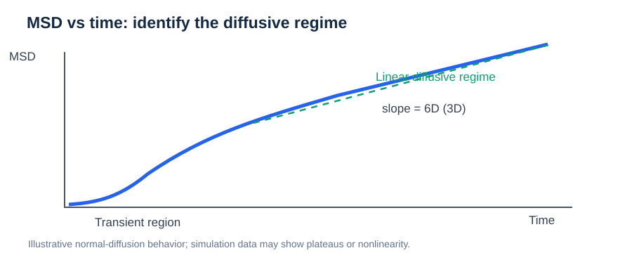
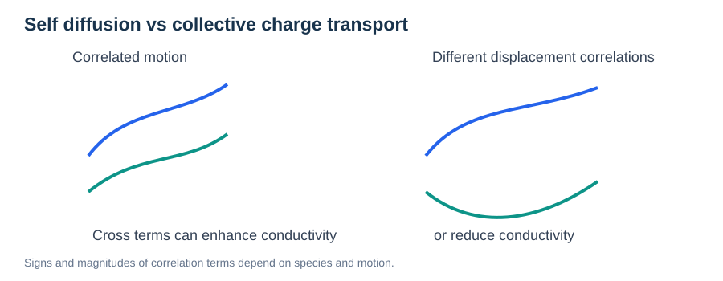
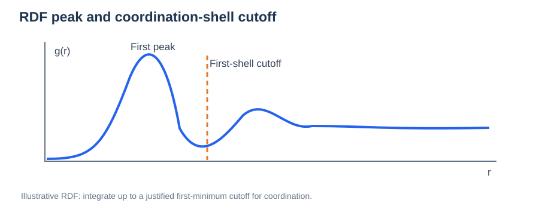

# Diffusion, Mean-Squared Displacement, and Ionic Transport

> **Prerequisite:** [Potential Energy Surfaces](../01-foundations/01-potential-energy-surface.md)  
> **Related:** [NEB](../02-methods/02-neb.md)

## 1. Diffusion describes statistical motion

A migration barrier characterizes a **specific microscopic pathway**. A diffusion coefficient measures how the spread of particle positions grows over time after suitable averaging.

For particle $i$, define its displacement over lag time $t$:

```math
\Delta\mathbf r_i(t;t_0)=\mathbf r_i(t_0+t)-\mathbf r_i(t_0).
```

For a set of equivalent mobile ions, the time-origin- and particle-averaged mean-squared displacement (MSD) is:

```math
\mathrm{MSD}(t)=\left\langle |\Delta\mathbf r_i(t;t_0)|^2\right\rangle_{i,t_0}.
```

The displacement must be computed using **unwrapped positions** across periodic boundaries.

## 2. Einstein relation



*Figure. Schematic MSD evolution; the diffusivity must be obtained from an appropriate long-time linear regime.*


For normal, isotropic three-dimensional diffusion in the long-time diffusive regime:

```math
D=\lim_{t\to\infty}\frac{\mathrm{MSD}(t)}{6t}.
```

If MSD has a linear regime, its slope is $6D$. The factor changes with dimensionality: $2dD$ for isotropic diffusion in $d$ dimensions.

**Never fit the initial ballistic or vibrational region and call the result a diffusion coefficient.** Assess whether an actual linear diffusive regime has emerged.

## 3. Directional diffusion

At a surface or interface, in-plane and surface-normal transport may differ:

```math
D_{\parallel}=\lim_{t\to\infty}\frac{\langle\Delta x^2+\Delta y^2\rangle}{4t},\qquad D_{\perp}=\lim_{t\to\infty}\frac{\langle\Delta z^2\rangle}{2t}.
```

These expressions apply when the corresponding directions exhibit normal diffusion. A confined direction can show a plateau rather than long-time unbounded diffusion.

## 4. From self-diffusion to conductivity



*Figure 2. Different cross-correlations between ionic displacements can increase or decrease net charge transport relative to an independent-particle estimate.*

### Correlated displacement terms and transport

Expanding the collective charge-displacement square shows self terms and cross terms:

```math
\left|\sum_i q_i\Delta\mathbf r_i\right|^2=\sum_i q_i^2|\Delta\mathbf r_i|^2+\sum_{i\ne j}q_iq_j\,\Delta\mathbf r_i\cdot\Delta\mathbf r_j.
```

The Nernst–Einstein approximation neglects distinct-particle displacement correlations; a collective Einstein–Helfand estimate retains them. Define the convention clearly when reporting a correlation factor $f_{\mathrm{corr}}=\sigma_{\mathrm{coll}}/\sigma_{\mathrm{NE}}$. It may be above or below unity, and should not be confused with a reciprocally defined Haven ratio.


The Nernst–Einstein (NE) estimate for identical mobile ions is:

```math
\sigma_{\mathrm{NE}}=\frac{nq^2 D_{\mathrm{self}}}{k_{\mathrm B}T},
```

where $n$ is the carrier number density and $q$ is the ionic charge. NE neglects distinct-ion displacement correlations.

Actual collective conductivity includes correlated motion; for a charge-neutral periodic system an Einstein–Helfand-type formulation is:

```math
\sigma=\lim_{t\to\infty}\frac{1}{6Vk_{\mathrm B}Tt}\left\langle\left|\sum_i q_i\Delta\mathbf r_i(t)\right|^2\right\rangle.
```

Care is required in defining transported charge and unwrapped trajectories for multi-species systems. For correlated transport, $\sigma/\sigma_{\mathrm{NE}}$ need not equal one.

### Structural interpretation: RDF and coordination number



*Figure. A schematic radial distribution function. The first minimum is often used as a cutoff for a first-shell coordination estimate.*

A radial distribution function $g_{\alpha\beta}(r)$ describes the relative occurrence of species $\beta$ at radial distance $r$ from species $\alpha$. For a homogeneous isotropic sample, the partial coordination number to radius $r_c$ is:

```math
N_{\alpha\beta}(r_c)=4\pi\rho_\beta\int_0^{r_c}g_{\alpha\beta}(r)\,r^2\,dr.
```

Here $\rho_\beta$ is the number density of species $\beta$. The chosen cutoff should be justified from the shell structure, and overlapping distributions may make a unique coordination assignment difficult.

For amorphous Li–O–Hf–Cl, Li–O and Li–Cl coordination statistics can help categorize migration environments. **A correlation between coordination and diffusivity is not itself proof of a causal migration mechanism**; combine local structure with residence times, hop statistics, and migration pathways.

### Comparing calculated and experimental activation energies

If a diffusion coefficient follows an Arrhenius law over a meaningful temperature range:

```math
D(T)=D_0\exp\left[-\frac{E_a}{k_{\mathrm B}T}\right].
```

The slope of $\ln D$ versus $1/T$ is $-E_a/k_{\mathrm B}$. A fitted $E_a$ describes the overall temperature dependence of the sampled transport regime; it need not match one specific NEB barrier, particularly when multiple hops, trapping, or correlations are important.


## 5. Why NEB does not directly output $D$

In a simple uncorrelated hopping model with equivalent sites and hop length $\ell$:

```math
D\approx\frac{z\ell^2\nu}{6}\exp\left(-\frac{E_m}{k_{\mathrm B}T}\right).
```

Here $z$ is the number of equivalent destinations and $\nu$ an attempt frequency. This is an **illustrative kinetic approximation**, not a general conversion from NEB barrier to conductivity. Site occupancy, trapping, network connectivity, entropy, and correlations matter.

## 6. Practical validation

- Plot MSD against time and show the selected fitting interval.
- Compare slopes across independent trajectories or glass realizations.
- Use appropriate lag-time averaging and uncertainty estimates.
- Separate diffusion along inequivalent axes.
- Check whether mobile species other than the target ion contribute to charge transport.
- Do not confuse proton transfer event frequency with a macroscopic proton diffusivity.

## Review questions

1. What is the difference between a hop barrier and a diffusion coefficient?
2. Why is position unwrapping essential under periodic boundary conditions?
3. Why can $\sigma_{\mathrm{NE}}$ and the collective conductivity differ?
4. What happens to the surface-normal MSD if ions remain confined?

**Related:** [NEB and migration barriers](../02-methods/02-neb.md).
