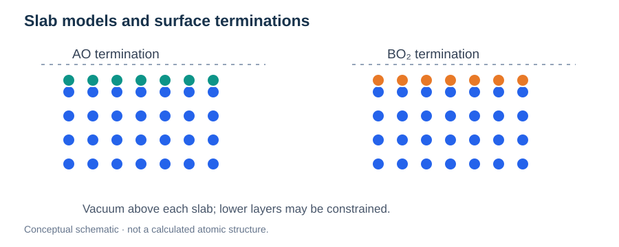
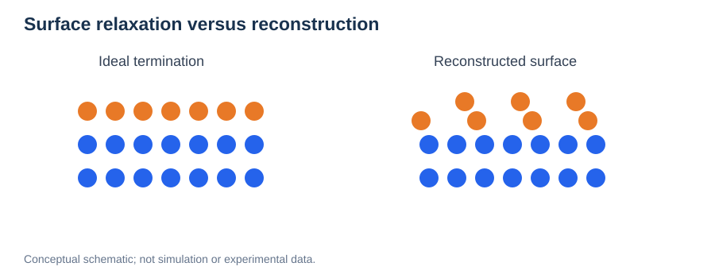
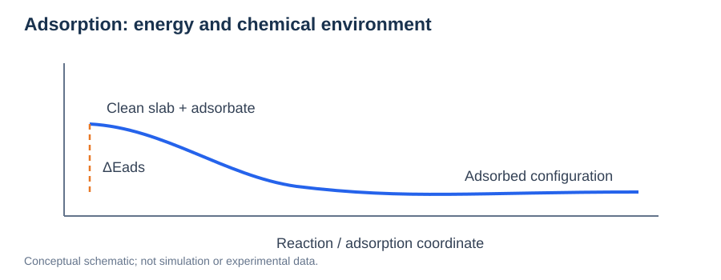
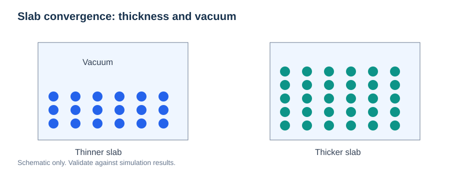

# Surfaces, Terminations, and Slab Models

> **Module:** Materials · **Prerequisites:** [Bulk Crystal Structures](01-bulk-crystal-structures.md), [PBC](../01-physical-foundations/03-periodic-boundary-conditions.md)  
> **Next:** [Interfaces](03-interfaces-and-heterostructures.md)

## Learning goals

Distinguish surface orientation from termination, construct reliable periodic slabs, understand surface energies and relaxations, and analyze direction-dependent proton or ion migration.



*Figure 1. Schematic of two possible stacking terminations. Actual BaZrO₃ terminations require chemically correct stoichiometry, bonding, and reconstruction.*

## 1. Orientation versus termination

An **orientation**, such as (001), specifies a crystallographic plane. A **termination** specifies which atomic layer appears at the exposed surface. In ideal cubic BaZrO₃, the (001) stacking can be described using alternating **BaO** and **ZrO₂** layers. Both are (001) surfaces but have different surface chemistry and coordination.

Real surfaces may reconstruct, adsorb hydroxyls or water, exchange oxygen, or develop charged/defective regions. Avoid treating an ideal cleaved slab as a unique experimental surface.

## 2. How a slab calculation works

A surface is often approximated by a finite-thickness slab repeated periodically in the plane, with a vacuum region along the surface normal. Check slab thickness, vacuum size, surface relaxation, and whether the model exposes one or two equivalent surfaces.

For a symmetric slab with two equivalent surfaces, a simplified cleavage/surface-energy expression is:

```math
\gamma=\frac{E_{\mathrm{slab}}-N E_{\mathrm{bulk}}}{2A}.
```

This expression assumes compatible bulk stoichiometry and chemical reference, two equivalent faces, and appropriate matching of bulk units. For inequivalent faces, nonstoichiometric slabs, or variable chemical environments, use an appropriate **surface grand potential** and chemical-potential bookkeeping instead.

## 3. Slab setup and numerical artifacts

| Variable | Why it matters |
| --- | --- |
| Slab thickness | Determines whether inner layers become bulk-like |
| Vacuum separation | Reduces interaction between periodic surfaces |
| Dipole correction | Can reduce artificial electrostatic fields in asymmetric slabs |
| Fixed lower layers | Mimics substrate/bulk constraint, but may affect relaxation |
| In-plane cell size | Controls dopant separation and lateral image effects |
| Surface coverage | Changes adsorption and hydrogen bonding |
| Termination/stoichiometry | Alters both thermodynamics and migration PES |

Converge the **observable of interest**, such as surface energy, adsorption energy, proton residence preference, or NEB barrier—not only the total energy.

## 4. Surface adsorption and hydration

Water and hydroxyls can change surface proton concentration and available pathways. A schematic adsorption energy is:

```math
E_{\mathrm{ads}}=E_{\mathrm{slab+ads}}-E_{\mathrm{clean\,slab}}-E_{\mathrm{adsorbate}}.
```

The definition depends on gas-phase or solution references, surface coverage, and whether dissociation occurs. Negative values under this convention indicate exothermic adsorption relative to the selected references, not necessarily experimental stability at finite temperature.

## 5. Transport parallel and normal to a surface

The in-plane and normal components of motion should be distinguished. In a genuinely diffusive regime, a directional Einstein relation gives:

```math
D_{\parallel}=\lim_{t\to\infty}\frac{\langle\Delta x^2+\Delta y^2\rangle}{4t}.
```

For motion along $z$, define $D_z$ only if unbounded normal diffusion exists. A finite slab with confinement can show a plateau in the $z$-MSD, in which case assigning an ordinary long-time diffusion coefficient is inappropriate.

**Surface residence** and **surface-to-subsurface transitions** are different observables. NEB can analyze a specific crossing; MD residence statistics characterize broader dynamical behavior.

## 6. BaZrO₃ case study: why termination matters

For hydrated BaZrO₃(001), compare BaO and ZrO₂ terminations with consistent slab and hydration conditions. Dopant depth may affect local stability and accessible normal migration routes. Important outputs include:

- Proton residence distribution by layer and oxygen environment.
- In-plane versus surface-normal MSD and residence times.
- Site-dependent proton transfer and OH reorientation barriers.
- Y–H proximity or association, checked against initial-condition bias.
- Connectivity across surface, subsurface, and bulk-like regions.

A lower local barrier does **not** automatically imply greater net proton transport across the surface.

## Surface Thermodynamics: Stability, Adsorption and Wulff Shapes

At equilibrium under a specified environment, surface stability is determined by the appropriate **surface excess free energy**, not simply the vacuum-slab total energy. If the slab can exchange species with reservoirs, define a surface grand potential with chemical potentials and the correct number of exposed faces.

For a simple one-species Langmuir adsorption model with noninteracting equivalent sites, the coverage can be expressed as

```math
\theta=\frac{KP}{1+KP},
```

where $P$ is an adsorbate pressure and $K$ has reciprocal-pressure units under this convention. Dissociative adsorption, lateral interactions, multiple sites and surface reconstructions generally require richer models.

### Wulff construction

The equilibrium shape of a crystal minimizes total surface free energy at fixed volume. The Wulff construction sets each facet's distance from the center proportional to its orientation-dependent surface free energy $\gamma(\hat{\mathbf n})$:

```math
h(\hat{\mathbf n})=\lambda\,\gamma(\hat{\mathbf n}).
```

This ideal equilibrium argument neglects kinetic growth limitations, support effects and changes in chemical environment unless explicitly included. It should not be used to infer experimentally observed nanoparticle shapes without checking those limitations.

### Why multiple terminations matter

Even for one Miller orientation, distinct atomic terminations may exhibit different chemistry, adsorption equilibria and relative thermodynamic stability. Compare candidates with consistent reservoir chemical potentials, stoichiometry and convergence settings. A low-energy termination is not necessarily the most kinetically accessible one.


## Review questions

1. Why can two (001) surfaces have distinct energetics?
2. When is the $2A$ surface-energy denominator justified?
3. Why may a slab require a dipole correction?
4. How should one interpret a plateau in surface-normal MSD?
5. How could dopant depth affect both residence and migration?

**Next:** [Interfaces and Heterostructures](03-interfaces-and-heterostructures.md) · [NEB](../03-atomistic-methods/04-neb.md).


## Advanced Application: Surface Relaxation and Reconstruction



*Figure 2. Relaxation changes atomic coordinates; reconstruction may change the surface periodicity and bonding pattern.*

**Surface relaxation** describes adjustments of near-surface positions with the same basic surface periodicity. **Surface reconstruction** involves a new ordering or periodicity, often accompanying changed bonding or stoichiometry. They are related but not interchangeable.

A small primitive $(1\times1)$ surface cell can prevent a physically relevant $(2\times1)$ or larger reconstruction. Surface thermodynamic comparisons should consider reconstructions and adsorption coverages that are realistic under the intended environment.

## Advanced Application: Adsorption Thermodynamics



*Figure 3. Adsorption energies depend on the chosen reference states; finite-temperature adsorption thermodynamics also includes entropy and chemical potentials.*

For a surface exchanging species with a reservoir, a grand-potential-based quantity is more general than a fixed-composition surface energy:

```math
\gamma(T,\{p_i\})=\frac{G_{\mathrm{slab}}(T)-\sum_i N_i\mu_i(T,p_i)}{A_{\mathrm{ref}}}.
```

Here $A_{\mathrm{ref}}$ must be defined consistently for the slab faces included. If two equivalent surfaces contribute, one commonly uses $2A$; asymmetric slabs require a separate accounting of inequivalent faces.

For ideal-gas reservoirs:

```math
\mu_i(T,p_i)=\mu_i^\circ(T,p^\circ)+k_{\mathrm B}T\ln\left(\frac{p_i}{p^\circ}\right).
```

This form uses a per-particle chemical potential. When using molar chemical potentials, replace $k_{\mathrm B}$ with $R$.

**BaZrO₃ example:** Different hydroxyl and water coverage on BaO versus ZrO₂ terminations can change proton binding sites and available pathways. When interpreting NEB, report the hydration/coverage state rather than treating the clean surface barrier as universal.

### Validation checklist

- Test larger lateral cells when reconstruction or adsorbate interactions are possible.
- Compare several adsorbate positions and coverages.
- State the chemical reservoirs and surface stoichiometry.
- Check slab thickness, vacuum, and electrostatic corrections.
- Separate equilibrium surface stability from the kinetics of individual proton hops.

---

## Advanced Practice: Slab Convergence and Surface Comparability



*Figure. A surface model should be thick enough for a bulk-like interior when that approximation is required.*

**A surface is not simply half of a bulk structure.** The exposed coordination changes atomic relaxation, charge distribution, adsorption, and often the relative stability of point defects.

A systematic slab study should vary:

- **Layer count:** do central layers recover bulk-like positions and electronic features?
- **Vacuum thickness:** are image-image electrostatic interactions negligible?
- **Lateral area:** are adsorbates/dopants interacting through periodic images?
- **Constraints:** do fixed lower layers bias adsorption or proton-transfer geometry?
- **Stoichiometry and termination:** are the compared slabs thermodynamically equivalent reference states?

### Comparing BaO and ZrO₂ terminations

For BaZrO₃(001), compare like with like: water coverage, dopant arrangements, charge bookkeeping, simulation conditions, and slab convergence. A bare-slab surface energy should not be compared directly with a hydrated slab without a specified chemical reservoir.

When interpreting proton transport, separate **where protons reside**, **how often elementary hops occur**, and **whether paths connect across layers**. A surface termination can stabilize a proton while suppressing its net migration away from the surface.

### Direction matters

For slabs with finite thickness, lateral diffusion may reach a linear MSD regime while the normal displacement remains confined. It is then appropriate to report layer exchange events, residence times, and directional displacement distributions rather than force a normal diffusion coefficient from a plateau.
