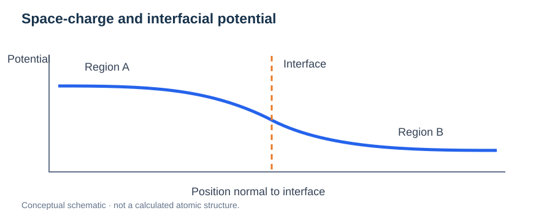
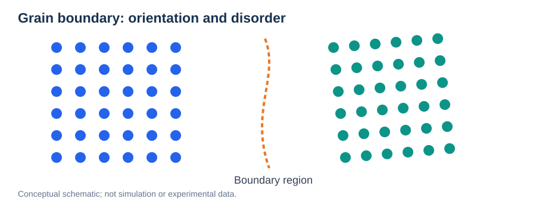
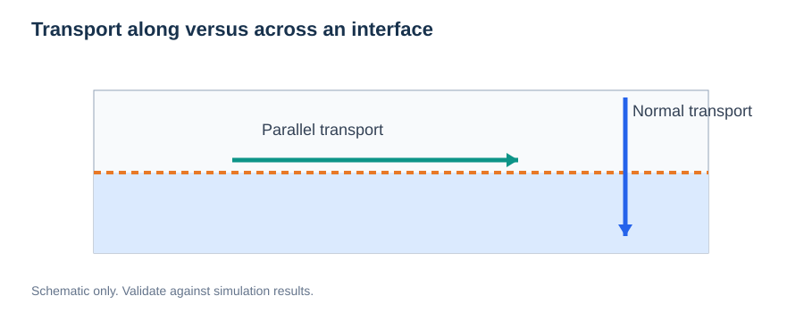

# Interfaces, Heterostructures, and Space Charge

> **Module:** Materials · **Prerequisites:** [Bulk Structures](01-bulk-crystal-structures.md), [Surfaces](02-surfaces-and-slabs.md)  
> **Related:** [Diffusion and Ionic Transport](../05-transport-properties/01-diffusion-and-msd.md)

## Learning goals

Understand coherent and incoherent interfaces, lattice mismatch, strain, interface formation energy, interfacial defects, electrostatic potential gradients, and how interfaces modify ion transport.


*Figure 1. A surface separates a material from its environment; an interface joins two distinct regions or phases.*

## 1. What is an interface?

An **interface** is the boundary between two materials, phases, grains, or structurally different regions. Examples include grain boundaries, crystalline–amorphous contacts, solid-electrolyte/electrode boundaries, and heteroepitaxial layers.

An ideal bulk calculation lacks such a boundary, while a single-surface slab borders vacuum or an environment. Interface models require two neighboring regions with explicitly defined chemistry and geometry.

## 2. Lattice mismatch and coherent strain

For an illustrative one-dimensional lattice matching problem, define a mismatch against substrate spacing $a_s$ as:

```math
f=\frac{a_f-a_s}{a_s}.
```

This is only one convention; the sign and reference must be stated. Real commensurate interface construction requires searching in-plane supercell matrices and considering possible rotations, misfit dislocations, and strain energy.

An artificially forced coherent match can change defect energies and ionic migration barriers.

## 3. Interface energy and adhesion

For a coherent model with suitable reference states, one possible interfacial formation-energy expression is:

```math
\gamma_{\mathrm{int}}=\frac{E_{\mathrm{cell}}-\sum_i N_i\mu_i}{n_{\mathrm{int}}A}.
```

The reference chemical potentials, strained bulk references, stoichiometry, and number $n_{\mathrm{int}}$ of equivalent interfaces must be defined explicitly. If interfaces are inequivalent, the total excess energy cannot generally be assigned to either interface without additional calculations.

**Work of adhesion** and **interface formation energy** are related but different quantities; do not interchange them.

## 4. Electrostatic potential and space-charge layers

Charged defects and redistribution of mobile ions can create an electrostatic potential gradient near an interface. In a continuum picture:

```math
\nabla\cdot[\varepsilon(\mathbf r)\nabla\phi(\mathbf r)]=-\rho(\mathbf r).
```

The potential $\phi$ and charge density $\rho$ must be consistent with electrostatic boundary conditions and the chosen dielectric description.



*Figure 2. A qualitative interfacial potential profile. Actual sign, width, and shape are material- and defect-dependent.*

Potential variations can alter ion concentrations and migration barriers. A space-charge layer is not guaranteed: its existence and magnitude depend on chemistry, defect equilibria, dielectric response, and temperature.

## 5. Interface-specific transport mechanisms

Several distinct effects can coexist:

| Mechanism | Potential consequence |
| --- | --- |
| Local strain | Modifies bond lengths and migration barriers |
| Defect segregation | Changes the population of mobile carriers and traps |
| Chemical intermixing | Creates different local coordination environments |
| Space charge | Redistributes mobile ion concentrations |
| Structural disorder | Produces a distribution of local pathways |
| Poor contact / voids | Adds an extrinsic resistance that atomistic ideal interfaces may miss |

A low NEB barrier at one interface site is insufficient to demonstrate an overall high interfacial conductivity. Long-range connected pathways, carrier concentrations, and transport across—not just along—the boundary matter.

## 6. Practical model-building workflow

1. Identify the two phases, orientations, and stable terminations.
2. Search possible supercell matches and quantify imposed strain.
3. Construct several plausible registries and interface chemistries.
4. Relax with transparent constraints and convergence settings.
5. Assess interfacial energies, local coordination, defects, and electrostatic potential.
6. Sample interface-parallel and interface-normal transport separately.
7. Validate representative NEB pathways, but integrate their kinetics with populations and connectivity.

## 7. Relevance to solid-state ion conductors

For glass–crystal or electrolyte–electrode contacts, distinguish intrinsic interfacial ionic mobility from the experimentally measured interface resistance. Grain boundary chemistry, contact quality, and reaction layers may dominate measured impedance even if atomistic local hopping barriers are small.

## Interface Thermodynamics and Segregation Equilibria

An interface has excess free energy that depends on strain, composition, orientation and interfacial chemical reservoirs. For a model containing two equivalent interfaces of area $A$, a reference-consistent excess energy may be written

```math
\gamma_{\mathrm{int}}=\frac{G_{\mathrm{cell}}-\sum_i N_i\mu_i}{2A}.
```

For inequivalent interfaces, the combined excess cannot generally be divided into two identical contributions. Elastic strain energy and appropriate strained bulk references require careful handling.

### Segregation versus mobility

A dopant or mobile defect can preferentially occupy an interface even if its local hopping barrier is high. Segregation changes the **carrier population**; barriers and hopping correlations change the **kinetics**. Both affect interfacial resistance.

A simple equilibrium site-occupation ratio between bulk and interface environments is

```math
\frac{p_{\mathrm{int}}}{p_{\mathrm{bulk}}}\propto\exp\!\left[-\frac{G_{\mathrm{int}}-G_{\mathrm{bulk}}}{k_{\mathrm B}T}\right],
```

with degeneracy, site capacity and concentration corrections in a quantitative model.

At an electrolyte/electrode interface, distinguish intrinsic ionic transport, space-charge redistribution and chemical reaction layers from extrinsic contact resistance.


## Review questions

1. How do interfaces differ from surfaces and grain boundaries?
2. Why can coherent matching change a migration barrier?
3. What additional information is required to calculate interface formation energy?
4. How might space charge change conductivity without changing the microscopic hop mechanism?
5. Why do ideal atomistic interfaces not capture contact resistance automatically?

**Next:** [Diffusion and Ionic Transport](../05-transport-properties/01-diffusion-and-msd.md).


## Advanced Application: Grain Boundaries



*Figure 3. Two differently oriented crystalline grains meet in a structurally distinct boundary region.*

A **grain boundary** is an interface between crystals of the same nominal phase with different orientations. Its local free volume, coordination, strain, and defects can differ substantially from those in either grain interior.

Grain boundaries are often classified by misorientation, boundary-plane orientation, and structural units. A single ideal model cannot generally represent the full distribution found in a polycrystal.

For a simple bicrystal supercell containing two equivalent grain boundaries, an illustrative excess energy is:

```math
\gamma_{\mathrm{GB}}=\frac{E_{\mathrm{bicrystal}}-N E_{\mathrm{bulk}}}{2A}.
```

This requires matched bulk reference strain/composition and truly equivalent boundaries. Otherwise, revise the reference and interface counting.

## Advanced Application: Segregation and Interfacial Resistance

A defect may prefer the boundary over a bulk-like site. Under a consistent energetic convention:

```math
E_{\mathrm{seg}}=E_{\mathrm{defect@GB}}-E_{\mathrm{defect@bulk}}.
```

When the compared cells contain identical species, charge states, and consistent reference energies, negative values indicate an energetic preference for the grain boundary. Entropic terms and concentration effects matter for equilibrium segregation.

### Resistive and fast-conducting boundaries

A boundary can impede transport if mobile ions are depleted, traps dominate, or connected pathways are blocked. In other systems, disordered or widened pathways can enhance interfacial diffusion. Avoid assuming all grain boundaries are either barriers or fast-ion channels.

For a macroscopically layered geometry, a simple series-resistance relation is:

```math
R_{\mathrm{total}}=R_{\mathrm{bulk}}+R_{\mathrm{interface}}+R_{\mathrm{contacts}}.
```

Real polycrystalline samples can have parallel pathways, tortuosity, space-charge effects, and contact impedances; the equation is an illustrative circuit approximation.

**Computational workflow:** Compare boundary-resolved residence, defect segregation, parallel/normal transport, and candidate NEB barriers. Distinguish interface-specific material physics from imperfect physical contact and measurement-model artifacts.

---

## Advanced Practice: Along-Interface versus Across-Interface Transport



*Figure. Motion parallel to an interface and transfer across it are physically distinct processes.*

An interface may support fast lateral diffusion yet resist crossing into an adjoining solid. Do not collapse these phenomena into one isotropic diffusion coefficient.

**Parallel transport** can be studied by in-plane displacements and residence-conditioned analyses. **Normal transfer** is often better characterized using crossing frequencies, layer populations, residence times, and recrossing probabilities. State whether tracked ions were initially in the interface region or remained there throughout the observation interval.

A simplified parallel diffusion expression is:

```math
D_{\parallel}=\lim_{t\to\infty}\frac{\langle\Delta x^2+\Delta y^2\rangle}{4t}.
```

This requires a genuine long-time diffusive regime and a clearly defined population; confinement or exchange makes careless fits misleading.

### Intrinsic and extrinsic interface resistance

A coherent atomic interface may capture local bonding, strain, segregation, and microscopic barriers. It cannot automatically represent imperfect contact, cracks, porosity, reaction layers, or the full grain-boundary network present in a macroscopic specimen.

**Solid-electrolyte application:** A glass–crystal junction may alter Li-ion coordination and transfer probability. Combine local structural statistics, directional trajectories, and selected NEB barriers before interpreting conductivity changes.

### Review questions

1. Can fast interface-parallel transport coexist with slow interface-normal transfer?
2. Why does membership in a spatial layer complicate MSD analysis?
3. Which sources of measured interface resistance are absent from a perfectly bonded atomistic model?
