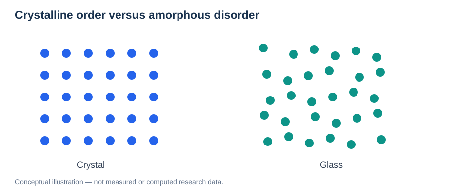
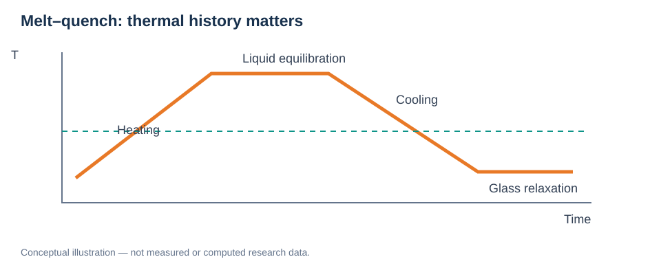
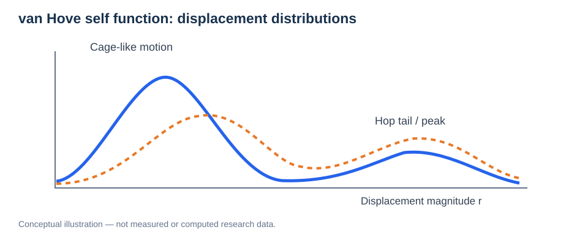
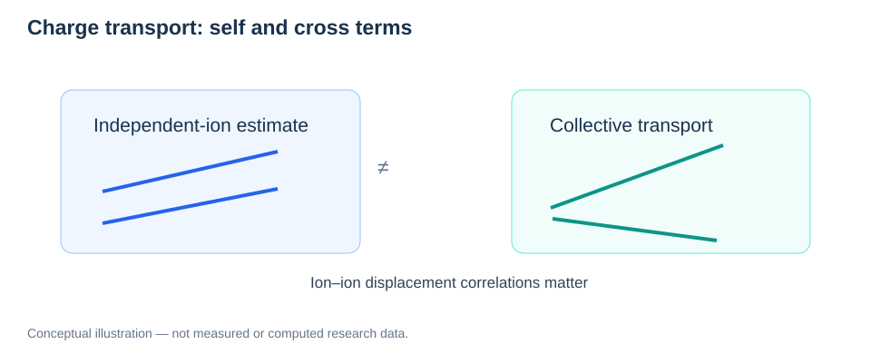

# Amorphous Structure and Ionic Transport

> **Study area:** Materials & Interfaces / Transport  
> **Prerequisites:** [Bulk Crystal Structures](01-bulk-crystal-structures.md), [Molecular Dynamics](../03-atomistic-methods/02-molecular-dynamics.md), [Diffusion](../05-transport-properties/01-diffusion-and-msd.md).

## Learning objectives

Understand the distinction between crystals and glasses, how melt–quench preparation affects structure, how to interpret RDF/coordination/structure factors and van Hove functions, and how correlated ion motion determines conductivity.



*Figure 1. Ordered periodic positions and locally structured but nonperiodic arrangements are conceptually different.*

## 1. Glass structure and disorder

A crystal has long-range translational order; a glass may retain short-range coordination and medium-range motifs without crystalline long-range order. **Amorphous does not mean structureless**: bond lengths, coordination polyhedra, network connectivity, voids, and chemical ordering remain important.

Different quenches at the same nominal composition may yield different local environments and transport pathways. Therefore, treat independent glass preparations as **distinct structural replicas**, rather than only varying initial velocities of one structure.

## 2. Melt–quench generation



*Figure 2. Heating, equilibrating a liquid-like state, cooling, and subsequent relaxation affect the resulting network.*

A typical computational preparation includes:

1. Prepare a chemically reasonable composition and density.
2. Heat beyond the structural disordering regime, while monitoring bonds and chemical stability.
3. Equilibrate at high temperature for adequate structural mixing.
4. Quench using a stated cooling schedule and ensemble.
5. Relax/anneal the generated structure at the target conditions.
6. Repeat independently and inspect crystallization, phase separation, density, and structural diversity.

Simulated cooling rates are usually much faster than experimental processing rates. A resulting structure is **protocol dependent**, not automatically a unique equilibrium glass.

## 3. Radial distribution functions and coordination

For species $a$ and $b$, the partial RDF $g_{ab}(r)$ describes the relative likelihood of observing a $b$ atom at distance $r$ from an $a$ atom, normalized by bulk number density.

For a homogeneous isotropic system, integrate to a justified cutoff $r_c$ to estimate coordination:

```math
N_{ab}(r_c)=4\pi\rho_b\int_0^{r_c}g_{ab}(r)r^2\,dr.
```

An RDF peak indicates preferred pair distances but does not, by itself, establish a unique chemical bond or transport channel. In disordered Li–O–Hf–Cl, compare Li–O, Li–Cl, Hf–O and Hf–Cl partial correlations, and state the cutoff selection.

## 4. Structure factor and medium-range order

The static structure factor is related to spatial correlations and is commonly compared with scattering experiments. For an isotropic single-component system, one illustrative relation is:

```math
S(q)=1+4\pi\rho\int_0^\infty [g(r)-1]\frac{\sin(qr)}{qr}r^2\,dr.
```

Multicomponent materials require partial structure factors and scattering-weighted combinations. Finite cells, termination of the integral, and limited $q$ resolution can introduce artifacts. An RDF alone cannot uniquely determine a glass network.

## 5. Ion cages, residence, and hopping

A mobile Li ion may vibrate in a local cage, escape to a neighboring coordination site, return, or participate in cooperative motion. These mechanisms require more than a single mean-squared-displacement plot.

Define residence carefully: site assignment method, recrossing tolerance, state boundaries, observation interval, and treatment of overlapping sites all influence estimated lifetimes.

## 6. Self van Hove function



*Figure 3. Self-displacement distributions can reveal caging and heterogeneous hopping beyond a single MSD slope.*

A three-dimensional self van Hove function is:

```math
G_s(\mathbf r,t)=\frac1N\left\langle\sum_i\delta\!\left(\mathbf r-[\mathbf r_i(t_0+t)-\mathbf r_i(t_0)]\right)\right\rangle_{t_0}.
```

Radially averaged distributions require the appropriate spherical measure; do not confuse the radial probability density $4\pi r^2 G_s(r,t)$ with $G_s(r,t)$ itself. Secondary features can suggest hopping but need geometric corroboration.

## 7. Self diffusion versus collective conductivity



*Figure 4. Self motion and charge-weighted collective displacement reflect different physical correlations.*

For mobile carriers of charge $q$, number density $n$ and self diffusivity $D$, the Nernst–Einstein estimate is:

```math
\sigma_{\mathrm{NE}}=\frac{nq^2D_{\mathrm{self}}}{k_{\mathrm B}T}.
```

The collective Einstein–Helfand expression is:

```math
\sigma_{\mathrm{coll}}=\lim_{t\to\infty}\frac{1}{6Vk_{\mathrm B}Tt}\left\langle\left|\sum_iq_i\Delta\mathbf r_i(t)\right|^2\right\rangle.
```

The second expression contains cross correlations and requires appropriately unwrapped, charge-consistent displacements. A defined factor $f_{\mathrm{corr}}=\sigma_{\mathrm{coll}}/\sigma_{\mathrm{NE}}$ can be above or below one; **Haven ratio conventions vary**, so explicitly state the equation rather than relying on a name.

## 8. Validation workflow for glass transport

| Check | Scientific purpose |
| --- | --- |
| Multiple independent quenches | Quantify preparation dependence |
| Density, energy and structural distributions | Reject obviously unphysical states |
| Partial RDFs and coordination | Identify local chemical environments |
| MSD in reliable time windows | Estimate long-time self diffusion |
| van Hove and residence statistics | Diagnose heterogeneous motion |
| Collective conductivity | Test displacement correlations |
| Selected NEB / reference calculations | Probe local energetic mechanisms |

### Research connection: Li–O–Hf–Cl

Compare structural environments across glass compositions without automatically attributing a conductivity change to one RDF peak or one NEB barrier. A strong analysis separates **composition**, **preparation-induced disorder**, **local mobility**, and **collective charge transport**.

## Review questions

1. Why do two independently quenched glasses deserve separate analysis?
2. What does RDF tell us, and what can it not establish?
3. How is a self van Hove function different from MSD?
4. Why can $\sigma_{\mathrm{coll}}$ differ from $\sigma_{\mathrm{NE}}$?
5. Why is a single NEB pathway insufficient for a glass with heterogeneous coordination?

**Related:** [Diffusion and MSD](../05-transport-properties/01-diffusion-and-msd.md) · [MLIP Validation](../06-machine-learning-potentials/02-mlip-validation.md).
