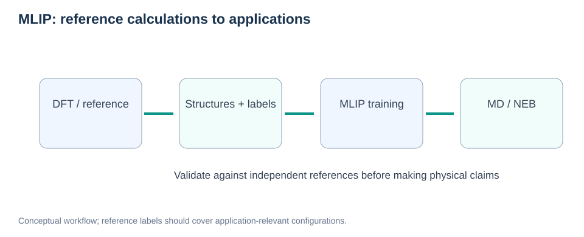
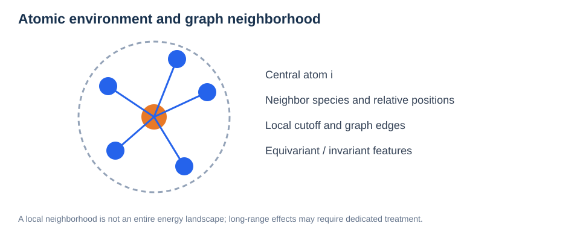
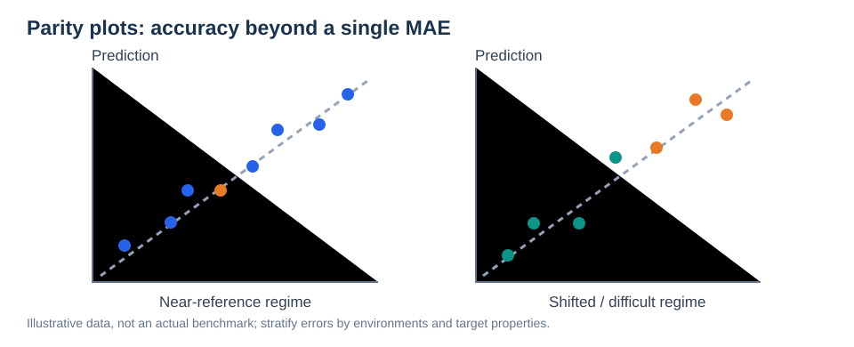
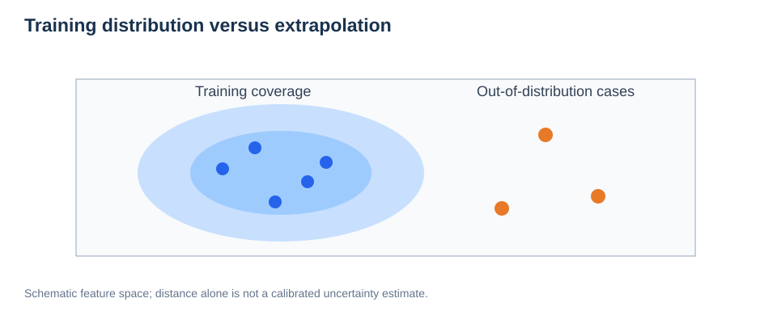

# Machine-Learned Interatomic Potentials: Fundamentals

> **Reading order:** 01 · Fundamentals → [02 · Validation for MD, NEB, and Diffusion](02-mlip-validation.md)  
> **Prerequisites:** [Potential Energy Surfaces](../01-physical-foundations/01-potential-energy-surface.md), [Forces](../01-physical-foundations/02-forces-and-gradients.md), [DFT](../02-electronic-structure/01-dft-fundamentals.md).

## Learning objectives

Explain how an MLIP approximates the PES, how local atomic environments are represented, what energy/force/stress training labels mean, why symmetries matter, and how model families differ.



*Figure 1. Reference calculations support model fitting; applications still require property-focused validation.*

## 1. The task: approximate a potential-energy surface

A reference method such as DFT maps an atomic configuration to an energy and forces. An MLIP learns an approximate mapping:

```math
\widehat E_\theta(\mathbf R,\mathbf Z,\mathbf h)\approx E_{\mathrm{ref}}(\mathbf R,\mathbf Z,\mathbf h).
```

Here $\mathbf R$ contains coordinates, $\mathbf Z$ species, $\mathbf h$ cell information, and $\theta$ learned parameters. Forces are generally **energy gradients**:

```math
\widehat{\mathbf F}_i=-\nabla_{\mathbf r_i}\widehat E_\theta.
```

Because a model is learned from a finite dataset, it is not guaranteed to remain accurate for every composition, strain state, temperature, or saddle-point geometry.

### Why energy conservation matters

A differentiable energy model produces conservative forces by construction when forces are obtained as its gradients. A model predicting unconstrained forces directly may not have this property automatically.

## 2. Local atomic environments and graph representations



*Figure 2. Neighbor identities and relative geometry form inputs for local descriptors or graph-based models.*

Many MLIPs approximate total energy as atomic contributions:

```math
\widehat E=\sum_i \varepsilon_\theta(\mathcal N_i).
```

The neighborhood $\mathcal N_i$ generally contains surrounding species and coordinates within a cutoff. This decomposition is **model dependent**, not a universal theorem: explicit long-range electrostatics or additional global terms may be important for charged/polar materials.

### Desired symmetries

| Symmetry | Physical requirement |
| --- | --- |
| Translation | Total energy unchanged by shifting all atoms |
| Rotation | Scalar energy invariant under rigid rotation |
| Permutation | Identical atoms interchangeable without changing physics |
| Force equivariance | Forces rotate together with the structure |

Graph/message-passing models exchange geometric and chemical information between neighboring atoms. The receptive field increases with message-passing steps, but finite depth and local cutoffs still constrain accessible interactions.

## 3. Model families: what is actually being learned?

| Family | Conceptual approach | Points to evaluate |
| --- | --- | --- |
| NEP | Neural-network energy model using engineered local descriptors | Descriptor coverage, speed, target properties |
| MACE | Equivariant message passing with many-body representations | Body order, cutoff, equivariant features |
| SevenNet | Graph neural-network potential with equivariant representations | Training domain, force accuracy, deployment cost |
| M3GNet | Materials graph network using local structural information | Pretraining domain, fine-tuning and transferability |

These descriptions are **high-level**. Specific architectures, pretrained versions, and supported interactions change across releases; verify the exact implementation before claiming two models are directly comparable.

## 4. Data and targets

Representative datasets should include relaxed configurations, thermally distorted structures, relevant compositions, different strain states, interfaces, and **transition-state-near configurations** where appropriate. Training on equilibrium bulk geometries alone creates an obvious coverage gap for surface, interface, and NEB studies.

One schematic multitask loss is:

```math
\mathcal L=\lambda_E\frac{1}{N_E}\sum_s(\widehat E_s-E_s)^2+\lambda_F\frac{1}{N_F}\sum_{s,i,\alpha}(\widehat F_{si\alpha}-F_{si\alpha})^2+\lambda_\sigma\frac{1}{N_\sigma}\sum_{s,\alpha,\beta}(\widehat\sigma_{s\alpha\beta}-\sigma_{s\alpha\beta})^2.
```

The weights $\lambda$ and normalizations must be documented; energies may be trained as per-atom values, total energies, or formation/relative quantities. Stress sign and units must be checked against the underlying code.

## 5. Training, validation, and test splits



*Figure 3. Global agreement can conceal systematic errors in application-relevant subsets.*

A randomly split correlated MD trajectory often puts nearly identical structures in both training and test sets. For honest generalization assessment, split by **trajectory, structural family, composition, dopant arrangement, or independently generated glass**, as appropriate.

Typical error metrics include:

```math
\mathrm{MAE}_F=\frac{1}{3N}\sum_{i=1}^N\sum_{\alpha\in\{x,y,z\}}\left|\widehat F_{i\alpha}-F_{i\alpha}\right|.
```

This formula describes one configuration and component-wise MAE; aggregation across datasets must state the weights. Besides an overall MAE, inspect error tails, maximum forces, surface versus bulk subsets, and configurations around chemical events.

## 6. In-distribution and out-of-distribution behavior



*Figure 4. Structures unlike the training distribution can show unpredictable errors.*

**Interpolation** means evaluating states within well-covered conditions; **extrapolation** means operating beyond tested coverage. Hot liquids, compressed interatomic distances, new phases, surfaces, and reaction saddles may be particularly challenging.

A low global energy MAE does not ensure correct relative stability, elastic constants, phonons, diffusion, or reaction barriers.

## 7. Practical workflow

1. Define the physical observables to be predicted.
2. Generate structurally diverse references using consistent electronic settings.
3. Split data with attention to correlations and leakage.
4. Train and tune using held-out validation only.
5. Evaluate a genuinely untouched test set and important physical properties.
6. Sample with the model, identify novel configurations, and decide whether new references are needed.

## Common mistakes

- Treating random snapshots from one trajectory as independent test cases.
- Choosing a model from overall force MAE alone.
- Ignoring long-range charge interactions when modeling ionic systems.
- Assuming accurate relaxed structures imply accurate saddle points.
- Reporting MD acceleration without confirming time-to-solution and hardware comparability.

## Worked research example: Li–O–Hf–Cl glass

A model for glass formation and Li hopping must cover liquid-like high-temperature structures, quenched glass local environments, various Li–O/Li–Cl coordinations, and possible compressed short contacts. Validate independent glass samples and transport behavior, not merely training loss.

## Review questions

1. Why should an MLIP respect permutation and rotational symmetries?
2. Why is a test split by independent glass realization preferable to a random frame split?
3. Why can a small force MAE coexist with poor diffusion predictions?
4. What is missing from a strictly short-range local model for some polar systems?

**Next:** [MLIP Validation for MD, NEB, and Diffusion](02-mlip-validation.md).
