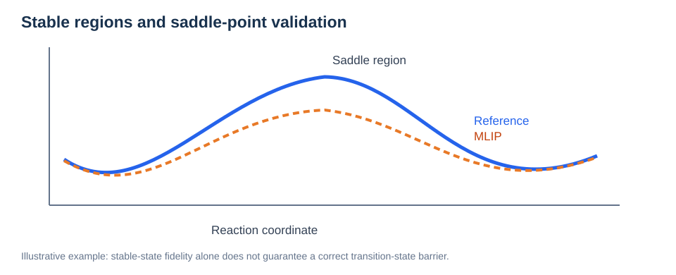
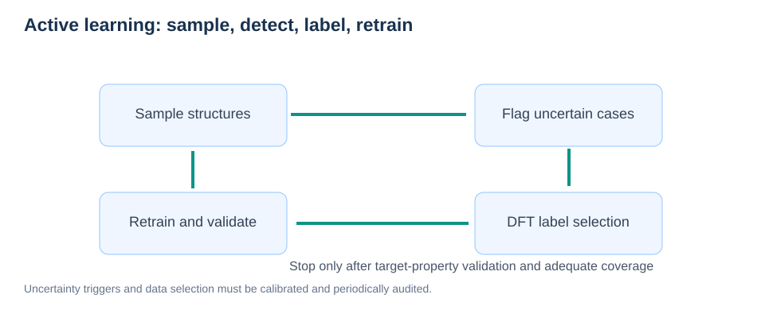
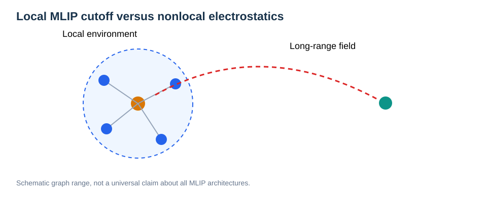

# MLIP Validation for MD, NEB, and Ionic Diffusion

> **Reading order:** [01 · MLIP Fundamentals](01-mlip-fundamentals.md) → **02 · Property-Driven Validation**  
> **Prerequisites:** [MD](../03-atomistic-methods/02-molecular-dynamics.md), [NEB](../03-atomistic-methods/04-neb.md), [Diffusion](../05-transport-properties/01-diffusion-and-msd.md).

## Learning objectives

Design a rigorous validation protocol for learned potentials, distinguish pointwise force errors from long-time properties, detect out-of-distribution behavior, and use active learning without contaminating independent tests.

## 1. The hierarchy of validation

Validation should be arranged from inexpensive checks to the physical observables that drive conclusions.

| Level | Tests | Why needed |
| --- | --- | --- |
| 1: Pointwise | Energy, force, stress errors and tails | Detect numerical or structural mismatches |
| 2: Static physics | EOS, relaxed lattice, defects, elastic response | Test energy differences and local curvature |
| 3: Vibrations | Phonons or Hessian-derived modes | Check the near-minimum PES |
| 4: Pathways | DFT single points and selected CI-NEB | Check saddle regions |
| 5: Dynamics | MD stability, RDF, diffusion, residence | Test trajectory-dependent observables |
| 6: Transport | Temperature dependence, collective conductivity | Test target scientific conclusions |

Do not claim an MLIP is validated for a **target property** solely because its global MAE is small.

## 2. Independent sets and data leakage

Near-neighbor frames from one MD trajectory are highly correlated. Splitting such frames randomly can yield a misleadingly optimistic test error. More demanding independent tests may include:

- Separate AIMD/DFT trajectory seeds.
- Different dopant depths or arrangements.
- Independently quenched amorphous samples.
- Different temperatures or cell sizes.
- Defects, surfaces, and strain conditions excluded from training.

Use the validation subset for hyperparameter selection, and protect the final test set from repeated tuning. If new reference data are later incorporated into training, use a fresh untouched benchmark to support subsequent claims.

## 3. Near-equilibrium parity is not barrier validation



*Figure 1. Conceptual difference in predicted saddle energy despite similar minima. The plotted curves are illustrative.*

NEB is sensitive to differences between local minima and a saddle, and therefore to the model's **relative energies and forces** in a rare configuration region.

```math
\Delta E_m=(\widehat E_{\mathrm{TS}}-\widehat E_A)-(E_{\mathrm{TS}}-E_A).
```

An energy offset that cancels in relative energies may be harmless, whereas a systematic saddle-specific error can change the barrier substantially.

### A practical saddle-validation checklist

1. Optimize the same endpoint states with well-defined constraints.
2. Compare reference and MLIP forces on intermediate and saddle-near geometries.
3. Run selected reference CI-NEB pathways when affordable.
4. Check whether both models predict the **same mechanism**, not only a similar highest energy.
5. Include paths that challenge the training domain (e.g., unusually close O–H or Li–Cl contacts).
6. Report barrier-error distributions across distinct paths instead of one showcase example.

A small barrier discrepancy on one path does not prove accuracy on other terminations or defect arrangements.

## 4. MD stability is necessary but not sufficient

A potential may generate a stable trajectory with plausible temperatures and RDFs while still producing biased kinetics.

**Separate these questions:**

- **Numerical stability:** no force explosions, unacceptable drift, or catastrophic contacts.
- **Structural fidelity:** reasonable local environments and distributions.
- **Dynamical fidelity:** appropriate vibrational response, jump mechanisms, and waiting times.
- **Transport fidelity:** credible diffusion coefficients and activation energies with uncertainty.

For three-dimensional normal diffusion:

```math
D=\lim_{t\to\infty}\frac{\mathrm{MSD}(t)}{6t}.
```

The MD trajectory must reach a genuine diffusive regime. If rare hops have not been observed, an apparent short-time diffusion estimate may be meaningless regardless of force MAE.

## 5. Active learning and uncertainty



*Figure 2. Active learning selects new reference labels from application-driven sampling, followed by retraining and validation.*

A practical process is to sample structures, detect unusual environments or model disagreement, select diverse high-value configurations, calculate consistent reference labels, retrain, and revalidate.

### What can count as an uncertainty signal?

- Disagreement between independently trained ensemble members.
- Extrapolation/descriptor-distance indicators.
- Force outliers or extreme structures during MD.
- Sudden change in coordination, compression, or temperature regime.
- Independent physical checks that disagree with reference observations.

**None of these is automatically a calibrated probability of error.** Model disagreement can be small even when ensemble members share the same bias.

## 6. Cross-property errors

A potential can have very good energy/force test metrics yet fail to reproduce the long-time conductivity. Conversely, a seemingly small error in local barrier height may amplify jump-rate discrepancies because rates can depend exponentially on barriers:

```math
\frac{k_{\mathrm{MLIP}}}{k_{\mathrm{ref}}}\approx\exp\left[-\frac{\Delta E_m}{k_{\mathrm B}T}\right],
```

under the restrictive assumption of equal prefactors and the same elementary transition mechanism. In general, attempt frequencies, state populations, kinetic connectivity, and correlations also affect diffusion.

## 7. Validation matrix for different environments

| Environment | Structure check | Kinetic/pathway check |
| --- | --- | --- |
| Bulk crystal | Lattice, defect relaxation, EOS | Bulk hops, phonons, diffusion |
| Surface slab | Termination, hydration, adsorption | In-plane and subsurface proton pathways |
| Interface | Strain, contact, segregation | Parallel and normal transfer |
| Amorphous glass | RDF, coordination distribution, density | Diverse Li hops, trapping, independent glass diffusivity |
| High-temperature liquid | Liquid structure and short contacts | Stability during melt–quench sampling |

An **interpolation/extrapolation map** for these environments is more informative than one pooled test-set MAE.

## 8. Worked research design: amorphous ion conductor

**Question:** Can an MLIP trained on a finite collection of DFT configurations reproduce ion transport in independently quenched glass samples?

A reasonable staged design is:

1. Generate independent glass configurations and reference snapshots spanning relevant local environments.
2. Withhold whole glass realizations for a final evaluation.
3. Measure energy/force accuracy across coordination categories, not only globally.
4. Compare independent DFT/AIMD trajectories at temperatures where sampling is feasible.
5. Inspect MSD window dependence, Li–O/Li–Cl RDFs, coordination numbers, and hop mechanisms.
6. Test a diverse subset of NEB events against reference calculations.
7. Estimate uncertainty across independent glasses; do not treat overlapping time origins as independent experiments.
8. Report any temperature or composition region for which reference validation is unavailable.

## 9. A transparent benchmark report

A good report states training-data provenance, reference code/settings, split strategy, model version, units, test-set composition, error distribution, trajectory length and timestep, number of independent replicas, selected NEB pathways, and limitations.

The conclusion should be proportional to the evidence: **“accurate for the tested force distribution”** is not the same claim as **“predicts room-temperature transport.”**

## Long-Range MLIP Physics and Reliability



*Figure. A finite local graph cutoff may omit important far-field electrostatic and polarization response.*

Many MLIPs express energy as a sum of local environment contributions. This assumption can be efficient, but in ionic and polar materials long-range Coulomb, dielectric response, and variable oxidation environments may matter.

A hybrid energy decomposition can be written schematically as

```math
E_{\mathrm{total}}=E_{\mathrm{short,ML}}+E_{\mathrm{long,physical}}+E_{\mathrm{other}},
```

where the terms must be designed and trained to avoid double counting. Examples of nonlocal modeling choices include explicit electrostatics, learned charges, charge-equilibration schemes, polarizable responses and global features. The best choice depends on the phenomena and data.

### What should be validated?

- **Charge/field response:** stress, dielectric behavior or polarization where applicable.
- **System-size transferability:** compare cells beyond the training size.
- **Defects and interfaces:** test environments with distinct local charges or dipoles.
- **Long-distance interactions:** verify asymptotic behavior where physically required.
- **Transport and saddles:** re-evaluate property-level errors, not just pointwise force MAE.

An ensemble-disagreement score is not automatically a calibrated uncertainty. Check reliability diagrams or coverage of prediction intervals on untouched validation families if probabilistic claims are made.

**Related:** [Electrostatics and Long-Range Interactions](../01-physical-foundations/10-electrostatics-and-long-range-interactions.md).


## Review questions

1. Why is a random train/test split of one AIMD trajectory often optimistic?
2. Why is stable MD insufficient to validate diffusivity?
3. What is the difference between an uncertainty indicator and a calibrated error probability?
4. What reference configurations are needed to check CI-NEB pathways?
5. Why might small barrier errors produce large rate errors?
6. Which validation tests would you add for an amorphous glass versus a crystalline solid?

## Suggested reading

- [MACE project and documentation](https://github.com/ACEsuit/mace)
- [GPUMD / NEP documentation](https://gpumd.org/)
- [ASE documentation](https://ase-lib.org/)

**Return:** [MLIP curriculum](README.md) · [Overall Learning Path](../README.md).
