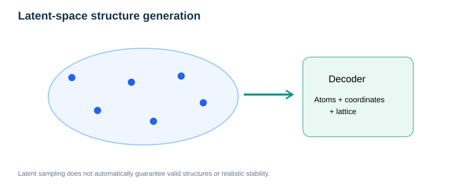

# Generative Models for Atomic Structures

> **Prerequisites:** [Crystallography](../04-materials-interfaces/01-bulk-crystal-structures.md), [PBC](../01-physical-foundations/03-periodic-boundary-conditions.md), [Statistical Mechanics](../01-physical-foundations/08-statistical-mechanics-fundamentals.md), [MLIP Fundamentals](01-mlip-fundamentals.md).

## Learning objectives

Understand predictive versus generative models, latent variables, VAEs, GANs, periodic crystal representations, conditional generation, structural validity, generalization and reference-based validation.

## 1. What does a generative model learn?

A property predictor maps structure to energy or another property. A generative model approximates a distribution of candidate structures, possibly conditioned on targets:

```math
p_\theta(\mathbf R,\mathbf Z,\mathbf h\mid \mathbf c).
```

Here $\mathbf R$ denotes atomic coordinates, $\mathbf Z$ atomic species, $\mathbf h$ the simulation cell, and $\mathbf c$ optional constraints. A sample is a **candidate**, not a certified stable or synthesizable material.

## 2. Variational autoencoders



*Figure 1. A decoder maps samples of a regularized latent distribution into candidate atomistic structures.*

A VAE encoder learns an approximate posterior $q_\phi(z\mid x)$, and a decoder defines $p_\theta(x\mid z)$. The evidence lower bound is:

```math
\log p_\theta(x)\geq \mathbb E_{q_\phi(z\mid x)}[\log p_\theta(x\mid z)]-D_{\mathrm{KL}}[q_\phi(z\mid x)\|p(z)].
```

The reconstruction term favors examples similar to observations, while KL regularization aligns latent statistics with a chosen prior. Neither proves physical stability.

## 3. Generative adversarial networks

A classical GAN optimizes:

```math
\min_G\max_D\left\{\mathbb E_{x\sim p_{\mathrm{data}}}\log D(x)+\mathbb E_{z\sim p_z}\log[1-D(G(z))]\right\}.
```

Generator and discriminator compete; modern implementations may use Wasserstein objectives and gradient penalties. Mode collapse and unstable optimization are important failure modes.

## 4. Periodic structure representation

For fractional coordinates $\mathbf s_i$ and cell matrix $\mathbf h$:

```math
\mathbf r_i=\mathbf h\mathbf s_i,\qquad \mathbf s_i\sim\mathbf s_i+\mathbf n,\quad\mathbf n\in\mathbb Z^3.
```

Distances and losses must respect periodic equivalence, atom permutations and rotation/translation symmetries. Fractional coordinates 0.01 and 0.99 can be close across a periodic boundary, even though a naive Euclidean difference suggests otherwise.

Generative models must also address plausible species counts, bond lengths, cell volumes and charge states. Symmetry constraints may be explicit or imposed during filtering.

## 5. Diffusion and score-based generators

Denoising diffusion models learn to reverse a stochastic noising process. This **generative diffusion** is not atomic self-diffusion measured by MD: their meanings, equations and time scales are different. A property-conditioned diffusion generator proposes structures, but physical relaxation and independent verification remain essential.

## 6. Validation and leakage

| Assessment | What it addresses | Caution |
| --- | --- | --- |
| Structural validity | Sensible geometry, charge and stoichiometry | Does not establish thermodynamic stability |
| Novelty | Difference from training samples | Requires invariant matching |
| Distribution coverage | Generated structural diversity | Depends on representation |
| Predicted properties | Screening usefulness | Surrogate exploitation is possible |
| Relaxation and reference energies | Local energetic plausibility | Does not prove synthesizability |

A robust workflow: generate → remove invalid/duplicate structures → relax with a validated calculator → verify using independent references → quantify diversity and property uncertainties.

## Review questions

1. How is a VAE different from an energy predictor?
2. Why can a GAN exhibit mode collapse?
3. Why must periodic coordinates be handled specially in losses?
4. Why is a low predicted energy not enough to establish experimentally stable matter?
5. How does diffusion generation differ from molecular dynamics?

## Further reading

- [MLIP Fundamentals](01-mlip-fundamentals.md)
- Public research contexts: [Crystal-GAN](https://github.com/ishikawa-group/Crystal-GAN) and [orr-vae](https://github.com/ishikawa-group/orr-vae).
