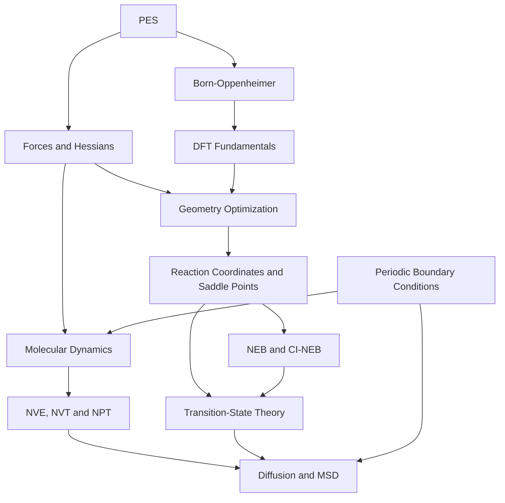

# Computational Materials Science · Learning Path

A growing collection of English-language study notes, organized by **prerequisites** rather than publication dates. Follow the reading sequence below, or browse by subject folder. Lesson file numbers indicate order *within a subject*, while this table gives the overall recommended learning sequence.

## Recommended Reading Sequence

| Step | Lesson | Subject |
| --- | --- | --- |
| 01 | [Potential Energy Surfaces](01-foundations/01-potential-energy-surface.md) | Foundations |
| 02 | [Forces, Gradients, and Curvature](01-foundations/02-forces-and-gradients.md) | Foundations |
| 03 | [Periodic Boundary Conditions](01-foundations/04-periodic-boundary-conditions.md) | Foundations |
| 04 | [Born–Oppenheimer Approximation](01-foundations/05-born-oppenheimer-approximation.md) | Foundations |
| 05 | [DFT Fundamentals](02-methods/04-dft-fundamentals.md) | Electronic structure |
| 06 | [Geometry Optimization and Convergence](02-methods/01-geometry-optimization.md) | Methods |
| 07 | [Reaction Coordinates, MEPs, and Saddle Points](01-foundations/03-reaction-coordinates-and-saddle-points.md) | Foundations |
| 08 | [NEB and CI-NEB](02-methods/02-neb.md) | Methods |
| 09 | [Molecular Dynamics Fundamentals](02-methods/03-molecular-dynamics.md) | Methods |
| 10 | [Statistical Ensembles: NVE/NVT/NPT](02-methods/05-statistical-ensembles.md) | Methods |
| 11 | [Transition-State Theory](02-methods/06-transition-state-theory.md) | Kinetics |
| 12 | [Diffusion, MSD, and Ionic Transport](03-transport/01-diffusion-and-msd.md) | Transport |

These are **suggested dependencies**, not the only valid reading order. MD and NEB are complementary branches; DFT can be learned in parallel with classical atomistic dynamics.

## Conceptual Roadmap



## Repository Organization

```text
computational-materials/
├── 01-foundations/
│   ├── 01-potential-energy-surface.md
│   ├── 02-forces-and-gradients.md
│   ├── 03-reaction-coordinates-and-saddle-points.md
│   ├── 04-periodic-boundary-conditions.md
│   └── 05-born-oppenheimer-approximation.md
├── 02-methods/
│   ├── 01-geometry-optimization.md
│   ├── 02-neb.md
│   ├── 03-molecular-dynamics.md
│   ├── 04-dft-fundamentals.md
│   ├── 05-statistical-ensembles.md
│   └── 06-transition-state-theory.md
├── 03-transport/
│   └── 01-diffusion-and-msd.md
├── assets/figures/
└── README.md
```

## Editorial Standards

- **English only:** no dates in filenames or article headings.
- **One core concept per article**, with prerequisites, intuition, equations, practical pitfalls, and review questions.
- **GitHub-compatible mathematics:** standalone LaTeX expressions use fenced `math` blocks.
- **Figures:** locally stored SVG illustrations with explanatory captions; diagrams are schematic unless explicitly labeled as data.
- **Navigation:** maintain prerequisite links and the roadmap when new material is added.
- **Scientific caution:** distinguish PES barriers, free-energy barriers, jump rates, diffusion coefficients, and conductivity.

## Next Expansion Ideas

- Self-consistent field convergence, plane-wave basis sets, and k-point sampling.
- Vibrations and phonons; harmonic transition-state theory.
- Thermostats, trajectory analysis, statistical uncertainty.
- RDF, coordination number, structure factors, and amorphous materials.
- Machine-learned interatomic potentials: training, validation, and out-of-distribution behavior.
- Collective charge transport and correlated ion migration.
