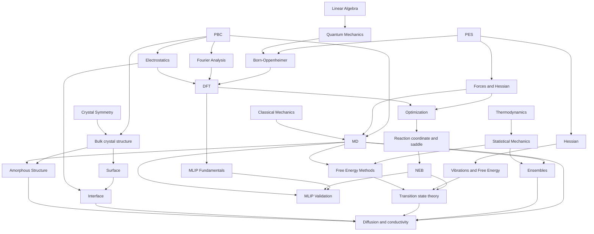

# Computational Materials Science · Learning Path

A structured collection of **English-language notes** organized by subject and cross-linked by prerequisites. The ordered path below is a recommended reading sequence, not a strict chain: electronic structure, dynamics, and materials structure have parallel prerequisites. Folder-local filename numbering remains stable even when the suggested global reading order changes.

## Recommended Reading Order

| Step | Topic | Study area |
| --- | --- | --- |
| 01 | [Linear Algebra, Forces and Curvature](01-physical-foundations/02-forces-and-gradients.md) | Foundations |
| 02 | [Quantum Mechanics Fundamentals](01-physical-foundations/09-quantum-mechanics-fundamentals.md) | Foundations |
| 03 | [Potential Energy Surfaces](01-physical-foundations/01-potential-energy-surface.md) | Foundations |
| 04 | [Thermodynamics Fundamentals](01-physical-foundations/07-thermodynamics-fundamentals.md) | Foundations |
| 05 | [Statistical Mechanics Fundamentals](01-physical-foundations/08-statistical-mechanics-fundamentals.md) | Foundations |
| 06 | [Periodic Boundary Conditions and Fourier Analysis](01-physical-foundations/03-periodic-boundary-conditions.md) | Foundations |
| 07 | [Bulk Crystal Structures and Symmetry](04-materials-interfaces/01-bulk-crystal-structures.md) | Materials |
| 08 | [Born–Oppenheimer Approximation](01-physical-foundations/04-born-oppenheimer-approximation.md) | Foundations |
| 09 | [DFT Fundamentals](02-electronic-structure/01-dft-fundamentals.md) | Electronic structure |
| 10 | [Geometry Optimization](03-atomistic-methods/01-geometry-optimization.md) | Atomistic methods |
| 11 | [Classical Mechanics and Molecular Dynamics](03-atomistic-methods/02-molecular-dynamics.md) | Atomistic methods |
| 12 | [Statistical Ensembles](03-atomistic-methods/03-statistical-ensembles.md) | Atomistic methods |
| 13 | [Vibrations, Phonons and Free Energy](01-physical-foundations/06-vibrations-phonons-free-energy.md) | Foundations |
| 14 | [Reaction Coordinates and Saddle Points](01-physical-foundations/05-reaction-coordinates-and-saddle-points.md) | Foundations |
| 15 | [NEB and CI-NEB](03-atomistic-methods/04-neb.md) | Atomistic methods |
| 16 | [Transition-State Theory](03-atomistic-methods/05-transition-state-theory.md) | Atomistic methods |
| 17 | [Free-Energy Calculation Methods](03-atomistic-methods/06-free-energy-calculation-methods.md) | Atomistic methods |
| 18 | [Surfaces and Slab Models](04-materials-interfaces/02-surfaces-and-slabs.md) | Materials |
| 19 | [Interfaces and Space Charge](04-materials-interfaces/03-interfaces-and-heterostructures.md) | Materials |
| 20 | [Diffusion, MSD and Ionic Transport](05-transport-properties/01-diffusion-and-msd.md) | Transport |
| 21 | [Amorphous Structure and Ionic Transport](04-materials-interfaces/04-amorphous-structure-and-ionic-transport.md) | Materials / transport |
| 22 | [MLIP Fundamentals](06-machine-learning-potentials/01-mlip-fundamentals.md) | Machine learning |
| 23 | [MLIP Validation for MD, NEB and Diffusion](06-machine-learning-potentials/02-mlip-validation.md) | Machine learning |
| 24 | [Electrostatics and Long-Range Interactions](01-physical-foundations/10-electrostatics-and-long-range-interactions.md) | Foundations |

**Suggested prerequisite route for the new lessons:** Thermodynamics → Statistical Mechanics → Statistical Ensembles → Free-Energy Calculation Methods. Reciprocal Space is integrated with PBC and Bulk; DFT Theory with DFT Fundamentals; Numerical Error Analysis with Geometry Optimization and MD.

**Foundational dependency guides:** Linear Algebra & Vector Calculus → Quantum Mechanics → Born–Oppenheimer → DFT; Crystallography & Symmetry → PBC / Reciprocal Space → periodic electronic structure; Classical Mechanics → MD → Statistical Mechanics & Uncertainty; numerical optimization → Geometry Optimization → NEB. Existing notes have been enriched in place rather than fragmented into many separate lessons.

## Electrostatics and Advanced Theory

**New independent foundation:** [Electrostatics and Long-Range Interactions](01-physical-foundations/10-electrostatics-and-long-range-interactions.md).

Existing lessons have been strengthened in place rather than split into small chapters:

| Theory topic | Updated course |
| --- | --- |
| Electronic Band Theory | [DFT Fundamentals](02-electronic-structure/01-dft-fundamentals.md) |
| Crystal Defects and Disorder | [Bulk Crystal Structures](04-materials-interfaces/01-bulk-crystal-structures.md) |
| Phonon Dispersion and Lattice Dynamics | [Vibrations and Phonons](01-physical-foundations/06-vibrations-phonons-free-energy.md) |
| Linear Response and Green–Kubo | [Diffusion and Ionic Transport](05-transport-properties/01-diffusion-and-msd.md) |
| Surface and Interface Thermodynamics | [Surfaces](04-materials-interfaces/02-surfaces-and-slabs.md) and [Interfaces](04-materials-interfaces/03-interfaces-and-heterostructures.md) |
| Enhanced Sampling and Convergence | [Free-Energy Calculation Methods](03-atomistic-methods/06-free-energy-calculation-methods.md) |
| MLIP Long-Range Physics and Reliability | [MLIP Validation](06-machine-learning-potentials/02-mlip-validation.md) |

Recommended prerequisite connection: **Vector Calculus → PBC and Fourier Analysis → Electrostatics → Electronic Structure / Interfaces / MLIP Long-Range Physics**.

## Additional General Foundations Inspired by Public Research Workflows

The [ishikawa-group public repository collection](https://github.com/ishikawa-group) spans atomistic calculators, neural potentials, structural generation, surface stability, enhanced sampling, and reaction-network modeling. The handbook uses these as **topic inspiration**, not as material-specific case studies.

| General theory | English lesson |
| --- | --- |
| Microkinetics and Electrochemical Reactions | [Microkinetics Fundamentals](03-atomistic-methods/07-microkinetics-and-electrocatalysis.md) |
| Structure Generation (VAEs, GANs, periodic representations) | [Generative Models for Atomic Structures](06-machine-learning-potentials/03-generative-materials-models.md) |
| Knowledge Distillation and Fine-Tuning | [MLIP Validation — additional section](06-machine-learning-potentials/02-mlip-validation.md) |
| Free-Energy Profiles and Reaction Networks | [Free-Energy Calculation Methods — additional section](03-atomistic-methods/06-free-energy-calculation-methods.md) |

Read in sequence: **Thermodynamics → Statistical Mechanics → Surface Chemistry → TST → Microkinetics**, and separately **Crystal Symmetry → MLIP Fundamentals → Transfer Learning → Generative Structure Models**.

## Concept Dependencies



## Subject Folders

```text
computational-materials/
├── 01-physical-foundations/     PES, forces, PBC, BO, reaction coordinates, vibrations, thermodynamics, statistical mechanics, quantum mechanics
├── 02-electronic-structure/     DFT and future SCF/convergence notes
├── 03-atomistic-methods/       optimization, MD, ensembles, NEB, TST, free-energy methods
├── 04-materials-interfaces/    bulk, surface, interface, amorphous structure
├── 05-transport-properties/    MSD, diffusion, conductivity
├── 06-machine-learning-potentials/  MLIP fundamentals and property validation
├── assets/figures/             original, version-controlled SVG illustrations
└── README.md
```

## Quality Review

The [Content Quality Audit](QUALITY_AUDIT.md) documents confirmed fixes, remaining scientific and editorial risks, figure-quality priorities, and the staged review plan.

## Editorial Rules

1. English writing throughout, without dates in article filenames.
2. Numbers indicate **reading order within a folder**; the cross-folder sequence is defined by this README.
3. Expand existing lessons with complementary fundamentals rather than creating a new file for every short concept.
4. Use GitHub `math` fenced blocks and local SVG figures, each captioned and labeled as schematic when applicable.
5. Check assumptions, convergence, unit conventions, uncertainty, and limitations.
6. Keep prerequisite links current when restructuring; former lesson paths contain a forwarding note.

## Next Topics

- Continue deepening numerical convergence, finite-size checks, and property-specific uncertainty.
- Extended sections now cover vector calculus, eigensystems, Fourier analysis, crystal symmetry, classical mechanics, probability, bonding, and optimization algorithms.
- Expand amorphous transport with independent glass protocols, RDF, van Hove, and charge-correlation studies.
- Compare NEP, MACE, and SevenNet on application-specific transferability and performance.
- Surface thermodynamics, grain boundaries, and interface resistance.
