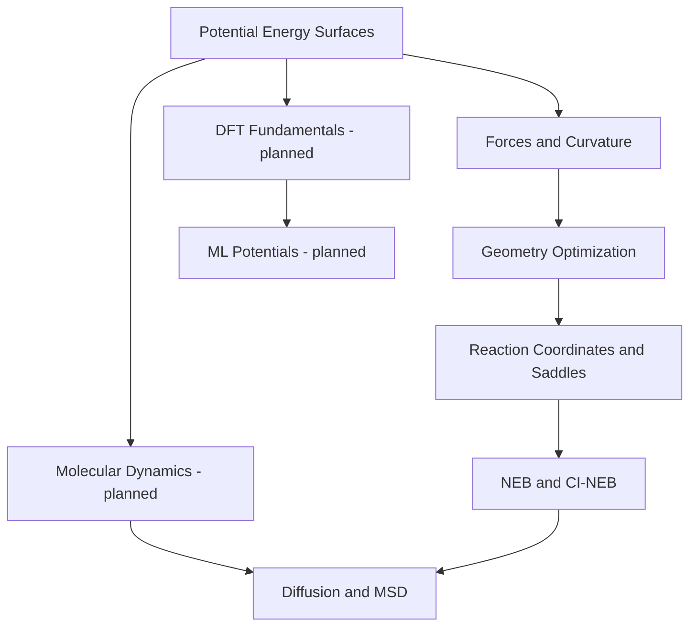

# Computational Materials Science · Learning Path

An English-language learning library arranged by **conceptual prerequisites** rather than publication date. Start with a physical concept, then learn the algorithm that uses it, and finally connect the results to measurable materials properties.

## Recommended Learning Sequence

| Step | Learning note | Main questions |
| --- | --- | --- |
| **01** | [Potential Energy Surfaces](01-foundations/01-potential-energy-surface.md) | How do atomic configurations determine energy? |
| **02** | [Forces, Gradients, and Curvature](01-foundations/02-forces-and-gradients.md) | How are forces and saddle points characterized? |
| **03** | [Geometry Optimization and Convergence](02-methods/01-geometry-optimization.md) | How do we relax structures reliably? |
| **04** | [Reaction Coordinates, MEPs, and Saddle Points](01-foundations/03-reaction-coordinates-and-saddle-points.md) | What is a migration pathway? |
| **05** | [Nudged Elastic Band and CI-NEB](02-methods/02-neb.md) | How do we find a minimum-energy pathway and barrier? |
| **06** | [Diffusion, MSD, and Ionic Transport](03-transport/01-diffusion-and-msd.md) | How do individual events relate to transport? |

The numbers in this table indicate **reading order**, not permanent subject identifiers; lesson files are grouped by subject for easier expansion.

## Concept Map

## Subjects

- **[Foundations](01-foundations/)** — PES, gradients, curvature, and reaction coordinates.
- **[Methods](02-methods/)** — geometry optimization, NEB, and future simulation methods.
- **[Transport](03-transport/)** — diffusion, MSD, charge transport, and later amorphous conductors.

## Future Topics

These will be added where their prerequisites make sense, with links updated as the collection grows:

- DFT fundamentals: Born–Oppenheimer approximation, exchange–correlation functionals, plane-wave basis, k-points.
- Molecular dynamics: ensembles, thermostats, timestep, equilibration, trajectory analysis.
- Transition-state theory: rate constants, attempt frequencies, free-energy barriers.
- Machine-learned interatomic potentials: training data, force errors, transferability, and saddle-point validation.
- Amorphous ion conductors: glass preparation, coordination analysis, sampling, and correlated transport.

## Editorial Conventions

1. Write **in English** with no dates in article titles or filenames.
2. Give each important concept a separate, focused page and explicit prerequisites.
3. Use GitHub-compatible `math` code blocks for standalone equations, native Markdown for prose, and Mermaid or repository-local SVG figures when useful.
4. Include physical intuition, assumptions, practical pitfalls, examples, and review questions.
5. Adjust reading order and internal links when new prerequisite concepts are added; subject categories remain stable where possible.
