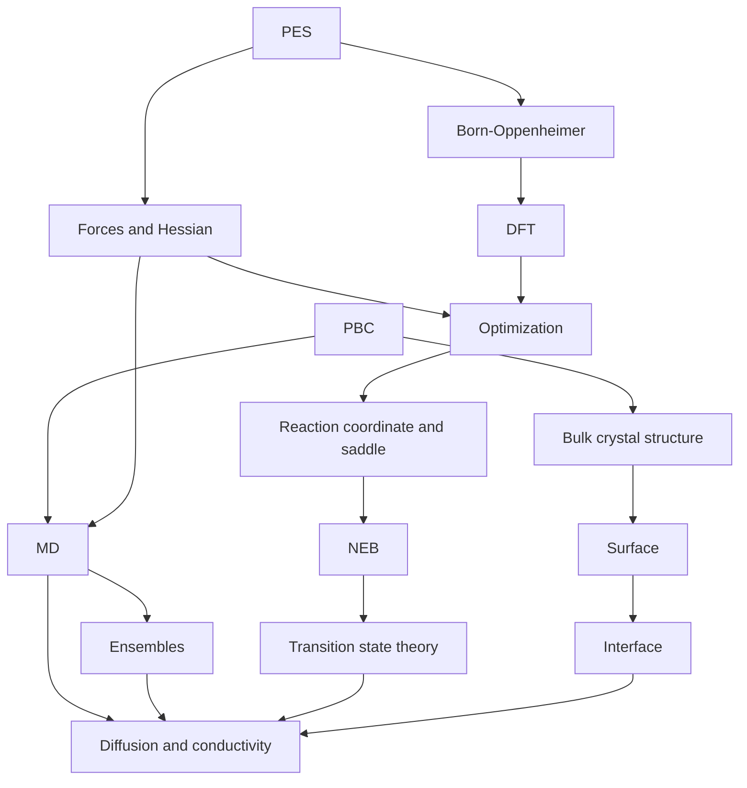

# Computational Materials Science · Learning Path

A structured collection of **English-language notes** organized by subject and cross-linked by prerequisites. The reading order below is a guide, not an assertion that all subjects must be learned sequentially.

## Recommended Reading Order

| Step | Topic | Study area |
| --- | --- | --- |
| 01 | [Potential Energy Surfaces](01-physical-foundations/01-potential-energy-surface.md) | Foundations |
| 02 | [Forces, Gradients and Curvature](01-physical-foundations/02-forces-and-gradients.md) | Foundations |
| 03 | [Periodic Boundary Conditions](01-physical-foundations/03-periodic-boundary-conditions.md) | Foundations |
| 04 | [Born–Oppenheimer Approximation](01-physical-foundations/04-born-oppenheimer-approximation.md) | Foundations |
| 05 | [Bulk Crystal Structures](04-materials-interfaces/01-bulk-crystal-structures.md) | Materials |
| 06 | [DFT Fundamentals](02-electronic-structure/01-dft-fundamentals.md) | Electronic structure |
| 07 | [Geometry Optimization](03-atomistic-methods/01-geometry-optimization.md) | Atomistic methods |
| 08 | [Reaction Coordinates and Saddle Points](01-physical-foundations/05-reaction-coordinates-and-saddle-points.md) | Foundations |
| 09 | [NEB and CI-NEB](03-atomistic-methods/04-neb.md) | Atomistic methods |
| 10 | [Molecular Dynamics Fundamentals](03-atomistic-methods/02-molecular-dynamics.md) | Atomistic methods |
| 11 | [Statistical Ensembles](03-atomistic-methods/03-statistical-ensembles.md) | Atomistic methods |
| 12 | [Transition-State Theory](03-atomistic-methods/05-transition-state-theory.md) | Atomistic methods |
| 13 | [Diffusion, MSD and Ionic Transport](05-transport-properties/01-diffusion-and-msd.md) | Transport |
| 14 | [Surfaces and Slab Models](04-materials-interfaces/02-surfaces-and-slabs.md) | Materials |
| 15 | [Interfaces, Heterostructures and Space Charge](04-materials-interfaces/03-interfaces-and-heterostructures.md) | Materials |

## Concept Dependencies



## Subject Folders

```text
computational-materials/
├── 01-physical-foundations/     PES, forces, PBC, BO, reaction coordinates
├── 02-electronic-structure/     DFT and future SCF/convergence notes
├── 03-atomistic-methods/       optimization, MD, ensembles, NEB, TST
├── 04-materials-interfaces/    bulk, surface, interface, defects
├── 05-transport-properties/    MSD, diffusion, conductivity
├── 06-machine-learning-potentials/  future MLIP course
├── assets/figures/             original, version-controlled SVG illustrations
└── README.md
```

## Editorial Rules

1. English writing throughout, without dates in article filenames.
2. Numbers indicate **reading order within a folder**; the cross-folder sequence is defined by this README.
3. Expand existing lessons with complementary fundamentals rather than creating a new file for every short concept.
4. Use GitHub `math` fenced blocks and local SVG figures, each captioned and labeled as schematic when applicable.
5. Check assumptions, convergence, unit conventions, uncertainty, and limitations.
6. Keep prerequisite links current when restructuring; former lesson paths contain a forwarding note.

## Next Topics

- Plane-wave cutoff, k-point convergence, pseudopotentials/PAW, and SCF numerical reliability.
- RDF, coordination environments, glass preparation, and charge-transport correlations.
- MLIP training data, force/energy/stress validation, and out-of-distribution transferability.
- Surface thermodynamics, grain boundaries, and interface resistance.
