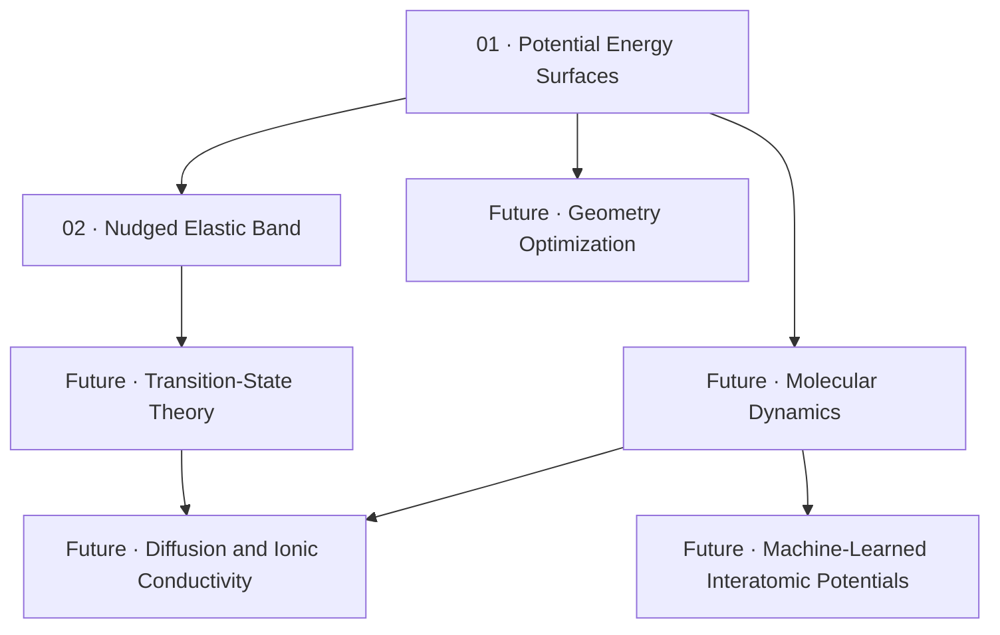

# Computational Materials Science · Learning Path

A structured, English-language study collection organized by **conceptual prerequisites**, not by the date a note was written.

> **How to use this course:** Read foundational concepts first, then numerical and atomistic methods, and finally advanced transport applications. The numbering shows learning order rather than a publication date.

## Learning Roadmap

| Order | Topic | Status |
| --- | --- | --- |
| **01** | [Potential Energy Surfaces (PES)](01-foundations/01-potential-energy-surface.md) | Available |
| **02** | [Nudged Elastic Band (NEB)](02-methods/02-neb.md) | Available |
| 03 | Geometry Optimization and Convergence | Planned |
| 04 | Molecular Dynamics and Statistical Mechanics | Planned |
| 05 | Transition-State Theory and Kinetic Models | Planned |
| 06 | Diffusion, MSD, and Ionic Conductivity | Planned |
| 07 | DFT Fundamentals | Planned |
| 08 | Machine-Learned Interatomic Potentials | Planned |
| 09 | Transport in Amorphous Materials | Planned |

## Organization

- `01-foundations/` — physical and mathematical ideas used by multiple methods.
- `02-methods/` — atomistic simulation techniques and algorithms.
- Future advanced lessons may be grouped into application-specific folders.

## Writing Conventions

- **English only**, including explanations, captions, terminology, and exercises.
- **No dates in filenames or article headings.** Sequential numbers describe the intended learning order.
- Use GitHub-native `math` and Mermaid blocks; use repository-hosted SVG diagrams when they materially aid understanding.
- Favor conceptual intuition, equations, validation criteria, worked examples, and further reading over disconnected definitions.
