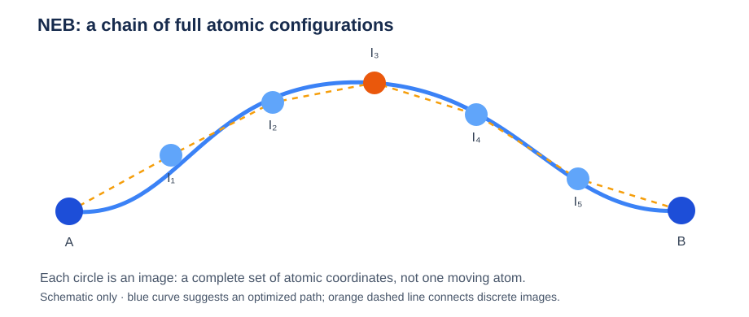
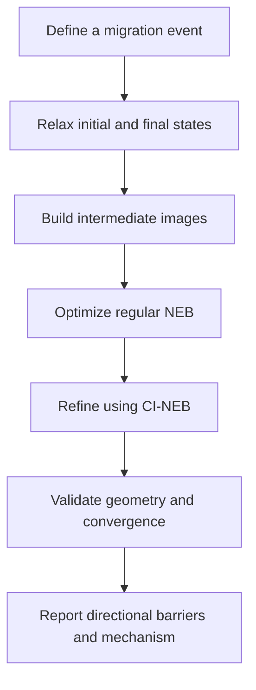

# Understanding the Nudged Elastic Band (NEB) Method

**From Potential Energy Surfaces to Ion Migration Barriers**

> **Study note · 8 October 2026**  
> Computational Materials Science · Atomistic Simulations · Solid-State Ion Transport  
> **Level:** Beginner → Intermediate · **Language:** English

> [!IMPORTANT]
> **Core idea:** NEB finds a *locally optimized minimum-energy pathway* between two specified atomic configurations. CI-NEB refines the highest-energy image toward a saddle point. **Neither technique directly calculates a diffusion coefficient.**

*Figure 1. Illustrative energy landscape showing initial and final states, a saddle point, and the forward migration barrier. Energies are examples, not measured results.*

## Table of Contents

- [1. Why NEB Matters](#1-why-neb-matters)
- [2. Physical Foundations](#2-physical-foundations)
- [3. The NEB Algorithm](#3-the-neb-algorithm)
- [4. Computational Workflow](#4-computational-workflow)
- [5. NEB, DFT, MD, and MLIPs](#5-neb-dft-md-and-mlips)
- [6. Migration Barriers vs Diffusion Activation Energies](#6-migration-barriers-vs-diffusion-activation-energies)
- [7. Practical Challenges](#7-practical-challenges)
- [8. Case Study: Proton Migration in BaZrO3](#8-case-study-proton-migration-in-bazro3)
- [9. Common Misconceptions](#9-common-misconceptions)
- [10. Knowledge Check](#10-knowledge-check)
- [11. Key Terminology](#11-key-terminology)
- [12. Further Reading](#12-further-reading)
- [Key Takeaway](#key-takeaway)

---

## 1. Why NEB Matters

In a solid electrolyte, an ion such as Li⁺ or a proton may move between nearby stable sites. However, the ion generally needs to overcome an energy barrier imposed by its surrounding atoms.

Three basic questions arise:

1. **Where does the ion start and end?** These correspond to the initial and final states.
2. **How does the system transform between these states?** This is the migration pathway.
3. **How much energy must be overcome?** This is the migration barrier.

The **nudged elastic band (NEB)** method optimizes a chain of atomic configurations to approximate a **minimum-energy path (MEP)** between two specified states. It does not automatically discover every possible migration mechanism.

## 2. Physical Foundations

### 2.1 Potential Energy Surface (PES)

For a system containing $N$ atoms, its atomic configuration can be written as

$$
\mathbf R=(\mathbf r_1,\mathbf r_2,\ldots,\mathbf r_N).
$$

The potential energy is a function of all atomic coordinates:

$$
E=E(\mathbf R).
$$

A **potential energy surface** is the multidimensional landscape defined by this function. Local valleys correspond to metastable structures, while higher-energy regions separate them. The familiar one-dimensional energy profile is only a projection along a selected reaction coordinate.

**Key distinction:** An energy profile plotted against a reaction coordinate is not the complete PES.

### 2.2 Initial and Final States

The **initial state** and **final state** are typically locally optimized structures representing two relevant arrangements of atoms. They should correspond to meaningful local minima under consistent simulation conditions.

In ion transport, these might be two different Li⁺ residence sites or two different proton configurations. Importantly, a state describes the **entire atomic configuration**, not just the position of the migrating ion.

### 2.3 Transition State and Saddle Point

A transition state on a conventional potential-energy landscape is associated with a **first-order saddle point**: the energy is locally maximal along one unstable direction and locally minimal along the other independent directions (apart from trivial zero modes).

The transition state is therefore not an ordinary stable minimum.

### 2.4 Migration Barrier

For a particular pathway, the forward potential-energy barrier is

$$
E_{m}^{A\rightarrow B}=E_{\mathrm{TS}}-E_A,
$$

where $E_A$ and $E_{\mathrm{TS}}$ are the energies of the initial state and the relevant transition state.

**Illustrative example:**

| Configuration | Relative potential energy |
| --- | ---: |
| Initial state A | 0.00 eV |
| Transition state | 0.45 eV |
| Final state B | −0.10 eV |

Then

$$
E_m^{A\rightarrow B}=0.45\ \mathrm{eV},\qquad
E_m^{B\rightarrow A}=0.55\ \mathrm{eV}.
$$

Even along the same pathway, forward and reverse barriers can differ when the endpoint energies differ.

### 2.5 Minimum-Energy Path (MEP)

A **minimum-energy path** connects two local minima while satisfying the condition that the component of the potential-energy gradient perpendicular to the path vanishes:

$$
\left.\nabla E\right|_{\perp}=0.
$$

The MEP need not be the geometrically shortest path. Atoms may move around a strongly repulsive region, and the surrounding lattice can relax as the migrating ion moves.

Several distinct local MEPs can exist between the same endpoint states. One successful NEB calculation does not prove that the globally lowest-barrier pathway has been found.

### 2.6 Images

*Figure 2. Seven configurations along a discretized pathway: five intermediate images and two fixed endpoints. Each image represents the entire atomic system.*

NEB represents a pathway using a finite sequence of **images**, or full atomic configurations:

$$
\mathbf R_0,\mathbf R_1,\ldots,\mathbf R_M.
$$

The endpoints $\mathbf R_0$ and $\mathbf R_M$ are usually held fixed; the intermediate images are optimized.

For example, five intermediate images plus two endpoints give seven configurations along the band.

**Common misconception:** An image is *not* one atom or one moment from a real-time MD simulation.

## 3. The NEB Algorithm

Imagine connecting successive images with artificial springs. The purpose of the springs is to maintain a useful distribution of images along the path.

If full physical forces and spring forces were simply added together, the band could suffer from undesirable effects. NEB instead separates the forces into components **perpendicular** and **parallel** to the local path tangent.

For an intermediate image $i$, the NEB force is schematically

$$
\mathbf F_i^{\mathrm{NEB}}
=
-\left.\nabla E(\mathbf R_i)\right|_{\perp}
+
\left.\mathbf F_i^{\mathrm{spring}}\right|_{\parallel}.
$$

Here:

- The **physical force perpendicular to the band** relaxes the pathway toward a local MEP.
- The **artificial spring force along the band** helps prevent the images from clustering.
- The tangent direction is estimated from neighboring images; good implementations use energy-aware tangent estimates.

The intermediate images are iteratively adjusted until the NEB forces meet a chosen convergence criterion.

### 3.1 Climbing-Image NEB (CI-NEB)

A regular NEB band approximates the MEP, but its highest-energy image may not lie exactly at the saddle point.

In **CI-NEB**, a selected high-energy image climbs toward the saddle point. For the climbing image, the spring contribution is removed and the physical force component parallel to the band is reversed:

$$
\mathbf F_i^{\mathrm{CI}}
=
-\nabla E(\mathbf R_i)
+
2[\nabla E(\mathbf R_i)\cdot\hat{\boldsymbol\tau}_i]
\hat{\boldsymbol\tau}_i.
$$

In practice, an initial regular-NEB relaxation can help stabilize the pathway before activating climbing-image optimization.

**NEB:** Refine the pathway.  
**CI-NEB:** More accurately localize the saddle point on that pathway.

## 4. Computational Workflow

*Figure 3. A practical NEB calculation sequence. Validation may require returning to earlier steps.*

### Step 1 — Define a Specific Migration Event

Choose a physically motivated ion transfer or atomic rearrangement. Identify which atoms may move and whether the event is a single-ion hop or a cooperative process.

### Step 2 — Optimize Both Endpoints

Relax the initial and final configurations using compatible settings (cell, functional or potential, numerical tolerances, constraints, and composition).

Check whether each endpoint remains in the intended local minimum after optimization.

### Step 3 — Generate Intermediate Images

Start with an interpolation or a more physically informed pathway.

Linear interpolation is convenient but can produce unrealistically short interatomic distances, especially in disordered materials. Alternative interpolation schemes or paths extracted from atomistic trajectories may provide better initial guesses.

### Step 4 — Run NEB and Check Convergence

Optimize intermediate images under NEB forces. Inspect force tolerances, the energy profile, atomic geometries, and the continuity of the path.

A calculation is not trustworthy merely because the software reports that it has stopped.

### Step 5 — Refine the Saddle Point with CI-NEB

Activate the climbing-image procedure when the band is sufficiently stable, and verify that the highest-energy image is converged.

### Step 6 — Interpret the Barrier

Compute the energy difference between the saddle point and initial state. If the endpoint energies differ, report directional barriers separately.

Inspect atomic displacements and changes in local coordination to identify the physical migration mechanism.

## 5. NEB, DFT, MD, and MLIPs

These techniques play different roles rather than being direct alternatives.

| Method | Main purpose | Typical output |
| --- | --- | --- |
| Density Functional Theory (DFT) | Compute electronic-structure-based energies and forces | Energies, forces, electronic properties |
| Molecular Dynamics (MD) | Simulate atomic motion as a function of time | Trajectories, MSD, diffusion estimates |
| Nudged Elastic Band (NEB) | Optimize a pathway between specified configurations | MEP and migration barrier |
| Machine-Learned Interatomic Potential (MLIP) | Approximate energies and forces using a trained model | Fast energy/force evaluations |

**DFT-NEB** uses DFT energies and forces. **MLIP-NEB** uses a machine-learned potential, such as MACE or NEP, to evaluate energies and forces during optimization.

An MLIP can make large-scale or repeated NEB calculations much more affordable, but speed does not guarantee fidelity near saddle points.

## 6. Migration Barriers vs Diffusion Activation Energies

For an elementary thermally activated jump, a simple transition-state-inspired rate expression is

$$
k\approx\nu\exp\left(-\frac{E_m}{k_\mathrm B T}\right),
$$

where $\nu$ is a characteristic attempt frequency.

This expression is useful for intuition, but **a single NEB potential-energy barrier is not automatically the experimental Arrhenius activation energy**.

Macroscopic diffusion and conductivity can depend on:

- The population and connectivity of available sites.
- Competing hops and trapping.
- Temperature-dependent free-energy effects and prefactors.
- Correlations and cooperative ionic motion.
- Changes in structure or transport mechanism with temperature.

Thus, NEB provides **microscopic mechanistic evidence**, while MD and transport experiments probe dynamical behavior at larger scales.

## 7. Practical Challenges

> [!WARNING]
> **Convergence does not prove physical correctness.** An NEB job may converge to an irrelevant local pathway if the endpoints or initial band are poorly chosen.

| Challenge | Why it matters | Practical response |
| --- | --- | --- |
| Endpoint selection | Poorly chosen endpoints can describe an irrelevant event | Relax and validate both states |
| Path initialization | Straight interpolation can cause atomic overlap | Examine geometry; use informed initial paths |
| Multiple pathways | NEB can converge to a local MEP | Test alternative paths and intermediate states |
| Complex atomic motion | The environment may reorganize during migration | Allow physically relevant atoms to relax |
| Numerical convergence | Inaccurate forces change the predicted barrier | Tighten and test force and electronic tolerances |
| MLIP transferability | Saddle-point environments may be underrepresented in training | Validate representative pathways against DFT |
| Statistical representativeness | One event need not control long-range diffusion | Sample diverse sites and pathways |

### 7.1 A Special Challenge in Amorphous Materials

Crystalline solids often provide symmetry-related sites and a manageable number of candidate jumps. Amorphous solids lack this simple regularity.

For a Li–O–Hf–Cl glass, distinct Li⁺ ions may encounter different local O/Cl coordination environments. The system may exhibit broad distributions of site energies, barriers, and residence times.

A representative workflow could be:

1. Generate multiple independently prepared glass structures.
2. Run MLIP-MD to identify candidate Li⁺ hopping or rearrangement events.
3. Characterize local environments and classify the events.
4. Optimize representative initial and final configurations.
5. Perform MLIP-NEB or CI-NEB for a diverse subset of pathways.
6. Validate selected barriers and saddle-region forces against DFT.
7. Compare barrier distributions with MD-derived dynamics and transport metrics.

This is a **proposed research workflow**, not a claim that NEB alone determines bulk conductivity.

## 8. Case Study: Proton Migration in BaZrO3

For hydrated BaZrO₃, proton motion may involve at least two different elementary rearrangements:

- **OH reorientation:** A proton changes orientation around an oxygen.
- **Proton transfer:** A proton moves between neighboring oxygen environments.

Each process requires an appropriately defined pair of endpoint configurations and possibly a different NEB pathway.

For a surface, distinct terminations and nearby dopants may change site stability and migration barriers. However, comparing two barriers alone does not establish which surface or dopant configuration has the highest long-range proton diffusivity; residence probabilities and kinetic connectivity matter too.

## 9. Common Misconceptions

**“NEB automatically discovers the diffusion pathway.”**  
Not exactly. NEB optimizes a pathway between endpoints; its outcome depends on path initialization and the energy landscape.

**“The highest intermediate image always is the exact transition state.”**  
Not necessarily. CI-NEB provides more accurate saddle-point localization.

**“A lower NEB barrier always means higher measured conductivity.”**  
Not necessarily. Site populations, connectivity, correlations, and other kinetic factors also matter.

**“An MLIP accurate in MD is automatically accurate for NEB.”**  
Not necessarily. High-energy transition-state configurations may be outside the model's well-tested domain.

## 10. Knowledge Check

1. Why must the initial and final states be relaxed independently?
2. What distinguishes an MEP from the shortest geometric path?
3. Why does NEB project the physical and spring forces into different directions?
4. What additional task does CI-NEB perform?
5. Why can one NEB barrier fail to represent transport in an amorphous ionic conductor?
6. How could an MD trajectory help you select realistic NEB endpoints?

## 11. Key Terminology

| Term | Meaning |
| --- | --- |
| Potential energy surface (PES) | Energy as a function of atomic configuration |
| Local minimum | A configuration stable against small allowed displacements |
| Transition state | High-energy configuration associated with a first-order saddle point |
| Minimum-energy path (MEP) | Path whose perpendicular energy gradient vanishes |
| Image | One full atomic configuration in the discretized band |
| Migration barrier | Energy difference between a pathway's saddle point and starting state |
| Climbing-image NEB (CI-NEB) | NEB refinement that converges a selected image toward a saddle point |
| Reaction coordinate | A variable parameterizing progress along a transformation |

## 12. Further Reading

- Henkelman, G.; Uberuaga, B. P.; Jónsson, H. **A Climbing Image Nudged Elastic Band Method for Finding Saddle Points and Minimum Energy Paths.** *Journal of Chemical Physics* **2000**, *113*, 9901–9904. DOI: [10.1063/1.1329672](https://doi.org/10.1063/1.1329672).
- Henkelman, G.; Jónsson, H. **Improved Tangent Estimate in the Nudged Elastic Band Method for Finding Minimum Energy Paths and Saddle Points.** *Journal of Chemical Physics* **2000**, *113*, 9978–9985. DOI: [10.1063/1.1323224](https://doi.org/10.1063/1.1323224).
- [ASE NEB documentation](https://ase-lib.org/ase/neb.html).

---

## Key Takeaway

NEB finds a locally optimized migration pathway and its potential-energy barrier between specified endpoint configurations. Its most difficult aspects are **selecting meaningful endpoints, sampling realistic pathways, converging saddle points, and connecting microscopic barriers to statistically representative transport mechanisms**.
